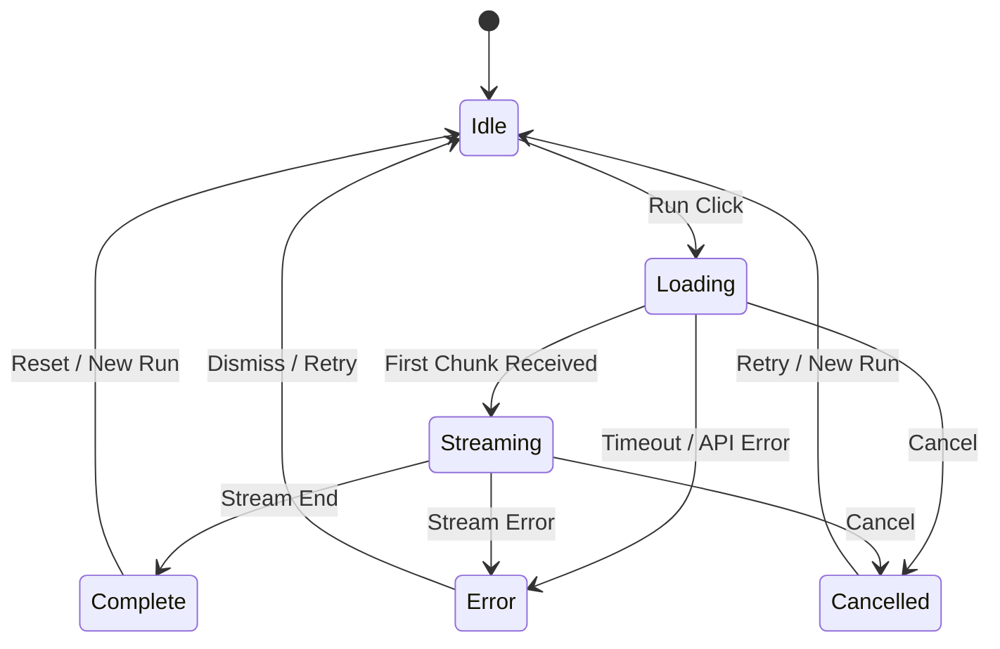

# UI Design Guide (2025-12, Crebit)

**작성**: 2025-12-28 (Last Updated: 2026-01-01 - Agent Studio 추가)  
**대상**: Product / Design / Frontend  
**목표**: 최신 UI/UX 기준과 기술 트렌드를 반영한 Crebit 전용 UI 가이드

---

## 1) Research baseline (2025-12)

### UI/UX fundamentals
- **WCAG 2.2**: 접근성 표준은 Perceivable/Operable/Understandable/Robust 4원칙을 기반으로 하며, UI 전반의 가독성/조작성/명확성을 보장해야 함.  
  https://www.w3.org/WAI/standards-guidelines/wcag/

### Modern UI engineering primitives (web)
- **Container Queries**: 컴포넌트가 자신의 컨테이너 크기에 반응하도록 설계 가능.  
  https://developer.mozilla.org/en-US/docs/Web/CSS/CSS_container_queries
- **View Transitions API**: 화면 전환 시 컨텍스트 유지/인지 부하 감소에 효과적.  
  https://developer.mozilla.org/en-US/docs/Web/API/View_Transitions_API
- **OKLCH + color-mix()**: 지각적으로 균일한 컬러 보간/조합에 유리.  
  https://developer.mozilla.org/en-US/docs/Web/CSS/color_value/oklch  
  https://developer.mozilla.org/en-US/docs/Web/CSS/color_value/color-mix
- **accent-color**: 시스템 컨트롤 스타일 일관성 유지에 유효.  
  https://developer.mozilla.org/en-US/docs/Web/CSS/accent-color

### Product context (NotebookLM/Opal)
- 역할 정의는 `10_PIPELINES_AND_USER_FLOWS.md`를 따른다.  
- NotebookLM Studio 다중 출력/다국어는 **다중 결과 카드/언어 스위치 UI**로 반영 필요.  
- Opal 워크플로는 **검수/라벨링 패널**을 통해 캡슐 스펙과 연결.  
  (출처는 `04_RESEARCH_SOURCES_2025-12.md` 참고)

### Benchmark UI notes
- Virlo Content Studio benchmark findings: `16_VIRLO_CONTENT_STUDIO_RESEARCH.md`

---

## 2) Crebit UI 방향성 (프로젝트 적합)

핵심 키워드:
- **Studio-grade**: 제작 도구처럼 깊이감 있는 레이어 구조
- **Evidence-first**: 근거/패턴/버전 정보가 UI에 자연스럽게 드러남
- **Capsule-first**: 핵심 로직은 봉인, 사용자는 입력/파라미터만 조정
- **Low-friction**: 템플릿 선택 → 캡슐 실행 → 프리뷰까지 3~5 클릭

---

## 3) Layout blueprint

기본 구조:
- **Top bar**: 프로젝트명/상태/Run 버튼 + Credit balance
- **Left rail**: Research / Creator Hub / Accounts / Credits / Affiliate
- **Canvas center**: 노드/엣지 편집
- **Right inspector**: 선택 노드 파라미터/증거/런 히스토리
- **Bottom panel**: Preview/Storyboard/Run 로그

모바일/소형 화면:
- 좌/우 패널은 **스와이프 드로어**로 전환
- 캔버스는 **read-only 축소 뷰** 제공

---

## 4) Visual system (tokens)

기본 테마는 기존 `globals.css`와 정합성을 유지:

색상 토큰 (예시):
- `--bg-0/#0b0e13`, `--bg-1/#0f172a`, `--bg-2/#111827`
- `--fg-0/#e2e8f0`, `--fg-muted` 65% alpha
- `--accent/#38bdf8`, `--accent-2/#f59e0b`

확장 토큰:
- `--surface-1`: color-mix(in oklch, var(--bg-2) 80%, white 20%)
- `--surface-2`: color-mix(in oklch, var(--bg-1) 70%, white 30%)
- `--border-muted`: rgba(148, 163, 184, 0.25)

규칙:
- 배경은 **다층 그라데이션** 유지
- 포커스/선택은 **accent 색상**만 사용 (보라색 회피)
- 카드/노드에는 **약한 글로우 + 보더**로 깊이감 부여

---

## 5) Typography

현재 폰트와 정합:
- UI 본문: **Space Grotesk**
- 코드/ID: **JetBrains Mono**

스케일 제안:
- Display 24/28
- Title 18/24
- Body 14/20
- Meta 12/16

규칙:
- 긴 텍스트는 **최대 60자/줄** 제한
- Inspector 레이블은 **12~13px** 고정

---

## 6) Component guidelines

### 6.1 Template Cards
- 카드 상단: 제목/태그라인
- 카드 하단: Start 버튼 + mini preview
- hover 시 preview_video_url 재생 (자동 음소거)
- Evidence refs가 있으면 **근거 배지** 표시 (count)

### 6.2 Capsule Node

**Visual Identity:**
- 잠금 아이콘 + "Sealed" 배지 (기본 상태)
- 파라미터는 슬라이더/드롭다운 중심
- evidence refs는 **접기 가능한 리스트**

**Node FSM (Virlo 기반 5-State Machine):**

| State       | Visual Cue                                      | UX Behavior                                    |
|-------------|-------------------------------------------------|------------------------------------------------|
| `Idle`      | `--border-muted`, 잠금 아이콘                     | 입력 대기, 파라미터 편집 가능                      |
| `Loading`   | `--accent` pulse border, spinner                | 입력 커밋 후 서버 응답 대기 (Optimistic)            |
| `Streaming` | `--accent-2` glow, partial text reveal          | 청크 단위 결과 표시 (SSE/WebSocket)              |
| `Complete`  | `--accent` solid border, checkmark badge        | 전체 결과 확정, 요약 카드 표시                     |
| `Error`     | `--red-500` border, warning icon                | 오류 메시지 + Retry CTA                         |
| `Cancelled` | `--muted` border, neutral badge                 | 사용자가 중단, Cancelled 배지 노출                |



**Implementation Notes:**
- `Loading` 상태 진입 시 **500ms 이내** 시각적 피드백 필수.
- `Streaming` 중 사용자 입력 필드는 **disabled** 상태로 전환하여 충돌 방지.
- `Error` 상태에서 `Retry` 클릭 시 마지막 파라미터로 재실행.

### 6.3 Inspector
- 섹션 분리: Params / Evidence / Runs
- Evidence는 **source_id + patternVersion** 고정 표기

### 6.4 Admin Panels (Optional)
- Notebook Library 뷰는 관리자 전용
- Evidence/Pattern Trace 테이블은 읽기 전용 + 필터 제공
- Pipeline Ops: 단계별 상태 카드 + Quarantine 요약 + 템플릿 시드 액션 + Ops 실행 로그
- Template Provenance: 템플릿별 guide_sources + evidence_refs 요약 카드 + 누락 카운트 배지
- Templates Stage Card: 공개 템플릿 + 근거 누락 수 표시
- Pattern Version History 카드 (최근 5개 버전 + note 표시)
- Quarantine 샘플 카드 (sheet/reason/row)
- Admin-only 메시지: 권한이 없을 때는 **admin-only** 힌트 + 로그인 CTA 출력

### 6.5 Preview Panel
- Storyboard 카드 (컷, 색감, 리듬)
- 다중 출력 전환: Video/Audio/Mind Map (NotebookLM Ultra 반영)

### 6.6 Onboarding / Empty State (Detailed)
- **Primary Action**: "Get Data" or "Create First Canvas" (Clear, singular CTA).
- **Empty Graph State**:
  - Show a "Seed Graph" selection (e.g., "Start with YouTube Repurposing", "Start with PDF Analysis").
  - Do not show a completely blank grid; guide the first node placement.
- **Visuals**:
  - Use "Input / Processor / Output" conceptual icons in the empty state.
  - See `virlo_content_studio_canvas` for reference on clear node ports.
- Core Components / What You Can Build / How It Works 카드 구성

### 6.7 Story-First Components (NEW: 2025-12-30)

Canvas UI의 우측 패널에 통합된 Story-First 제어 컴포넌트들:

#### 6.7.1 CanvasNarrativePanel
서사 구조와 훅 설계를 위한 확장 가능한 패널.

**구성:**
- **헤더**: Story-First DNA 활성화 토글 + 현재 설정 요약
- **3-Tab 구조**:
  - `부조화 설계`: 익숙함/낯섦 조합 (Cognitive Dissonance)
  - `감정 곡선`: 시작/절정/결말 감정 설정
  - `훅 스타일`: HookVariantSelector 통합

**스타일:**
- Glassmorphism 컨테이너 (`bg-[#0A0A0C]/90 backdrop-blur-xl`)
- Motion Tab (Framer Motion `layoutId`)
- Gradient 버튼 (`from-yellow-600 to-orange-600` 등)

#### 6.7.2 HookVariantSelector
8가지 훅 스타일 중 선택 및 A/B 테스트 설정.

**훅 스타일 (8종):**
| Style     | Label    | Color       | Description              |
|-----------|----------|-------------|--------------------------|
| shock     | 충격형   | red-400     | 강렬한 시각적 충격        |
| curiosity | 호기심형 | purple-400  | 미스터리와 궁금증 유발    |
| emotion   | 감정형   | pink-400    | 감정적 연결로 시작        |
| question  | 의문형   | blue-400    | 직접적 질문으로 시작      |
| paradox   | 역설형   | yellow-400  | 예상을 뒤집는 부조화      |
| tease     | 티저형   | cyan-400    | 결과를 먼저 보여주기      |
| action    | 액션형   | orange-400  | 바로 액션으로 돌입        |
| calm      | 차분형   | emerald-400 | 여유로운 분위기 조성      |

**VariantCard 스타일:**
- 기본: `bg-white/5 border-white/5 hover:bg-white/10`
- 선택됨: 해당 색상 배경 + Glow 효과 (`shadow-lg`)
- A/B 테스트 모드: `ring-2 ring-blue-500`

#### 6.7.3 DNAComplianceViewer
브랜드 DNA 가이드라인 준수 여부를 시각적으로 표시.

**구성:**
- **Summary Card**: 준수율 퍼센트 + 적합/주의/위반 카운트
- **Shot Reports**: 확장 가능한 샷별 상세 리포트
- **Action Items**: AI 수정 제안 + 재생성 버튼

**레벨 배지:**
| Level      | Icon           | Color        |
|------------|----------------|--------------|
| compliant  | CheckCircle    | emerald-400  |
| partial    | AlertTriangle  | yellow-400   |
| violation  | XCircle        | red-400      |
| unknown    | HelpCircle     | gray-400     |

#### 6.7.4 MetricsDashboard
바이럴 성과 분석 및 A/B 테스트 결과 대시보드.

**탭 구성:**
- `개요`: 총 조회수/콘텐츠/참여율/바이럴점수 + 훅 스타일별 바 차트
- `A/B 테스트`: 테스트별 변형 성과 비교 카드
- `인사이트`: AI 기반 성과 인사이트 + 추천 액션

**스타일:**
- StatCard: `bg-white/5 backdrop-blur-md rounded-2xl`
- 바 차트: Motion 애니메이션 (`width: 0 → X%`)
- 인사이트 카드: Hover 시 Purple Glow

---

## 6.8 Agent Studio (Chat-first) (NEW: 2026-01-01)

Chat-first 진입점을 위한 Agent Studio UI 가이드.

**구성 원칙:**
- **Simple / Expert** 토글: Simple은 결과 중심(아티팩트/텍스트), Expert는 도구/메타/세션 정보 노출.
- **Chat Panel**: role 구분(User/Agent/Tool) + SSE 스트리밍 상태 표시.
- **Tool Result Card**: 실패/거절은 명확한 색상/문구, 성공은 payload 요약.
- **Artifact Preview**: Storyboard/Shot List/Data Table은 **확장 뷰 + CSV 다운로드** 지원.
- **Canvas Sync**: 워크플로우 수신 시 적용/무시 선택 + 자동 적용 토글.

권장 톤:
- 에이전트 메시지는 **부드러운 카드 대비**와 충분한 행간으로 가독성 확보.
- 도구 결과는 **작고 밀도 있는 카드**, 아티팩트는 **큰 프리뷰 카드**로 분리.

## 6.9 Glassmorphism Design System (NEW: 2025-12-30)

Story-First 컴포넌트 전반에 적용된 Premium 디자인 시스템.

### 기본 원칙

1. **투명도 계층 (Opacity Hierarchy)**
   - 배경: `bg-[#0A0A0C]/90` 또는 `bg-white/5`
   - 보더: `border-white/5` → `border-white/10` → `border-white/20`
   - 호버: `hover:bg-white/10`

2. **블러 효과 (Backdrop Blur)**
   - 기본 패널: `backdrop-blur-xl`
   - 모달/오버레이: `backdrop-blur-md`
   - 카드: `backdrop-blur-sm`

3. **그림자 및 Glow**
   - 선택/활성 상태: `shadow-lg shadow-{color}-500/20`
   - 패널 그림자: `shadow-2xl`
   - Glow Ring: `ring-1 ring-{color}-500/50`

### 색상 팔레트 (Story-First 전용)

```css
/* Primary Actions */
--sf-purple: #a855f7;  /* purple-500 */
--sf-pink: #ec4899;    /* pink-500 */

/* Status Colors */
--sf-success: #10b981; /* emerald-500 */
--sf-warning: #f59e0b; /* amber-500 */
--sf-error: #ef4444;   /* red-500 */

/* Neutral */
--sf-bg-base: #0A0A0C;
--sf-border-muted: rgba(255, 255, 255, 0.05);
--sf-border-default: rgba(255, 255, 255, 0.10);
```

### 인터랙션 패턴

1. **Tab 전환**: `layoutId` 기반 Shared Layout Animation
2. **카드 호버**: `scale: 1.02, y: -2` (Framer Motion)
3. **버튼 호버**: Gradient Shift + Shadow 증가
4. **Input 포커스**: `border-purple-500/50` + `ring-1 ring-purple-500/20`

---

## 7) Motion & Interaction

- **View Transition**: 패널 전환, 템플릿 → 캔버스 이동
- **Reduced motion**: `prefers-reduced-motion` 시 애니메이션 제거
- Drag/Drop은 **100ms 이하 반응성** 유지

---

## 8) Accessibility (WCAG 2.2 준수)

- 텍스트 대비 **4.5:1 이상**
- 모든 주요 액션 **키보드 접근 가능**
- 상태 변화는 **색상 + 텍스트**로 이중 표현
- 포커스 링은 **명확하고 일관성 있게**

---

## 9) Implementation notes (frontend)

- `container-type: inline-size`로 Inspector/Preview 패널 반응형 설계
- `accent-color`로 체크박스/슬라이더 톤 정렬
- 컬러 계산은 `oklch` + `color-mix()` 활용
- View Transition 지원 브라우저에서만 활성화 (폴백 제공)

---

## 10) Acceptance checklist

- 템플릿 카드 → 캔버스 전환이 1초 내 완료
- 캡슐 실행 후 요약/근거가 한 화면에서 확인 가능
- Storyboard/Preview는 다중 출력 전환 가능
- 모든 주요 UI는 키보드만으로 조작 가능
