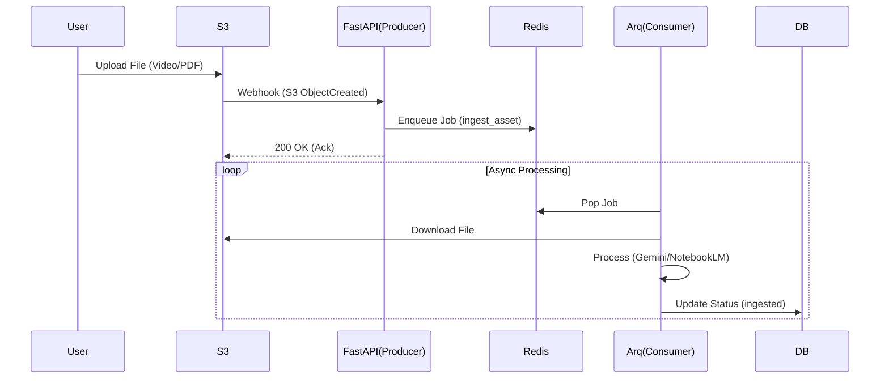

# Event-Driven Architecture Specification (SPEC v37)

**Date**: 2025-12-28  
**Status**: DRAFT (Phase 3 Blueprint, codebase partially scaffolded)  
**Author**: Data Engineer Persona (Antigravity)  
**Context**: Crebit Phase 3.1 - Event-driven Pipeline

---

## 0.1 Current Implementation Snapshot

- Redis는 `docker-compose.yml`에 포함됨.
- Arq 워커 스캐폴딩: `backend/app/worker.py` (job 등록만 존재).
- 이벤트 라우터는 별도 구현되지 않았고, `_deprecated` 경로에 과거 라우터만 존재.

---

## 1. Goal & Philosophy
**"Decouple & Scale"**  
현재의 동기식(Synchronous) API 호출 구조를 비동기 이벤트 기반(Event-driven) 아키텍처로 전환하여 대량의 데이터 처리 안정성과 확장성을 확보한다.

**Key Objectives**:
1. **User Experience**: 대용량 파일 업로드 시 즉시 응답 반환 (Non-blocking).
2. **Reliability**: Worker 재시도(Retry) 및 실패 격리(Dead Letter Queue).
3. **Scalability**: S3 Trigger를 통한 자동 파이프라인 시작.

---

## 2. Architecture Overview

### 2.1 Technology Stack (Selected)
- **Broker**: **Redis** (Lightweight, High-throughput)
- **Worker**: **Arq** (Async-native, Python 3.13 friendly, minimal overhead)
- **Trigger**: **S3 Event Notification** (Simulated via Webhook locally)

### 2.2 Data Flow


---

## 3. Implementation Details

### 3.1 Infrastructure (`docker-compose.yml`)
Add Redis service:
```yaml
redis:
  image: redis:alpine
  ports:
    - "6379:6379"
```

### 3.2 Backend Implementation
**Requirements**: `arq`, `redis`

**Job Definitions (`backend/app/worker.py`)**:
- `analyze_source_pack(source_pack, capsule_id)`
- `generate_video_batch(storyboard_cards, provider, sequence_id, scene_id)`
- `sandbox_execute(tool_id, input_data, user_id, session_id)`
- `index_tool(tool_id)`
- `poll_batch_jobs(job_ids=None)`

**Event Router (planned)**:
- `POST /api/v1/events/s3_hook`: Receives S3 Event JSON, validates, enqueues job.

### 3.3 Event Schema (Internal)
Standardized event envelope:
```python
class PipelineEvent(BaseModel):
    event_id: UUID
    event_type: str  # e.g., "s3:ObjectCreated:Put"
    payload: Dict[str, Any]
    timestamp: datetime
```

### 3.4 Agent SSE Event Envelope (Chat)
실시간 Agent Chat 스트리밍은 SSE(`text/event-stream`)로 전달한다.
구현 위치: `backend/app/routers/agent.py`

**Envelope (JSON):**
```json
{
  "event_id": "session_id:seq",
  "session_id": "uuid",
  "type": "agent.delta",
  "seq": 12,
  "ts": "2026-01-01T00:00:00Z",
  "payload": {}
}
```

**Event types + payload shape:**
- `agent.session`: `{ "status": "active", "title": "...", "agent_model": "..." }`
- `agent.thinking`: `{ "message_id": "uuid" }`
- `agent.delta`: `{ "message_id": "uuid", "delta": "..." }`
- `agent.tool_calls`: `{ "message_id": "uuid", "tool_calls": [{ "id": "...", "name": "...", "arguments": {} }] }`
- `agent.message`: `{ "message_id": "uuid", "role": "assistant", "content": "...", "tool_calls": [] }`
- `agent.tool_result`: `{ "name": "...", "tool_call_id": "...", "status": "completed", "output": {}, "error": null, "task_id": null }`
- `agent.analysis_progress`: `{ "tool_call_id": "...", "step": 1, "name": "logic_vector", "progress": 20, "total_steps": 5 }`
- `agent.capsule_start|agent.capsule_progress|agent.capsule_complete`:
  `{ "tool_call_id": "...", "tool_name": "run_capsule", "capsule_id": "...", "progress": 0-100, "message": "..." }`
- `agent.audio_overview_start|agent.audio_overview_progress`:
  `{ "tool_call_id": "...", "notebook_id": "...", "audio_overview_id": "...", "status": "creating|READY", "progress": 0-100 }`
- `agent.artifact_update`:
  `{ "artifact_id": "...", "artifact_type": "storyboard|shot_list|data_table|scene_card|video_summary|audio_overview", "payload": {}, "version": 1, "created_at": "...Z", "updated_at": "...Z" }`

---

## 4. Execution Roadmap (Phase 3.1)

1. **Infra Setup**: Redis 추가, `arq` 설치.
2. **Worker Bootstrap**: `backend/app/worker.py` 구현 및 `WorkerSettings` 설정.
3. **Event Handler**: `POST /events/s3_hook` 엔드포인트 구현.
4. **Integration**: 기존 `Ingest` 로직을 Worker Job으로 이관.
