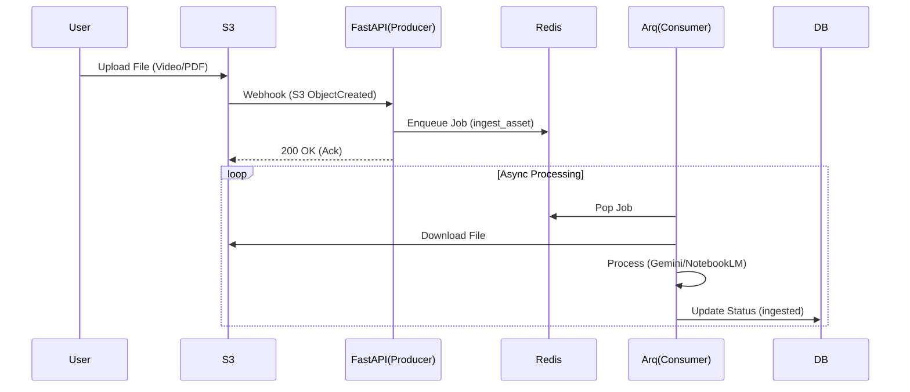

# Event-Driven Architecture Specification (SPEC v37)

**Date**: 2025-12-28  
**Status**: DRAFT (Phase 3 Blueprint)  
**Author**: Data Engineer Persona (Antigravity)  
**Context**: Crebit Phase 3.1 - Event-driven Pipeline

---

## 1. Goal & Philosophy
**"Decouple & Scale"**  
현재의 동기식(Synchronous) API 호출 구조를 비동기 이벤트 기반(Event-driven) 아키텍처로 전환하여 대량의 데이터 처리 안정성과 확장성을 확보한다.

**Key Objectives**:
1. **User Experience**: 대용량 파일 업로드 시 즉시 응답 반환 (Non-blocking).
2. **Reliability**: Worker 재시도(Retry) 및 실패 격리(Dead Letter Queue).
3. **Scalability**: S3 Trigger를 통한 자동 파이프라인 시작.

---

## 2. Architecture Overview

### 2.1 Technology Stack (Selected)
- **Broker**: **Redis** (Lightweight, High-throughput)
- **Worker**: **Arq** (Async-native, Python 3.13 friendly, minimal overhead)
- **Trigger**: **S3 Event Notification** (Simulated via Webhook locally)

### 2.2 Data Flow


---

## 3. Implementation Details

### 3.1 Infrastructure (`docker-compose.yml`)
Add Redis service:
```yaml
redis:
  image: redis:alpine
  ports:
    - "6379:6379"
```

### 3.2 Backend Implementation
**Requirements**: `arq`, `redis`

**Job Definitions (`app/worker.py`)**:
- `process_upload(file_key: str)`
- `generate_capsule(asset_id: str)`
- `sync_sheets()`

**Event Router (`routers/events.py`)**:
- `POST /api/v1/events/s3_hook`: Receives S3 Event JSON, validates, enqueues job.

### 3.3 Event Schema (Internal)
Standardized event envelope:
```python
class PipelineEvent(BaseModel):
    event_id: UUID
    event_type: str  # e.g., "s3:ObjectCreated:Put"
    payload: Dict[str, Any]
    timestamp: datetime
```

---

## 4. Execution Roadmap (Phase 3.1)

1. **Infra Setup**: Redis 추가, `arq` 설치.
2. **Worker Bootstrap**: `backend/app/worker.py` 구현 및 `WorkerSettings` 설정.
3. **Event Handler**: `POST /events/s3_hook` 엔드포인트 구현.
4. **Integration**: 기존 `Ingest` 로직을 Worker Job으로 이관.
