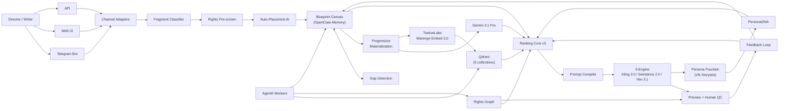

# VIVID — Ambient Creative Canvas OS

> Assemble everyday inspiration into a 100-minute blueprint.

[](https://github.com/ds4psb-ai/vivid/actions)


[Vision](docs/AD_AMBIENT_CREATIVE_CANVAS_VISION_2026_H2.md) ·
[SSOT](docs/AD_CO_DIRECTOR_OS_SSOT_2026_H2.md) ·
[Quality Patterns](docs/strategic/AD_STUDIO_MASTERPIECE_PATTERN_2026_H2.md) ·
[30-Day Runbook](docs/AD_30DAY_TIGER_RUNBOOK_2026-02.md) ·
[Operations](docs/ORIGINAL_IP_FOUNDRY_OPERATIONS_RUNBOOK_2026-02.md)

---

## Table of Contents

- [Overview](#overview)
- [Architecture](#architecture)
- [Key Concepts](#key-concepts)
  - [Blueprint Canvas](#blueprint-canvas)
  - [Fragment & Ingestion](#fragment--ingestion)
  - [Progressive Materialization](#progressive-materialization)
  - [3-Engine Video Compilation](#3-engine-video-compilation)
  - [Model Council](#model-council)
  - [Original-IP Foundry](#original-ip-foundry)
  - [Persona Fountain](#persona-fountain)
- [Tech Stack](#tech-stack)
- [Quick Start](#quick-start)
- [Project Structure](#project-structure)
- [API Overview](#api-overview)
- [Dimension Miniapps](#dimension-miniapps)
- [Documentation](#documentation)
- [Deployment](#deployment)
- [Roadmap](#roadmap)
- [License](#license)

---

## Overview

VIVID is an **Ambient Creative Canvas OS** — a non-linear creative operating system that lets directors and writers assemble a feature-length blueprint from everyday inspiration.

The core insight: **directors don't create linearly**. They snap a photo at a cafe, capture an idea mid-conversation, get inspired by a frame at 3 AM. A 100-minute timeline fills out non-sequentially, like missing teeth.

Existing tools assume "sit at a desk, build Scene 1 first." VIVID breaks this assumption.

### Core Pipeline

```
Fragment Capture → Canvas Placement → Progressive Materialization → 3-Engine Compilation
```

### North Star Metric

```
creative_fill_rate = filled_cells / total_cells
```

How much of the canvas is filled — a direct measure of creative progress.

### Quality Gate

`continuity_score >= 0.80` — enforced only at video generation (Level 3→4), not during canvas filling. Creative freedom first; continuity is infrastructure, not the goal.

### 4-Layer Ecosystem

| Layer | Component | Description |
|:-----:|-----------|-------------|
| **4** | Trust & Governance | Tool tiers (Experimental → Verified → Certified), sandbox, audit |
| **3** | RAG / Knowledge | Qdrant hybrid search + Cinema Grammar KB |
| **2** | Human Cloud | Request → Creator matching → Delivery |
| **1** | Tool Workshop | Dimension miniapps, revenue sharing |

---

## Architecture



Key flow: Fragments enter through channel adapters, get classified and rights-screened, then auto-placed onto the Blueprint Canvas. Gap Detection identifies narrative holes. Progressive Materialization advances fragments from memo to video through 5 levels. The 3-Engine compiler produces final output, gated by quality checks and rights verification. Persona Fountain collects user creative preferences through interactive storylets and injects PersonaDNA into the Ranking Core as a persona_alignment factor. Generated output feeds back as future Fountain content (self-referential loop).

---

## Key Concepts

### Blueprint Canvas

A 100-minute sparse timeline represented as a 5-min × 20-cell grid.

| Property | Description |
|----------|-------------|
| **Sparse** | Starts mostly empty; fills over time |
| **Non-sequential** | Any cell can be filled first — start at minute 32 if you want |
| **Multi-resolution** | Each cell progresses: memo → storyboard → key visual → prompt → video |
| **Persistent** | Stored in OpenClaw Workspace Memory |

### Fragment & Ingestion

A **Fragment** is the atomic unit of inspiration — anything a director captures.

**7 types**: `text_memo`, `voice_memo`, `photo`, `video_clip`, `url_bookmark`, `sketch`, `prompt_draft`

**Channels**: Telegram (primary), Web UI, API → normalized via `ChannelEvent v1` → classify → rights pre-screen → auto-place onto canvas.

**SLO**: < 5s end-to-end (channel receive → canvas placement).

### Progressive Materialization

Bidirectional 5-level concretization:

```
Level 0: Memo           "Rain-soaked street, protagonist walks alone"
    ↕
Level 1: Storyboard     [rough sketches + shot composition notes]
    ↕
Level 2: Key Visual     [AI-generated still / concept art]
    ↕
Level 3: Prompt         [compiled per-engine prompt set]
    ↕
Level 4: Video          [generated video clip — final output]
```

Council validates level transitions. Continuity is enforced only at Level 3→4.

### 3-Engine Video Compilation

| Engine | Resolution | Duration | Key Strength |
|--------|-----------|----------|--------------|
| **Seedance 2.0** | 2K | ~20s | Director Control (lens switch, camera path) + physics-aware |
| **Kling 3.0** | Native 4K | 3-15s | Smart Storyboard — AI auto-split up to 6 shots |
| **Veo 3.1** | 1080p / 4K | 4-8s + ext ~148s | Native audio + SynthID watermark |

Sora was removed: API rate limits unsuitable for production (5-50 RPM), IP policy conflicts with Original-IP Foundry workflows, manual multi-shot vs Kling's AI auto-split, and no differentiated value given the 3-engine coverage.

### Model Council

3-model consensus for quality assurance:

| Model | Role | Focus |
|-------|------|-------|
| **Gemini 3.1 Pro** | Visual Parser | Shot grammar, editing rules, 180°/30° compliance |
| **Opus 4.6** (2-pass) | Deep Analyst | Narrative coherence, character motivation, emotion flow |
| **Codex 5.3 xhigh** | Data Analyst | Quantitative analysis — ASL rhythm, transition stats, theory cross-validation |
| **Gemini Flash** | Synthesizer | Empirical × theoretical fusion → final verdict |

**Cinema Grammar KB** — three knowledge bases grounding Council judgments in 100 years of film theory:

- `EditingGrammarKB`: continuity, montage, 180°/30° rules, match on action, ASL rhythm
- `NarrativeTheoryKB`: setup/conflict/payoff, dramatic question, emotion curves
- `StylePatternKB`: director-specific patterns (Hitchcock suspense, Bong vertical composition, etc.)

**3-class taxonomy**: Invariant (theory-aligned, high performance) · Power Mutation (theory-breaking but effective) · Dead Rule (theory-aligned, low performance)

### Original-IP Foundry

Rights-safe original IP creation — not copying, but mining reusable **Pattern Atoms** from licensed references.

- **Rights Graph**: source license tracking, allowed actions, provenance chain
- **3 Gates**: Pre-gen (block policy violations) → Post-gen (similarity/blacklist check) → Publish (no evidence = no publish)
- **Pattern Atoms**: decomposed shot grammar (composition, camera motion, edit rhythm, emotion arc) extracted from rights-cleared references
- **C2PA v2.3**: provenance export for global verification (Phase 2)

### Persona Fountain

Interactive persona elicitation — a visual novel-style experience that discovers the user's creative DNA and feeds it into Foundry as a control variable.

Inspired by Midjourney's [Dramamancer](https://arxiv.org/html/2601.18785) (UIST 2025), each session guides users through auteur-themed storylets where every choice shapes their **PersonaDNA** (OCEAN traits + auteur affinity + creative tendencies).

- **Storylet Engine**: LLM dynamically generates narrative + choices based on user's evolving trait state (Sealed Capsule)
- **DNA Synthesis**: Trait accumulation → PersonaDNA → `persona_alignment` factor injected into Foundry ranking
- **Self-Referential Loop**: IPs generated by Foundry become visual novel backgrounds in future Fountain sessions

```
persona_alignment (12% weight in Ranking v3)
  = 40% auteur_affinity_match
  + 30% OCEAN_emotion_tone_match
  + 20% creative_tendency_overlap
  + 10% visual_embedding_similarity
```

Design: [Persona Fountain Research](docs/plans/2026-02-23-persona-fountain-research.md)

---

## Tech Stack

| Layer | Technology | Version |
|-------|-----------|---------|
| **Frontend** | Next.js | 16.1 |
| | React | 19.2 |
| | TypeScript | 5.x |
| | Tailwind CSS | 4.x |
| | XState | 5.x |
| | Zustand | 5.x |
| **Backend** | FastAPI | ≥ 0.109 |
| | Python | 3.11 |
| | SQLAlchemy (async) | 2.0 |
| | Pydantic | v2 |
| **Database** | PostgreSQL (pgvector) | 16 |
| | Qdrant | latest |
| | Redis | latest |
| **AI / LLM** | Gemini 3.1 Pro | — |
| **Video Engines** | Seedance 2.0, Kling 3.0, Veo 3.1 | — |
| **Memory** | OpenClaw | latest |
| **Embeddings** | TwelveLabs Marengo Embed 3.0 | — |
| **Orchestration** | Agent0 (worker swarm) | — |
| **Deployment** | Vercel (frontend), Railway (backend) | — |
| **CI/CD** | GitHub Actions | — |

### Qdrant Collections

| Collection | Purpose |
|------------|---------|
| `shot_corpus` | Segment vectors + timecode + shot grammar payload |
| `pattern_atoms` | Pattern embeddings + metadata (effect, preconditions, anti-patterns) |
| `transition_rules` | Shot transition probabilities + continuity stability ranges |
| `rights_constraints` | License, blacklist elements, allowed action index |
| `blueprint_fragments` | Fragment embeddings + type/metadata + canvas placement info |

---

## Quick Start

### Prerequisites

- Docker & Docker Compose
- Node.js 22+
- Python 3.11+

### 1. Infrastructure

```bash
docker-compose up -d
```

Starts PostgreSQL (port 5433), Redis (port 6380), and Qdrant (port 6333).

### 2. Backend

```bash
cd backend
python3 -m venv venv && source venv/bin/activate
pip install -r requirements.txt
cp .env.example .env          # configure your API keys
alembic upgrade head           # run migrations
uvicorn app.main:app --reload --port 8100
```

Optional — seed auteur templates:

```bash
python scripts/seed_auteur_data.py
# or set SEED_AUTEUR_DATA=true in .env
```

### 3. Frontend

```bash
cd frontend
npm install
cp .env.example .env.local     # set NEXT_PUBLIC_API_URL=http://127.0.0.1:8100
npm run dev
```

### 4. Verify

```bash
cd backend && source venv/bin/activate && pytest --tb=short -q   # backend tests
cd frontend && npm run build                                      # frontend build
```

### Ports

| Service | Port |
|---------|------|
| Frontend | 3100 |
| Backend | 8100 |
| PostgreSQL | 5433 |
| Redis | 6380 |
| Qdrant | 6333 |

---

## Project Structure

```
vivid/
├── backend/
│   ├── app/
│   │   ├── routers/
│   │   │   ├── dimension/          # Dimension miniapp routers
│   │   │   ├── run_token.py        # Run Token API
│   │   │   └── ...
│   │   ├── features/
│   │   │   └── original_ip_foundry/  # Foundry: rights, patterns, recommendations
│   │   ├── rag/                    # Hybrid RAG (Qdrant + BM25)
│   │   ├── agents/                 # Agent tools, intent factory
│   │   ├── services/               # Capsule executor, credit system
│   │   └── generation_client.py    # Shot/Prompt contract
│   ├── alembic/                    # DB migrations
│   └── tests/
├── frontend/
│   ├── src/
│   │   ├── app/                    # Next.js App Router pages
│   │   ├── components/             # UI components (dimension panels, etc.)
│   │   └── lib/                    # API client, tokens, utilities
│   └── public/
├── config/
│   └── apps/content/dimensions/    # YAML SSoT configs for each miniapp
├── docs/                           # Strategic & operational docs
└── .github/workflows/ci.yml        # CI pipeline
```

---

## API Overview

### Dimension

| Method | Endpoint | Description |
|--------|----------|-------------|
| POST | `/api/dimension/{app}/generate` | Generate content via dimension miniapp |
| POST | `/api/dimension/{app}/analyze` | Analyze reference material |

### Agent Chat

| Method | Endpoint | Description |
|--------|----------|-------------|
| POST | `/api/v1/agent/chat` | Chat with Vivid Agent (SSE streaming) |
| POST | `/api/v1/agent/upload` | Upload media for agent processing |
| GET | `/api/v1/agent/sessions/{id}` | Retrieve session state |

### Workflow

| Method | Endpoint | Description |
|--------|----------|-------------|
| GET | `/api/v1/workflow/templates` | List workflow templates |
| POST | `/api/v1/workflow/plan` | Create execution plan |
| POST | `/api/v1/workflow/session/{id}/advance` | Advance workflow step |

### Credits & Run Token

| Method | Endpoint | Description |
|--------|----------|-------------|
| GET | `/api/v1/credits/balance` | Check credit balance |
| POST | `/api/v1/run-token/issue` | Issue run token |
| POST | `/api/v1/run-token/{run_id}/deduct` | Deduct after execution |
| POST | `/api/v1/run-token/{run_id}/refund` | Refund on failure |

### Original-IP Foundry

| Method | Endpoint | Description |
|--------|----------|-------------|
| POST | `/api/v1/foundry/rights/evaluate-assets` | Evaluate asset rights |
| POST | `/api/v1/foundry/patterns/extract` | Extract pattern atoms |
| POST | `/api/v1/foundry/recommendations/next-scene` | Get next-scene recommendation |
| POST | `/api/v1/foundry/experiments/assign` | A/B experiment assignment |
| POST | `/api/v1/foundry/provenance/export-c2pa` | Export C2PA provenance |

### Persona Fountain

| Method | Endpoint | Description |
|--------|----------|-------------|
| POST | `/api/v1/fountain/sessions` | Start fountain session |
| POST | `/api/v1/fountain/sessions/{id}/choose` | Submit storylet choice |
| GET | `/api/v1/fountain/sessions/{id}/next-storylet` | Stream next storylet (SSE) |
| POST | `/api/v1/fountain/sessions/{id}/complete` | Synthesize PersonaDNA |
| GET | `/api/v1/fountain/persona/{user_id}/card` | Get shareable Creative DNA Card |

**Auth**: Google OAuth + session cookie (`X-User-Id` header as dev fallback).

---

## Dimension Miniapps

20+ miniapps for specialized creative tasks, each defined by a YAML config in `config/apps/content/dimensions/`.

| App | Key Capability |
|-----|---------------|
| 1D Origin | Veo prompt generation |
| 2D Blueprint | Storyboard creation |
| 3D Ambience | Image prompt generation |
| 4D Moment | Reference analysis |
| AD Studio | Full AD co-direction |
| Kling | Kling video generation |
| Veo | Veo video generation |
| Sound | Audio/music generation |
| Story | Narrative writing |
| Prompt | Prompt alchemy |
| Mirror | Abyss mirror (style analysis) |
| Character | Character consistency |
| Storyboard | Visual storyboarding |
| QC | Quality check |
| NanoBanana | Korean image generation |
| Persona Fountain | Creative DNA elicitation (visual novel) |

---

## Documentation

### Strategic Documents (SSoT)

| Document | Purpose |
|----------|---------|
| [Vision](docs/AD_AMBIENT_CREATIVE_CANVAS_VISION_2026_H2.md) | Why — Ambient Creative Canvas OS paradigm |
| [SSOT](docs/AD_CO_DIRECTOR_OS_SSOT_2026_H2.md) | How — full architecture, decisions D-01 to D-13, tech stack |
| [Quality Patterns](docs/strategic/AD_STUDIO_MASTERPIECE_PATTERN_2026_H2.md) | MOP-v2 5-layer architecture, release gates |
| [30-Day Runbook](docs/AD_30DAY_TIGER_RUNBOOK_2026-02.md) | Execution — Wave 0-4 timeline, daily cadence |
| [Operations](docs/ORIGINAL_IP_FOUNDRY_OPERATIONS_RUNBOOK_2026-02.md) | Feature flags, staged rollout, kill switches |

### Additional Documents

| Document | Purpose |
|----------|---------|
| [Docs Index](docs/00_DOCS_INDEX.md) | Full document map |
| [Architecture Codex](15_CREBIT_ARCHITECTURE_EVOLUTION_CODEX.md) | Design philosophy |
| [Model Council Spec](docs/MODEL_COUNCIL_OPERATIONS_SPEC_2026-02.md) | Council operations detail |
| [Persona Fountain Research](docs/plans/2026-02-23-persona-fountain-research.md) | Interactive persona elicitation, Foundry integration, DB schema |

---

## Deployment

### Frontend — Vercel

API-based deployment is recommended over CLI for stability.

```bash
# Trigger production deployment via Vercel API
# See deployment guide for token setup and full instructions
curl -s -X POST "https://api.vercel.com/v13/deployments" \
  -H "Authorization: Bearer $VERCEL_TOKEN" \
  -H "Content-Type: application/json" \
  -d '{"name":"crebit","project":"crebit","gitSource":{"type":"github","org":"ds4psb-ai","repo":"vivid","ref":"main"},"target":"production"}'
```

### Backend — Railway

```bash
cd backend && railway up --service vivid --detach
```

> The `Dockerfile` lives in `backend/`. Always `cd backend` before running.

---

## Roadmap

30-day sprint to Launch Candidate (from Tiger Runbook):

| Wave | Days | Focus |
|------|------|-------|
| **0** | 0-2 | War-Room — team setup, contract definitions, Canvas/Fragment schema design |
| **1** | 3-9 | Foundation — Rights Graph, Qdrant 5 collections, Fragment Ingestion v0, Blueprint Canvas MVP, Sora removal |
| **2** | 10-16 | Intelligence — Ranking v3, Council Core, Pattern Atom extraction, Progressive Materialization v0, Gap Detection v0 |
| **3** | 17-23 | Channel Hardening — Telegram Fragment UX, Web Canvas UI, Retrospective Council, Meta-Council audit |
| **4** | 24-30 | Launch Readiness — Vendor Switch Drill, pilot onboarding, fill rate 30%+ verification |

Full details: [AD 30-Day Tiger Runbook](docs/AD_30DAY_TIGER_RUNBOOK_2026-02.md)

---

## License

This project is licensed under the [MIT License](LICENSE).
