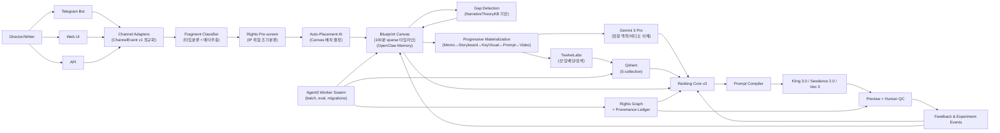

# AD Co-Director OS SSOT (2026 H2/H3)

> **Status**: Active SSoT (PDR 상위)
> **Version**: 4.0 (Ambient Canvas)
> **Last Verified**: 2026-02-23 (US)
> **Owners**: VIVID Product / AD Studio / Platform / Legal Ops

---

## 0) 문서 우선순위

본 문서는 `AD_AMBIENT_CREATIVE_CANVAS_VISION_2026_H2.md`에서 정의한 비전을 구현하는 SSoT다.

본 문서는 AD Co-Director와 Original-IP Foundry의 상위 SSoT다.

1. 본 문서 > PDR > 구현 계획 > 코드 주석
2. PDR은 본 문서의 하위 구현 상세 문서로만 사용한다.
3. 본 문서와 충돌하는 구현은 배포 금지한다.

---

## 1) 제품 북극성 (North Star)

**Ambient Creative Canvas OS** — 일상의 영감을 100분 블루프린트로 조립하는 비선형 창작 운영체제를 만든다.

감독의 창작은 선형이 아니다. 카페에서 사진을 찍고, 새벽 3시에 영상을 보며 영감을 얻고, 출근길에 32분 지점의 전환을 메모한다. 100분 타임라인은 이빨 빠지듯 비선형적으로 채워진다.

### 핵심 흐름

```
Fragment Capture → Canvas Placement → Progressive Materialization
     (영감 포착)       (자동 배치)         (점진적 구체화)
```

1. 감독/작가가 텔레그램·웹에서 던진 영감(Fragment)을 **Fragment Ingestion Pipeline**이 자동 분류
2. **Auto-Placement AI**가 Blueprint Canvas(100분 sparse 타임라인)에 최적 배치
3. **Gap Detection**이 서사 구조적 결핍을 감지하고 제안
4. **Progressive Materialization**이 양방향(Memo↔Storyboard↔KeyVisual↔Prompt↔Video)으로 점진 구체화
5. 멀티샷 프롬프트를 3-Engine(Kling 3.0/Seedance 2.0/Veo 3)으로 자동 컴파일
6. 결과를 A/B/Thompson 루프로 학습

### North Star Metric: `creative_fill_rate`

```
creative_fill_rate = filled_cells / total_cells
```

Canvas가 얼마나 채워졌는가 — 창작의 진행도를 직접 측정한다.

### Quality Gate: `continuity_score`

연속성은 당연히 중요하지만, **1순위 목표가 아니라 품질 게이트**다. Fragment가 영상(Level 4)으로 Materialize될 때 검증한다. Canvas 채우기 단계에서는 continuity를 강제하지 않는다 (창작 자유 보장).

---

## 2) Non-negotiable 결정

| ID | 결정 |
|---|---|
| D-01 | `creative_fill_rate`를 북극성 지표로 고정, `continuity_score`를 품질 게이트로 유지 |
| D-02 | OpenClaw를 **프로젝트 메모리 SSoT 런타임**으로 채택 (파일 기반 메모리 + 하이브리드 검색) |
| D-03 | Agent0는 **병렬 실행/백오피스 워커 오케스트레이션** 용도로 채택 (도메인 지능은 AD 레이어에 유지, Taskiq/Temporal 대체 경로 유지) |
| D-04 | 모델 역할 분리: Gemini 3 Pro(장문 맥락/비디오 이해) + TwelveLabs(샷 임베딩/검색) + 생성엔진(Kling 3.0/Seedance 2.0/Veo 3) |
| D-05 | ElevenLabs는 기본 스택에서 제외 (현재 스코프는 생성엔진 네이티브 오디오 우선) |
| D-06 | Qdrant를 기본 검색 계층으로 유지, Vespa는 랭킹 복잡도 임계치 시 승격 |
| D-07 | Original-IP Foundry는 **권리 그래프(Rights Graph) + 생성 전/후 릴리즈 게이트**를 필수로 둔다 |
| D-08 | B2C 채널은 **Fragment Ingestion Pipeline**을 통해 연결한다 (Channel Adapter → FragmentClassifier → Auto-Placement → Canvas) |
| D-09 | 메모리·오케스트레이션은 **Provider Port**로 추상화한다 (OpenClaw/Agent0 고정 의존 금지) |
| D-10 | 분기마다 "2주 이내 대체 가능성" 리허설(Vendor Switch Drill)을 수행한다 |
| D-11 | Council은 **경험 데이터(VDG+클러스터)**와 **이론 데이터(Cinema Grammar KB)**를 독립 축으로 처리한다. 두 축의 판단을 Synthesizer가 합성한다. |
| D-12 | **Blueprint Canvas**를 프로젝트별 100분 타임라인 SSoT로 채택한다 (5분×20셀 sparse grid, OpenClaw Memory 저장) |
| D-13 | **Progressive Materialization**은 양방향(상향/하향)을 지원한다 — Memo↔Storyboard↔KeyVisual↔Prompt↔Video |

---

## 2-H) Cinema Grammar Knowledge Layer

> **근거**: Shen et al. 2025 (CoNLL), L-Storyboard 2025 (arXiv), Cinema Multiverse Lounge (CHI 2025)

현재 Council은 VDG 46컬럼 + 클러스터링 + aggregated_dna 기반의 **경험 데이터**만 사용한다. 2024-2025 영화 도메인 LLM 연구는 "서사/시네마 이론을 명시적 태스크/지식으로 주지 않으면 영화 이해 성능이 한계에 부딪힌다"는 것을 보여준다. Council의 판단 품질을 한 단계 올리려면, **이론 데이터를 별도 계층으로 분리하여 Council의 독립 축으로 사용**해야 한다.

### 2-H.1 Knowledge Base 3종

| KB | 범위 | 소스 유형 | Council 활용 지점 |
|---|---|---|---|
| `EditingGrammarKB` | 편집 문법 — continuity, montage, 180도/30도 룰, match on action, ASL 리듬, shot/reverse-shot | 교과서, 편집 규칙집, 학술 논문 | PrePhase 클러스터 정화, DP① 코칭, DP④ Director Pack |
| `NarrativeTheoryKB` | 서사 구조 — setup/conflict/payoff, dramatic question, 감정곡선, 캐릭터 동기, 정보 비대칭 | 서사학 교재, 영화 분석 논문 | DP② 코칭, Negotiation Protocol, continuity 서사 축 |
| `StylePatternKB` | 감독/장르별 반복 패턴 — 히치콕 서스펜스 정보비대칭, 봉준호 수직구도-계급, 핀처 암부 활용 등 | 비평/에세이, 감독론, 장르 분석 | director_style_profile 보강, Pattern Atom enrichment |

### 2-H.2 VPS 4대 배치 설계

| VPS | OpenClaw 역할 | Agent0 역할 |
|-----|-------------|------------|
| VPS-1 | EditingGrammarKB 저장/검색 | KB 인덱싱 배치 (Codex 5.3 xhigh dispatch) |
| VPS-2 | NarrativeTheoryKB 저장/검색 | Council enrichment 워커 |
| VPS-3 | StylePatternKB 저장/검색 | Retrospective 분석 워커 |
| VPS-4 | director_style_profile (기존 메모리) | 실험/통계 집계 워커 (기존) |

- OpenClaw: KB별 `memory/*.md` 파일 기반 저장 + BM25+벡터 하이브리드 검색
- Agent0: Codex 5.3 xhigh dispatch로 KB 파싱/인덱싱/교차검증 배치 실행
- VPS-4는 기존 역할 유지, VPS 1~3이 Cinema Grammar KB 전용

### 2-H.3 3단 분류 매트릭스

Codex 5.3 xhigh가 정량 교차검증 후 모든 Pattern Atom을 분류한다:

| 분류 | 이론 준수 | 실전 성과 | 의미 | 액션 |
|------|---------|---------|------|------|
| **Invariant** | O | 높음 | 교과서적으로도 맞고 잘 먹힘 | 핵심 패턴으로 고정 |
| **Power Mutation** | X | 높음 | 룰을 어겼지만 효과적 | 스타일 변주로 태깅, 맥락 조건 명시 |
| **Dead Rule** | O | 낮음 | 이론은 맞지만 안 먹힘 | 감쇠 후보, 주간 prune 대상 |

### 2-H.4 코칭 카드 이원화 구조

Council이 생성하는 코칭은 **실전 근거와 이론 근거를 분리**하여 크리에이터가 "의도적 룰 위반 vs 실수"를 구분할 수 있게 한다:

```json
{
  "creator_coaching": {
    "practical_findings": ["클러스터 통계 기반 실전 인사이트"],
    "theoretical_findings": ["시네마 문법 위반/활용 분석 + KB 규칙 참조"],
    "power_mutations_detected": ["이론 위반이지만 성과 높은 의도적 변주"],
    "actions": [
      {"shot": "S01", "fix": "...", "source": "theory|empirical", "expected_uplift": 0.06}
    ]
  }
}
```

### 2-H.5 Canvas Integration

Cinema Grammar KB는 추천/코칭뿐 아니라 **Blueprint Canvas의 Auto-Placement 및 Gap Detection**에도 핵심 역할을 한다.

#### Auto-Placement 활용

- **NarrativeTheoryKB → 서사 위치 판단**: Fragment의 내용을 분석하여 setup/conflict/payoff 등 서사 구조상 어디에 해당하는지 판단한다. 예: "주인공의 내적 갈등 묘사" → midpoint crisis 패턴 매칭 → Canvas 30분 지점 배치 제안.
- **StylePatternKB → 감독 스타일 기반 배치 보정**: 감독의 과거 작품 패턴에 따라 배치 위치를 보정한다. 예: 봉준호 스타일에서 수직구도-계급 갈등 씬은 1막 후반(20~25분)에 집중.

#### Gap Detection 활용

- **NarrativeTheoryKB → 구조적 결핍 판단**: Canvas의 빈 셀을 분석하여 서사 구조상 반드시 필요한 beat가 누락되었는지 감지한다. Inciting Incident 없음, Climax 전 buildup 부재 등 Structural Gap을 식별하고 필수 beat를 제안.
- **EditingGrammarKB → 시각적 결핍 판단**: 인접 셀 간 시각적 연속성을 검증하여 공간/시간/조명 점프(Visual Gap)를 감지하고, 전환 장면을 제안. 180도 룰 위반, 매치 온 액션 부재 등 편집 문법 결핍도 포착.
- **StylePatternKB → 리듬 결핍 판단**: 장면 길이 분포와 감독 스타일 패턴을 비교하여 리듬 단조로움(Rhythm Gap)을 감지.

---

## 3) 사업성 판단 (결론)

### 3.1 Why now

1. 생성 모델 성능 격차가 줄어드는 구간에서, 승부처는 "모델"보다 **라스트마일 워크플로/메모리/운영 데이터**다.
2. VIVID의 차별화는 모델 자체가 아니라:
   - 감독별 장기 메모리
   - 연속성 중심 추천 품질
   - 승인/기각/수정 로그 기반 학습 루프
   - 권리 안전한 Original-IP 재창조 파이프라인
3. 결론: **사업성 있음.** 단, "툴 래퍼 SaaS"가 아니라 "조감독 운영체제 + 권리 게이팅 OS"로 포지셔닝해야 한다.
4. 2026년 2월 기준 Seedance 2.0/Kling 3.0/Veo 3의 등장으로 멀티샷 일관성이 commodity. 승부처는 '영감 → 블루프린트 조립' 워크플로.

### 3.2 승부가 나는 핵심 IP(지적자산)

- `director_style_profile` (프로젝트/감독별 누적 취향 벡터)
- `continuity_graph` (씬-샷 연쇄 지식)
- `prompt_compiler` (엔진별 문법 최적화 레이어)
- `rights_graph + provenance_ledger` (합법 창작 증빙 체계)
- `blueprint_canvas` (프로젝트별 100분 구조 지식)
- `fragment_ingestion_pipeline` (채널별 영감 분류/배치 노하우)

### 3.3 저장소/프로젝트 전략 (30일 기준 최종 결정)

**결정: 새 프로젝트를 파지 말고, VIVID 모노레포 내부에 "격리된 수직 슬라이스"로 만든다.**

이유:
1. 30일 내 출시에서 인증/크레딧/기존 RAG/관측성 자산 재사용이 압도적으로 유리
2. 새 레포는 CI/CD/권한/운영도구/모니터링을 재구축해야 해서 초기 속도 저하
3. 기술부채 우려는 "레포 분리"가 아니라 "Port/Adapter 계약"으로 해결 가능

실행 규칙:
- `backend/app/features/original_ip_foundry/*`로 기능 경계 고정
- Channel/Memory/Worker는 Port 인터페이스 강제
- 30일 후 분리 조건(트래픽/배포주기/조직분리)이 충족되면 서비스 스핀아웃 검토

---

## 4) 기준 아키텍처 (Ambient Creative Canvas OS)



### 4.1 Fragment Ingestion Pipeline (채널 확장 원칙)

Fragment Ingestion Pipeline은 감독의 영감(Fragment)을 어떤 채널에서든 수신하여 자동 분류하고 Blueprint Canvas에 배치하는 파이프라인이다.

#### Phase 1: Telegram + Web UI (우선)

| 채널 | 역할 | 이유 |
|------|------|------|
| **Telegram** | Fragment 캡처 주력 채널 | 생활 속 즉시 전송. 사진/음성/텍스트 모두 지원. 봇 API 성숙도 높음 |
| **Web UI** | Canvas 시각화 + Materialization 작업 | 복잡한 타임라인 조작은 큰 화면 필요 |

#### Phase 2: KakaoTalk (후순위)

- 한국 시장 도달률은 높지만, 봇 API 제약이 큼 (메시지 타입/크기/빈도)
- Fragment 캡처 용도로는 Telegram이 우월
- KakaoTalk은 알림/요약 전송 채널로 활용

#### 파이프라인 구조

```
Director
  │
  ├─ Telegram Bot ──┐
  ├─ Web UI ────────┤
  └─ API ───────────┘
                    │
            ┌───────▼───────┐
            │  Channel      │  ChannelEvent v1 정규화
            │  Adapters     │  (D-08)
            └───────┬───────┘
                    │
            ┌───────▼───────┐
            │  Fragment     │  타입 분류 + 메타데이터 추출
            │  Classifier   │  (STT, EXIF, URL preview)
            └───────┬───────┘
                    │
            ┌───────▼───────┐
            │  Rights       │  IP 위험 조기 분류
            │  Pre-screen   │  (Rights Graph §6.4)
            └───────┬───────┘
                    │
            ┌───────▼───────┐
            │  Auto-        │  Canvas 상태 + Fragment → 배치 결정
            │  Placement AI │  (§5 OpenClaw/Agent0 참조)
            └───────┬───────┘
                    │
            ┌───────▼───────┐
            │  Blueprint    │  Fragment 저장 + Canvas 업데이트
            │  Canvas       │  (OpenClaw Memory)
            └───────────────┘
```

#### SLO

| 단계 | p95 목표 |
|------|---------|
| Fragment Classification | < 1s |
| Auto-Placement | < 3s |
| End-to-end (채널 수신 → Canvas 반영) | < 5s |

#### 채널 아키텍처 원칙

1. 모든 입력은 `ChannelEvent v1`으로 정규화한다.
2. 채널별 API/SDK 의존은 `channel_adapters/*`로 격리한다.
3. AD Co-Director 코어는 채널명을 몰라야 한다 (채널 독립).
4. 카카오/텔레그램 정책·쿼터 변화는 어댑터에서만 흡수한다.
5. 신규 채널 추가 시 코어 수정 없이 Adapter + Mapper + Contract Test만 추가한다.

### 4.2 A-Prime 운영 규약 (빠른 통합 + 최소 안전장치)

옵션 A(기존 서비스 직접 통합)로 가되, 아래 6개는 하드룰로 강제한다.

1. **Kill Switch 1개 필수**: `AD_FOUNDRY_ENABLED` 즉시 차단 가능해야 함
2. **내부/파일럿 allowlist 강제**: 수강생 전체 공개 전 내부 계정만 접근
3. **읽기전용 시작**: 초기 72시간은 추천 결과 저장/출력만, 파괴적 write 금지
4. **큐 분리**: 기존 수강생 기능 큐와 Foundry 배치 큐 분리
5. **DB/검색 네임스페이스 분리**: Qdrant 컬렉션·키스페이스를 Foundry 전용으로 분리
6. **즉시 롤백 절차 문서화**: 장애 시 10분 내 비활성화 가능한 운영 절차 유지

### 4.3 구현 반영 스냅샷 (2026-02-18)

아래 항목은 코드 레벨에서 1차 반영 완료 상태다.

1. **관측성 스키마 강제**
   - `/api/v1/foundry/*` 요청은 `FoundryAuditRoute`에서 공통 로깅
   - 필수 필드: `user/model/input_type/latency_ms/failure_code/block_reason`
2. **권리 게이트 확장**
   - `POST /api/v1/foundry/rights/evaluate-assets`
   - 응답 계약: `decision + reason_codes + per_asset + evidence_refs`
3. **패턴 원자화 v0**
   - `POST /api/v1/foundry/patterns/extract`
   - 샷 입력을 `pattern_atoms + transition_rules`로 구조화
4. **연속성 우선 추천 v1**
   - `POST /api/v1/foundry/recommendations/next-scene`
   - `continuity_score` 하드 게이트 + 권리판정 결합
5. **A/B 실험 레이어 v1**
   - `POST /api/v1/foundry/experiments/assign`
   - `POST /api/v1/foundry/experiments/feedback`
   - `GET /api/v1/foundry/experiments/{experiment_key}/summary`
6. **메모리/이중검색 1차**
   - `POST /api/v1/foundry/memory/normalize`
   - `POST /api/v1/foundry/retrieval/query` (`director_context` vs `shot_reference`)
7. **Worker Runtime 다중 provider + 스코프 가드**
   - `GET /api/v1/foundry/workers/providers`
   - `POST /api/v1/foundry/workers/dispatch`
   - `GET /api/v1/foundry/workers/jobs/{job_id}?tenant_id=...&project_id=...`
   - `POST /api/v1/foundry/workers/jobs/{job_id}/cancel?tenant_id=...&project_id=...`
   - 스코프 불일치 시 `403` 반환으로 테넌트 간 상태 조회 차단

---

## 5) OpenClaw / Agent0 역할 경계 (중요)

### 5.1 OpenClaw (필수 권장)

OpenClaw 공식 문서 기준, 다음을 그대로 활용한다.

- 파일 우선 메모리 SSoT (`memory/*.md`, `MEMORY.md`, `bank/`, `entities/`)
- BM25 + 벡터 하이브리드 검색
- 텔레그램 채널 연동
- 에이전트 툴 런타임
- **Blueprint Canvas 프로젝트 상태 저장** (Canvas 셀 구조, Fragment 배치 정보, fill_rate 이력을 프로젝트별 메모리로 영구 관리)

**정의:** OpenClaw는 VIVID의 "감독 기억 장치 + 세션 허브 + Canvas 상태 저장소"다.

### 5.2 Agent0 (선택적이지만 실무 효율 높음)

Agent0 공식 문서 기준 프로젝트/시크릿/툴/자기개선 루프를 활용해 아래 백오피스 작업을 분산한다.

- 대규모 배치 인덱싱
- 실험 통계 집계
- 품질 리그레션 검사
- 코퍼스 재처리/마이그레이션
- **Auto-Placement 배치 추론** (Fragment의 Canvas 배치 위치를 Cinema Grammar KB + 프로젝트 컨텍스트 기반으로 추론하는 워커 실행)

**정의:** Agent0는 "실행 공장(operations fabric)"이고, 제품 두뇌는 AD Core에 둔다.

### 5.3 둘 다 없을 때의 대체안

가능하다. 단 개발 속도와 운영 효율이 크게 하락한다.

- OpenClaw 대체: Postgres + Object Storage + 자체 메모리 검색 서비스
- Agent0 대체: Temporal/Celery/K8s CronJob 기반 워커 오케스트레이션

### 5.4 기술부채 방지용 갈아끼우기 규칙 (핵심)

1. **Memory Port**
   - 계약: `put_memory`, `search_memory`, `list_memory`, `delete_memory`
   - 구현체: OpenClawMemoryProvider / ClaudeMemoryProvider / InternalMemoryProvider

2. **Worker Port**
   - 계약: `dispatch_job`, `get_job_status`, `cancel_job`
   - 구현체: Agent0WorkerProvider / TaskiqWorkerProvider / TemporalWorkerProvider
   - 보안 규약: status/cancel은 `tenant_id + project_id` 스코프 검증을 통과해야 한다.

3. **Channel Port**
   - 계약: `ingest_event`, `send_reply`, `upload_media`
   - 구현체: TelegramAdapter / KakaoAdapter / WebChatAdapter

4. **Contract Test 강제**
   - 모든 구현체는 공통 Contract Test Suite 통과 시에만 프로덕션 등록.

5. **Switch Drill 운영**
   - 분기 1회, 샌드박스에서 OpenClaw 또는 Agent0 대체 전환 리허설 수행.
   - 목표: 기능 저하 없이 2주 내 대체 가능성 검증.

---

## 6) Original-IP Foundry (합법 창작) 설계

### 6.1 목표

"기존 IP를 복제"가 아니라, **권리 충돌 없는 신규 IP 생성·재창조**를 지원한다.

### 6.2 필수 원칙

1. 입력 자산은 `source_license`를 강제 저장한다.
2. 라이선스 타입별 정책을 자동 적용한다.
3. 생성 전/후 모두 권리 게이트를 통과해야 퍼블리시 가능하다.

### 6.3 Rights Graph 핵심 스키마

- `asset_id`, `source_type`, `license_type`, `license_url`
- `allowed_actions` (train/reference/remix/commercial)
- `attribution_required` (bool)
- `derivative_allowed` (bool)
- `blocked_elements` (캐릭터/로고/고유명사 등)
- `provenance_trace` (입력→중간산출→최종결과 체인)

### 6.4 릴리즈 게이트

- Gate A (Pre-gen): 권리 정책 위반 입력 차단
- Gate B (Post-gen): 유사도/금칙요소/출처 검증
- Gate C (Publish): 증빙 레포트 없으면 배포 금지

### 6.4.1 C2PA 호환 Export (Phase 2)

- 엔드포인트: `POST /api/v1/foundry/provenance/export-c2pa`
- 출력: `spec_version`, `manifest`, `compliance`, `warnings`
- 목적:
  1. `provenance_trace`를 C2PA claim/assertion 구조로 내보내 글로벌 검증 호환성 확보
  2. EU AI Act Art.50 대응용 기계판독 가능 provenance 패키지 확보
  3. Publish Gate에서 "증빙 포맷 미존재" 리스크 최소화
- 주의:
  - 초기 버전은 detached manifest export다.
  - 암호학적 서명/하드 바인딩(assertion)은 후속 단계에서 추가한다.

### 6.5 Masterpiece Pattern 데이터화 공식 (핵심 차별화)

VIVID의 품질 차별화는 "명작을 감상적으로 참조"가 아니라, **명작의 장점을 기계가 재사용 가능한 패턴 원자(Pattern Atom)로 변환**하는 데서 나온다.

#### 6.5.1 Pattern Atom 스키마

각 패턴은 아래 구조로 저장한다.

- `pattern_id`
- `pattern_type` (`composition`, `camera_motion`, `edit_rhythm`, `emotion_arc`, `dialogue_tension`, `blocking`)
- `preconditions` (언제 쓰는지: 감정/공간/인물 조건)
- `execution_template` (샷 길이/앵글/무브/전환 규칙)
- `expected_effect` (관객 체감 효과)
- `anti_pattern` (연속성 훼손/과잉 연출 위험 조건)
- `source_license`, `provenance_trace`
- `theory_layer` (신규 §2-H 연동):
  - `grammar_refs` — EditingGrammarKB 규칙 ID 목록
  - `theory_alignment` — 이론 준수도 (0.0~1.0)
  - `alignment_detail` — compliant_rules / violated_rules / power_mutations
  - `narrative_refs` — NarrativeTheoryKB 참조 목록
  - `narrative_alignment` — 서사 이론 준수도
  - `style_refs` — StylePatternKB 참조 목록
  - `enrichment_source` — "codex_5.3_xhigh + opus_4.6_2pass"

#### 6.5.2 샷 단위 표준화 계층 (Shot Grammar Canonicalization)

명작/레퍼런스 클립을 다음 단위로 강제 정규화한다.

1. **Shot Scale**: ECU/CU/MCU/MS/MLS/LS/ELS
2. **Angle/Level**: low/eye/high + dutch/bird 등
3. **Camera Motion**: pan/tilt/dolly/truck/zoom/handheld/locked
4. **Edit Grammar**: cut/dissolve/fade/match/action cut
5. **Rhythm**: 샷 길이 분포(평균/분산/가속도)
6. **Narrative Role**: setup/conflict/escalation/payoff/release

#### 6.5.3 패턴 추출 파이프라인 (실행 순서)

1. **Ingest & Rights Gate**: 라이선스/출처 검증된 소스만 투입
2. **Temporal Segmentation**: scene→shot→beat 분절
3. **Feature Extraction**:
   - Gemini: 장면 역할/감정곡선/서사 기능
   - TwelveLabs: 멀티모달 임베딩/샷 검색 키
   - CV 룰셋: 구도/무브/편집 리듬 정량값
4. **Pattern Mining + Theory Validation**:
   - 전이 규칙(shot A→B→C)과 성공 조합 빈도 추출
   - Council Theory Validation (§2-H 연동):
     - Codex 5.3 xhigh + EditingGrammarKB: grammar_refs 매칭 + theory_alignment 계산
     - Opus 4.6 Pass 2 + NarrativeTheoryKB: narrative_alignment 계산
     - Codex 5.3 xhigh + StylePatternKB: style_refs 매칭
     - Codex 5.3 xhigh: 3단 분류 확정 (Invariant / Power Mutation / Dead Rule)
5. **Packaging**: `pattern_atoms`, `transition_rules`, `anti_patterns`로 저장
6. **Serving**: 추천 시 Pattern Atom 조합을 샷 후보 위에 오버레이

#### 6.5.4 추천 수식 확장 (연속성 + 패턴 적합도 + Canvas Fill Rate Impact)

기존 점수에 패턴 적합도, Canvas fill rate 기여도, 복제 위험 패널티를 종합한다.

`final_score_v3 = 0.20*continuity + 0.18*mise_en_scene + 0.14*story_intent_fit + 0.15*director_style_fit + 0.08*execution_feasibility + 0.15*pattern_affinity + 0.15*fill_rate_impact - 0.08*clone_risk`

- `continuity`: 시각/서사/리듬 연속성 (v2 대비 0.40→0.20 — 품질 게이트로 격하, 가중치 축소)
- `mise_en_scene`: 미장센 품질
- `story_intent_fit`: 서사 의도 적합도
- `director_style_fit`: 감독 스타일 적합도 (v2 대비 0.10→0.15 — 개인화 강화)
- `execution_feasibility`: 실행 가능성
- `pattern_affinity`: 현재 씬 목적과 Pattern Atom 조합의 적합도 (v2 대비 0.10→0.15)
- `fill_rate_impact`: Fragment가 Canvas의 gap을 채우는 정도 (신규 — Structural Gap 해소 시 최대 가중치)
- `clone_risk`: 단일 원천 IP 유사도 과다(근접복제) 위험 지표

#### 6.5.5 Qdrant 컬렉션 설계 (한 줄 아님, 코어 설계)

1. `shot_corpus`
   - 세그먼트 벡터 + 타임코드 + shot grammar payload
2. `pattern_atoms`
   - 패턴 임베딩 + 패턴 메타(효과/전제/금칙)
3. `transition_rules`
   - 샷 전이 확률 + 연속성 안정 구간
4. `rights_constraints`
   - 라이선스·금칙요소·사용가능 액션 인덱스
5. `blueprint_fragments`
   - Fragment 임베딩 + 타입/메타데이터 + Canvas 배치 정보
   - 용도: Fragment 간 유사도 검색, Auto-Placement 시 기존 배치 패턴 참조, Gap Detection 시 인접 Fragment 맥락 파악
   - payload index: `project_id`, `fragment_type`, `suggested_cell`, `materialization_level`, `placement_confidence`

**동시성 제어(2026-H1 hardening):**

- 모든 Foundry pattern upsert는 `revision` 필드를 증가시키는 optimistic update로 처리
- Qdrant write는 `wait=true` + `ordering=strong` 기본값 사용
- `expected_revision != current_revision`이면 conflict 반환 후 재시도 큐로 넘긴다

**검색 단계(5-pass):**

1. Dense ANN 회수 (`shot_corpus`)
2. payload 필터 (장르/무브/권리조건)
3. multivector 또는 late interaction 재정렬 (`pattern_atoms`)
4. transition compatibility 재랭킹 (`transition_rules`)
5. Canvas context 보강 (`blueprint_fragments` — 프로젝트 내 인접 셀 Fragment와의 맥락 정합성 가산)

#### 6.5.6 내부 학습 루프 (Foundation 재학습 없이도 가능)

1. **Online**: A/B/Thompson으로 패턴 채택률 실시간 업데이트
2. **Weekly Supervised Ranker**: 승인/수정/기각 로그로 가중치 재학습
3. **Prompt Policy Tuning**: 엔진별 컴파일 템플릿을 주간 보정
4. **Pattern Pruning**: 성능 낮은 패턴 자동 감쇠/폐기

#### 6.5.7 운영 KPI (패턴 엔진 전용)

- `pattern_reuse_rate` (실제 채택된 패턴 비율)
- `continuity_uplift_from_patterns` (패턴 적용 전후 연속성 상승량)
- `edit_reduction` (수정 횟수 감소율)
- `clone_risk_block_rate` (복제 위험 사전 차단율)
- `justification_coverage` (추천 근거에 패턴 설명 포함 비율)

---

## 6.6) Model Council Integration Layer (3-Model Consensus)

> **근거 문서**: `docs/reports/2026-02-19-model-council-feasibility-report.md`, `docs/plans/2026-02-19-council-moat-strategy.md`

Council은 §6.5.3 step 3(Feature Extraction) 이후에 개입하여, 추출 산출물을 **해석하고 보강**하는 지능 레이어다. 새로운 파이프라인이 아니라, 기존 파이프라인의 **품질 증폭기**다.

### 6.6.1 역할 배치

| 모델 | 역할 | Empirical Pass | Theoretical Pass (§2-H) | 호출 경로 |
|------|------|---------------|------------------------|----------|
| Gemini 3 Pro | Visual Parser | "What" — 시각 파싱 | EditingGrammarKB 대조 — 180도/30도 룰, match on action 위반 플래그 | AD Core 직접 호출 |
| Opus 4.6 | Deep Analyst (2-pass) | VDG+클러스터 기반 서사/감정 판단 | NarrativeTheoryKB 대조 — dramatic question 해결 여부, 캐릭터 동기 일관성 | OpenClaw 구독 토큰 (VPS) |
| Codex 5.3 xhigh | Data Analyst + KB Indexer | 정량 분석 (ASL, 리듬, 전환 빈도) | EditingGrammarKB 정량 교차검증 — "이론 권장값 vs 실제 성과값" 편차 계산 | Agent0 구독 토큰 (VPS) |
| Gemini Flash | Synthesizer | Empirical 합의 | **Empirical × Theoretical 교차 합성** → confidence_tier + theory_alignment | AD Core 직접 호출 (최저가) |

**Opus 4.6 2-pass 프롬프트 구조:**

- Pass 1 (Empirical): VDG 46컬럼 + 클러스터 성과 데이터 기반 판단
- Pass 2 (Theoretical): NarrativeTheoryKB를 참조하여 Pass 1 결과를 이론적으로 검증
- 출력: `{ empirical_judgment, theoretical_judgment, alignment_score, conflicts[] }`

**Codex 5.3 xhigh KB 인덱싱 파이프라인 (Agent0 orchestrated):**

1. EditingGrammarKB 원문 → 구조화 파싱 (rule_id, rule_name, conditions, expected_effect, violation_symptom)
2. NarrativeTheoryKB 원문 → taxonomic 분류 (concept_id, category, definition, measurable_proxy)
3. StylePatternKB 비평 텍스트 → 패턴 추출 (director, technique, frequency, context, counter_example)
4. Council 호출 시: 클러스터 top-10 ASL/전환 통계를 KB 권장값과 대조 → `{ theory_compliance_rate, power_mutations[], dead_rules[] }`

**핵심 전제**: Opus와 Codex는 영상을 볼 수 없다. Step 3의 비주얼 추출은 Gemini + TwelveLabs + CV가 단독 수행. Council이 개입하는 것은 그 **텍스트 산출물 + Cinema Grammar KB 이론 텍스트**이다.

### 6.6.2 적용 지점 (선택적, 전면 적용 금지)

| 우선순위 | 적용 지점 | SSOT 참조 | Council 역할 |
|---------|----------|----------|-------------|
| **P0** | Pattern Atom Enrichment + Theory Validation | §6.5.3 step 4 + §2-H | Opus 2-pass: `expected_effect`/`anti_pattern` (경험) + `narrative_alignment` (이론), Codex xhigh: `execution_template` 정량 보정 + `theory_alignment` 계산 + 3단 분류 |
| **P0** | Gate B OR-gate | §6.4 | 3모델 시각/서사/법적 3축 독립 검증, 하나라도 위반 시 차단 |
| **P1** | continuity_score 3축 분리 | §7 | Gemini: 시각, Opus: 서사, Codex: 리듬 연속성 |
| **P2** | Borderline Negotiation | §7.2 확장 | 0.55~0.65 경계선에서 구체적 수정안 합의 |

### 6.6.3 Provider Port (D-09 준수)

Council도 D-09(Provider Port 추상화)를 준수한다.

```python
class CouncilProvider(Protocol):
    async def query_visual(self, input: CouncilInput) -> ModelResponse: ...
    async def query_narrative(self, input: CouncilInput) -> ModelResponse: ...
    async def query_quantitative(self, input: CouncilInput) -> ModelResponse: ...
    async def synthesize(self, responses: list[ModelResponse]) -> CouncilVerdict: ...
```

구현체: `OpenClawCouncilProvider` (기본) / `DirectAPICouncilProvider` (fallback)
분기 Switch Drill(D-10) 대상에 포함.

### 6.6.4 비용 원칙

1. 구독 토큰 우선, API 직접 과금은 fallback
2. 전면 적용 금지 — P0 게이트만 Council 사용
3. Synthesizer는 항상 최저가 모델(Flash)

### 6.6.5 해자 전략 (6축)

| 해자 | 메커니즘 | SSOT 연결 |
|------|---------|----------|
| Bootstrap | Council 자체가 Pattern Atom enrichment 도구 | §6.5.3 step 4 |
| Flywheel | Council 불일치 → 실험 우선순위 부스트 | §9 실험 엔진 |
| Negotiation | 경계선 후보에 구체적 수정안 제시 | §7.2 확장 |
| Meta-Council | Council 건강 지표 자동 감시 | §12 KPI |
| Retrospective | 생성 결과 gap → Prompt Compiler 피드백 루프 | §10 Prompt Compiler |
| Director Persona | 감독 페르소나를 검색 벡터 변조로 구현 | §8 검색 계층 |
| **Theory Grounding** | Cinema Grammar KB로 Council 판단에 100년치 시네마 이론 근거 부여 | §2-H KB 계층 |

### 6.6.6 §6.5.3 step 4 확장: Council-Enriched Pattern Mining

```
Step 4: Pattern Mining (Council-Enriched + Theory-Validated)
├── 통계 추출 (기존): PatternExtractionService.extract()
│   → atom_id, frequency, confidence (변경 없음)
├── Council Enrichment: CouncilService.enrich()
│   ├── Gemini: pattern_type 검증 + preconditions 초안
│   ├── Opus Pass 1: expected_effect + anti_pattern (경험 기반)
│   ├── Codex xhigh: execution_template 정량 보정 (코퍼스 통계 기반)
│   └── Synthesizer: confidence_tier 분류 (high/medium/low)
└── Theory Validation (신규 §2-H): CouncilService.validate_theory()
    ├── Codex xhigh + EditingGrammarKB: grammar_refs 매칭 + theory_alignment 계산
    ├── Opus Pass 2 + NarrativeTheoryKB: narrative_alignment 계산
    ├── Codex xhigh + StylePatternKB: style_refs 매칭
    └── Codex xhigh: 3단 분류 확정 (Invariant / Power Mutation / Dead Rule)
```

Council 메타데이터는 Pattern Atom에 `council_metadata` 필드로 저장한다:

```json
{
  "council_metadata": {
    "consensus_rate": 0.92,
    "confidence_tier": "high",
    "models": ["gemini_3_pro", "opus_4_6", "codex_5_3_xhigh"],
    "enrichment_version": "council_v2"
  },
  "theory_layer": {
    "grammar_refs": ["EG-017:180_degree_rule", "EG-042:match_on_action"],
    "theory_alignment": 0.85,
    "alignment_detail": {
      "compliant_rules": ["EG-017", "EG-042"],
      "violated_rules": ["EG-023:30_degree_rule"],
      "power_mutations": ["EG-023 위반이지만 jump cut 스타일로 engagement +12%"]
    },
    "narrative_refs": ["NT-008:setup_payoff_closure"],
    "narrative_alignment": 0.72,
    "style_refs": ["SP-BONG-003:vertical_composition"],
    "classification": "power_mutation",
    "enrichment_source": "codex_5.3_xhigh + opus_4.6_2pass"
  }
}
```

---

## 7) 추천/랭킹 SSOT

### 7.1 기본식

`final_score_v3 = 0.20*continuity + 0.18*mise_en_scene + 0.14*story_intent_fit + 0.15*director_style_fit + 0.08*execution_feasibility + 0.15*pattern_affinity + 0.15*fill_rate_impact - 0.08*clone_risk`

> Fallback(v2): `fill_rate_impact` 미계산 환경에서는 기존 v2 공식을 사용하되, 4주 내 v3 이관을 완료한다.

### 7.2 하드 게이트 + Borderline Negotiation

| 구간 | 판정 | 동작 |
|------|------|------|
| `< 0.55` | 자동 탈락 | 추천 목록에서 제외 |
| `0.55 <= x < 0.65` | **Negotiation Council** | 3모델이 구체적 수정안 합의 → "여기를 이렇게 고치면 예상 0.7X" 사용자 제시 |
| `0.65 <= x < 0.80` | 제한 노출 | 추천 가능, 주석 표기 |
| `>= 0.80` | 기본 추천군 | 자동 추천 |

**Negotiation Protocol** (§6.6 Council 활용):
1. Gemini: 시각 연속성 0.XX — 조명/프레임 내 위치 판단 + EditingGrammarKB 위반 플래그
2. Opus Pass 1: 서사 연속성 0.XX — 캐릭터 동기/감정 흐름 판단 + **구체적 수정안** 제시
3. Opus Pass 2: NarrativeTheoryKB 대조 — dramatic question 해결 여부, 서사 완결성 검증
4. Codex xhigh: 리듬 연속성 0.XX — 삽입 시 리듬 개선 예상치 계산 + EditingGrammarKB 권장값 대조
5. Synthesizer: Empirical × Theoretical 교차 합성 → 수정 후 예상 점수 + 이론 근거와 함께 사용자 제시

> 명확한 합격/불합격은 Council이 불필요하다. **Council의 가치는 경계선에서 극대화된다.**

### 7.3 증거 출력 계약

추천마다 아래 3개를 반드시 노출한다.

1. 근거 레퍼런스(클립/타임코드)
2. 추천 사유(카메라 문법 + 서사 연결)
3. 이전/다음 샷 연속성 설명

### 7.4 Fill Rate Impact Scoring

Fragment가 Canvas의 gap을 채우는 정도에 비례하여 `fill_rate_impact`를 계산한다.

#### 산출 로직

1. **Gap 유형 식별**: Fragment가 해소하는 gap의 유형을 분류 (Structural / Emotional / Visual / Rhythm)
2. **구조적 가중치**: Structural Gap 해소 시 최대 가중치(1.0), Emotional/Visual Gap은 0.7, Rhythm Gap은 0.5
3. **인접 셀 보너스**: 기존에 채워진 셀과 인접한 gap을 채울 경우 +0.15 보너스 (연속성 확보 용이)
4. **고립 셀 페널티**: Canvas 양쪽 모두 빈 셀인 고립 위치에 배치 시 -0.10 감쇠 (연속성 검증 어려움)

#### 수식

```
fill_rate_impact = gap_type_weight * (1.0 + adjacency_bonus - isolation_penalty) * placement_confidence
```

- `gap_type_weight`: Structural=1.0, Emotional=0.7, Visual=0.7, Rhythm=0.5
- `adjacency_bonus`: 인접 셀에 Fragment 존재 시 +0.15
- `isolation_penalty`: 양쪽 모두 비어있을 시 +0.10
- `placement_confidence`: Auto-Placement AI의 배치 확신도 (0.0~1.0)

#### 설계 근거

Ranking에 fill_rate_impact를 포함함으로써, **Canvas의 빈 틈을 구조적으로 메우는 추천이 우선순위를 갖게 된다.** 이는 "다음 씬을 추천"하는 선형 패러다임에서 "Blueprint를 효율적으로 완성하는 추천"으로의 전환을 반영한다.

---

## 8) 검색 계층 전략 (Qdrant 기본, Vespa 승격)

### 8.1 기본

- Qdrant: 벡터 + 하이브리드 검색 + 멀티벡터(필요시)
- 앱 레이어 재랭킹: continuity/스타일/실행 가능성 가중

**실제 운영 구성:**

1. 컬렉션 분리: `shot_corpus`, `pattern_atoms`, `transition_rules`, `rights_constraints`, `blueprint_fragments`
2. payload index 필드: `project_id`, `scene_role`, `shot_scale`, `camera_motion`, `license_type`, `derivative_allowed`, `fragment_type`, `suggested_cell`, `materialization_level`, `placement_confidence`
3. Query Plan:
   - Stage A: semantic recall (dense/hybrid)
   - Stage B: 권리/금칙 필터
   - Stage C: pattern affinity rerank
   - Stage D: continuity + transition rerank
   - Stage E: Canvas context 보강 (blueprint_fragments 기반 인접 셀 맥락 정합성)
4. 캐시 전략:
   - scene intent hash 캐시 (15분)
   - director profile 캐시 (실시간 무효화)
   - canvas state 캐시 (Fragment 추가 시 무효화)

### 8.2 Vespa 승격 트리거

아래 중 2개 이상 충족 시 승격 검토:

1. 온라인 랭킹 규칙 20개+
2. 요청당 후보 10k+
3. p95 지연 SLO 지속 초과
4. 개인화 피처 실시간 결합이 기본화

---

## 9) 실험 엔진 (A/B + Thompson)

### 9.1 변형 단위

- Synopsis A/B
- SceneFlow A/B/AB
- ShotSequence A/B
- CoachingSource A/B/C (§2-H 연동): A=Empirical only, B=Theory only, C=Fused Council
- FragmentPlacement A/B: Auto-Placement 알고리즘 비교 (규칙 기반 vs ML 기반 vs Cinema Grammar KB 가중)
- MaterializationPath A/B: Level 0→4 최적 경로 비교 (순차 vs 건너뛰기 vs 양방향)
- GapSuggestion A/B: Gap 제안 전략 비교 (Structural 우선 vs Emotional 우선 vs 감독 스타일 맞춤)

### 9.2 보상 함수

`reward = 0.40*adoption + 0.20*low_edit_distance + 0.20*decision_speed + 0.20*post_render_satisfaction`

**보조 지표 (CoachingSource A/B/C 비교용, reward에 직접 합산하지 않음):**
- `theory_compliance_adoption`: 이론 준수 코칭을 받아들인 비율
- `mutation_acceptance`: Power Mutation 제안을 수용한 비율
- `dead_rule_skip_rate`: Dead Rule 경고 후 해당 패턴을 건너뛴 비율

**Canvas 실험 보조 지표:**
- `placement_accept_rate`: Auto-Placement 자동 배치 수락률
- `materialization_step_skip_rate`: Level 건너뛰기 빈도
- `gap_suggestion_click_rate`: Gap 제안 클릭률
- `fill_rate_delta_per_session`: 세션당 fill_rate 증가량

### 9.3 저장 이벤트

- assignment_created / viewed / selected / edited / rejected / render_completed
- theory_coaching_viewed / theory_coaching_applied (§2-H 코칭 이원화 추적)
- fragment_captured / fragment_placed / fragment_moved / fragment_rejected (Canvas 이벤트)
- gap_suggested / gap_accepted / gap_dismissed (Gap Detection 이벤트)
- materialization_started / materialization_completed / materialization_reversed (Materialization 이벤트)

### 9.4 CoachingSource A/B/C 실험 설계 (§2-H 연동)

| 실험군 | Council 구성 | 코칭 카드 | 가설 |
|--------|------------|----------|------|
| A: Empirical | Opus Pass 1 + Codex 정량만 | practical_findings only | 기존 baseline |
| B: Theory | Opus Pass 2 + Codex KB 교차검증만 | theoretical_findings only | 이론만으로 충분한가 |
| C: Fused | 전체 Council (Empirical + Theoretical + Synthesizer) | 이원화 코칭 카드 전체 | 융합이 최선인가 |

**성공 기준:**
- C > A by +10% adoption (기존 council_on 기준과 동일)
- C > B by +5% adoption (이론만으로는 부족함을 입증)
- B > A by any margin (이론 축이 독립 가치 있음을 입증)

**실험 순서:**
1. Phase 1 (Day 15-16): A vs C — 기존 Council ON/OFF와 동일
2. Phase 2 (Day 20+): A vs B vs C — Theory 축 독립 가치 검증 (데이터 충분 시)

---

## 10) 생성엔진 컴파일 정책 (2026-02-23 기준, 3-Engine)

### 2026 현실: 멀티샷 일관성은 Commodity

Seedance 2.0, Kling 3.0, Veo 3의 등장으로 멀티샷 일관성은 더 이상 차별화 요소가 아니다. 승부처는 "어떤 영상을 만들까"가 아니라 "일상의 영감을 어떻게 100분 블루프린트로 조립하는가"다.

### 엔진 상세

#### Seedance 2.0

| 항목 | 사양 |
|------|------|
| 입력 | 4-modal (텍스트/이미지/비디오/오디오 참조) |
| Director Control | 렌즈 전환(lens switch), 카메라 패스(camera path), 모션 제어 |
| 멀티샷 | 네이티브 지원 — 캐릭터/배경 일관성 |
| 해상도 | 최대 1080p |
| 길이 | 최대 15초 |
| 강점 | 가장 정밀한 카메라 워크 제어. AD Co-Director의 shot grammar 지시를 가장 정확하게 반영 |

#### Kling 3.0

| 항목 | 사양 |
|------|------|
| 입력 | 멀티모달 (텍스트/이미지/비디오) |
| 멀티샷 | 6-shot storyboard 네이티브 — 하나의 프롬프트로 6연속 샷 생성 |
| 캐릭터 일관성 | 완벽한 캐릭터 유지 (face/body/clothing) |
| 움직임 | 고품질 인물 움직임, 자연스러운 물리 시뮬레이션 |
| 강점 | Blueprint Canvas의 인접 셀들을 한 번에 생성하는 데 최적. 캐릭터 중심 시퀀스에 강력 |

#### Veo 3

| 항목 | 사양 |
|------|------|
| 플랫폼 | Google Vertex AI |
| 오디오 | 네이티브 오디오 생성 (대사/효과음/환경음 통합) |
| 길이 | 4/6/8초 duration 파라미터 |
| 강점 | 음향까지 통합된 유일한 엔진. 사운드가 중요한 씬에 우선 배정 |

### Sora 제거 사유

1. **멀티샷 미지원**: 2026-02 기준 단일 샷 생성만 가능. Blueprint Canvas 워크플로에서 인접 셀 일관성 보장 불가 — 근본적 비호환
2. **권리 거부 과잉**: 저작권 캐릭터/음악 거부 정책이 Original-IP Foundry의 합법 재창조 워크플로에서도 과도하게 발동. CC0/CC-BY 소스 기반 창작에서도 불필요한 차단 빈발
3. **비용 대비 효용**: Seedance 2.0/Kling 3.0/Veo 3이 멀티샷/오디오/카메라 제어를 모두 커버하는 상황에서 Sora만의 차별 가치 부재

### Prompt Compiler 엔진 배정 전략

```
Fragment materialization (Level 3→4) 시:
├── 카메라 워크 정밀 제어 필요 → Seedance 2.0
├── 연속 샷 시퀀스 (2+ shots) → Kling 3.0
├── 사운드 통합 필요 → Veo 3
└── 일반 → 비용/품질 최적 엔진 자동 선택
```

> 엔진 한계가 다르므로 Prompt Compiler가 shot-plan을 엔진 제약에 맞춰 자동 분할/재조합한다.

---

## 11) 30일 초고속 실행 로드맵 (Ambient Canvas + Opus 4.6 + Codex 5.3 Full-Load)

> 근거: Claude Code release notes(Opus 4.6 + memory)와 OpenAI Codex 최신 업데이트(gpt-5.3-codex, background/parallel coding) 기준으로 개발 사이클을 압축한다. Ambient Creative Canvas OS의 핵심 컴포넌트(Blueprint Canvas, Fragment Ingestion, Auto-Placement, Gap Detection, Progressive Materialization)를 전 Wave에 걸쳐 통합한다.

### Wave 0 (Day 0-2): War-Room Setup

1. Tiger Team 구성 (Product/Platform/RAG/Legal Ops/QA)
2. Codex/Claude 병렬 개발 레인 분리
   - Codex: 코드 생성/리팩터/테스트 자동화
   - Opus 4.6: 아키텍처 검토/리스크 분석/문서 검증
3. "Contract First" 기준 고정 (Channel/Memory/Worker/Pattern/Fragment/Canvas)
4. 30일 KPI 대시보드 오픈 (creative_fill_rate, fragment_capture_rate, continuity, pattern reuse, clone risk, p95)
5. **Canvas 스키마 설계**: Blueprint Canvas 데이터 모델 + OpenClaw Memory 저장 구조 확정
6. **Fragment Ingestion 계약**: Fragment Schema + FragmentClassifier 인터페이스 + Channel Adapter 확장 계약
7. **Auto-Placement 계약**: 입출력 스키마 + Cinema Grammar KB 연동 인터페이스 확정

### Wave 1 (Day 3-9): Core Foundation

1. OpenClaw 메모리 SSoT 매핑 + Provider Port 골격 완성
2. Rights Graph 스키마 + pre/post gate API 배포
3. Qdrant 5-컬렉션 구축 (`shot_corpus`, `pattern_atoms`, `transition_rules`, `rights_constraints`, `blueprint_fragments`)
4. Masterpiece ingestion v0 실행 (최소 1,000 클립 분절)
5. **Council 전제조건**: `council_provider.py` Port 계약 + Contract Test, OpenClaw→Opus / Agent0→Codex 호출 경로 검증
6. **Council-Bootstrapped Seeding**: CC0 클립 50개 → bare atom 추출 + Council enrichment 병렬 진행 (목표: Day 9까지 enriched atom 200+)
7. **Fragment Ingestion Pipeline v0**: FragmentClassifier 구현 + Telegram/Web Channel Adapter → Fragment 수신/분류 파이프라인 배포
8. **Blueprint Canvas MVP**: Canvas CRUD API + OpenClaw Memory 연동 + 기본 셀 시각화 (Web UI)
9. **Sora 제거**: Prompt Compiler에서 Sora adapter 삭제, 3-Engine 계약으로 전환

### Wave 2 (Day 10-16): Intelligence Activation

1. Pattern Atom 추출 파이프라인 운영화
2. **Ranking v3 적용**: `fill_rate_impact` 추가, continuity 가중치 0.40→0.20 조정, `director_style_fit` 0.10→0.15
3. A/B + Thompson 루프 연결
4. Prompt Compiler 3엔진 계약 고정 (Seedance 2.0/Kling 3.0/Veo 3 adapter 업데이트)
5. **Council Core**: `council.py` 골격 + `council_synthesizer.py` + `council_config.py`
6. **P0 통합**: Pattern Extraction Council Enrichment (§6.6.6) + Gate B 3모델 OR-gate
7. **P1 통합**: continuity_score 3축 분리 + Borderline Negotiation 프로토타입 (§7.2)
8. **A/B 실험**: Council ON/OFF 비교 + Disagreement 기반 실험 우선순위 로직
9. **Progressive Materialization v0**: Level 0→1→2 전환 API + 양방향 지원
10. **Gap Detection v0**: NarrativeTheoryKB 기반 Structural Gap 감지 + 제안 API

### Wave 3 (Day 17-23): B2C Channel Hardening + Canvas UX

1. **Telegram Fragment UX**: Telegram 봇에서 Fragment 전송 시 즉시 Canvas 배치 확인 + 수락/이동/거부 인라인 버튼
2. **Web Canvas UI**: Blueprint Canvas 풀 시각화 + 드래그 앤 드롭 Fragment 이동 + Gap 하이라이트 + Materialization 진행 표시
3. Kakao adapter 통합(베타) — Fragment 캡처 + 알림 채널
4. 실험/피드백 이벤트 파이프라인 안정화
5. QC/근거/권리 리포트 관리자 화면 배포
6. **Retrospective Council**: 생성 결과 vs 의도 gap 분석 → `prompt_compiler.py` 피드백 루프
7. **Meta-Council 주간 감사**: `kpi_service.py`에 council_diversity/bias_drift/synthesizer_fidelity 추가
8. **Gap Suggestion v0**: Gap Detection 결과를 기반으로 구체적 Fragment 생성 제안 (NarrativeTheoryKB + StylePatternKB 활용)

### Wave 4 (Day 24-30): Launch Readiness

1. Vendor Switch Drill (OpenClaw/Agent0 대체 리허설) 1회 + **Council Provider Switch Drill 1회**
2. near-duplicate 차단 + clone risk gate 고도화
3. 파일럿 그룹 온보딩(유료 또는 LOI)
4. Launch Candidate 승인
5. **Canvas Launch Gate**: creative_fill_rate 30%+ 달성 프로젝트 3개+ 확인
6. **fragment_capture_rate 모니터링**: 일 평균 5+ Fragment 수집 달성 여부 확인
7. **Auto-Placement 정확도 검증**: auto_placement_accuracy 70%+ 달성 확인

---

## 12) KPI / 릴리즈 게이트

### 12.1 핵심 KPI

- 추천 API p95 < 2.5s
- 검색 p95 < 900ms
- continuity >= 0.80 추천 비율 주간 70%+
- 월간 채택률 +15% 개선(초기 3개월)
- 권리 증빙 누락 0건
- pattern_reuse_rate 주간 35%+
- pattern 적용군 continuity uplift +0.08 이상
- clone_risk 차단 누락 0건
- **`creative_fill_rate` 30%+ per project** (North Star)
- **`fragment_capture_rate` 5+/day** (생활 속 캡처 활성도)
- **`auto_placement_accuracy` 70%+** (자동 배치 수락률)
- **`materialization_velocity` < 4h** (Fragment → Video 평균 소요 시간)

### 12.2 Council 건강 KPI (§6.6 연동)

| 지표 | 주기 | 기준 | 조치 |
|------|------|------|------|
| `council_diversity_score` | 주간 | > 0.2 | < 0.2이면 모델 역할 재설계 |
| `council_bias_drift` | 주간 | < 0.7 | > 0.7이면 가중치 재조정 |
| `synthesizer_fidelity` | 주간 | > 0.6 | < 0.6이면 Synthesizer 프롬프트 점검 |
| `council_outcome_correlation` | 월간 | > 0.5 (Spearman) | < 0.5이면 Council 기준 자체 재검토 |
| `council_on_accept_uplift` | 주간 | > +10% vs OFF | < +5%이면 Council 적용 범위 축소 검토 |
| `negotiation_fixable_rate` | 주간 | > 30% | 경계선 후보 중 수정안 제시 비율 |
| `theory_alignment_avg` | 주간 | > 0.5 (Invariant 패턴 기준) | < 0.4이면 KB 품질 또는 매칭 로직 점검 |
| `power_mutation_ratio` | 주간 | 15~25% | > 30%이면 KB 규칙 과다, < 10%이면 KB 규칙 부족 |
| `dead_rule_prune_count` | 주간 | 기록용 | 주간 감쇠/폐기된 Dead Rule 수 |
| `kb_indexing_coverage` | 주간 | EditingGrammar 100+, Narrative 50+, Style 30+ | KB 인덱싱 규칙 수 |

### 12.3 30일 런치 타겟

- Day 30 기준 파일럿 10팀 이상 활성
- pattern_atoms 누적 10,000+ (권리 태그 포함)
- **Council-enriched atoms 1,000+** (bare atom과 별도 카운트)
- launch candidate에서 gate reject false-negative 0건
- **Council ON/OFF A/B에서 ON accept_rate +10%**
- **Meta-Council 감사 2회+, diversity_score > 0.3**
- **Council Provider Switch Drill 완료 1회**
- **EditingGrammarKB 인덱싱 완료 (규칙 100+)**
- **Theory-validated atoms 500+ (theory_layer 포함)**
- **CoachingSource C > A uplift 확인**

---

## 13) 소스 (2026-02-23 재검증)

### 플랫폼/모델

1. Gemini API docs (Gemini 3 모델 및 파라미터): https://ai.google.dev/gemini-api/docs/models
2. Gemini 3 Pro preview model card: https://ai.google.dev/gemini-api/docs/models/gemini#gemini-3-models
3. Veo 3 API parameters (duration 4/6/8 sec, native audio): https://docs.cloud.google.com/vertex-ai/generative-ai/docs/model-reference/veo-video-generation
4. Seedance 2.0 공식 런치 (4-modal input, Director Control, multi-shot, 15초 1080p): https://seed.bytedance.com/en/blog/official-launch-of-seedance-2-0
5. Kling 3.0 공식 발표 (6-shot storyboard, 캐릭터 일관성, 멀티모달): https://www.prnewswire.com/news-releases/kuaishou-launches-kling-ai-3-0-model-and-kling-ai-studio-for-global-creators-and-businesses-302490441.html
6. Claude Memory Tool (지원 모델/동작): https://platform.claude.com/docs/en/agents-and-tools/tool-use/memory-tool
7. OpenAI Codex CLI docs: https://developers.openai.com/codex/cli/
8. OpenAI Codex background mode docs: https://developers.openai.com/codex/background/
9. OpenAI Codex settings docs: https://developers.openai.com/codex/cli/settings/
10. OpenAI Codex update (gpt-5.3-codex availability): https://help.openai.com/en/articles/6825453-chatgpt-rlease-notes

### 메모리/에이전트/검색

11. Claude Code changelog (Opus 4.6 + memory updates): https://raw.githubusercontent.com/anthropics/claude-code/main/CHANGELOG.md
12. OpenClaw founder move + foundation continuity (Reuters/TechCrunch): https://finance.yahoo.com/news/openclaw-founder-steinberger-joins-openai-223554158.html
13. OpenClaw Memory concept: https://docs.openclaw.ai/concepts/memory
14. OpenClaw architecture: https://docs.openclaw.ai/architecture
15. OpenClaw Telegram channel: https://docs.openclaw.ai/channels/telegram
16. Agent0 Memory docs: https://www.agent-zero.ai/p/docs/memory/
17. Agent0 official docs (projects): https://www.agent-zero.ai/p/docs/projects/
18. Agent0 changelog (0.9.6/0.9.8): https://www.agent-zero.ai/p/docs/changelog/0.9.8/
19. Agent0 GitHub: https://github.com/agent0ai/agent-zero
20. TwelveLabs docs (embeddings): https://docs.twelvelabs.io/docs/guides/create-embeddings
21. TwelveLabs + Qdrant tutorial: https://www.twelvelabs.io/blog/twelve-labs-qdrant-api
22. Qdrant concepts: https://qdrant.tech/documentation/concepts/
23. Qdrant multivector/late interaction: https://qdrant.tech/documentation/tutorials-search-engineering/using-multivector-representations/
24. Vespa phased ranking: https://docs.vespa.ai/en/phased-ranking.html

### 마스터피스 패턴 데이터화(학술/데이터셋)

25. CineScale (792K frames, shot scale): https://www.sciencedirect.com/science/article/pii/S2352340921002869
26. CineScale2 (angle/level, ~25K frames): https://www.sciencedirect.com/science/article/pii/S2352340923007126
27. CineScale project site: https://cinescale.github.io/shotscale/
28. MovieNet (ECCV 2020, 1.1K movies, cinematic style tags): https://movienet.github.io/projects/eccv20movienet.html
29. MovieShots (ECCV 2020, 46K shots / 7K trailers): https://movienet.github.io/projects/eccv20shot.html
30. MovieBench (CVPR 2025, hierarchical movie/scene/shot annotations): https://openaccess.thecvf.com/content/CVPR2025/html/Wu_MovieBench_A_Hierarchical_Movie_Level_Dataset_for_Long_Video_Generation_CVPR_2025_paper.html
31. MovieBench project repository: https://github.com/showlab/MovieBench
32. MultiShotMaster (arXiv 2025, multi-shot controllable generation/data curation): https://arxiv.org/html/2512.03041v1

### 권리/라이선스

33. Telegram Bot API: https://core.telegram.org/bots/api
34. Kakao Talk Message concepts: https://developers.kakao.com/docs/latest/en/kakaotalk-message
35. Kakao Talk Message REST API: https://developers.kakao.com/docs/latest/en/kakaotalk-message/rest-api
36. U.S. Copyright Office AI Report Part 2 (copyrightability): https://www.copyright.gov/ai/Copyright-and-Artificial-Intelligence-Part-2-Copyrightability-Report.pdf
37. U.S. Copyright fair use FAQ: https://www.copyright.gov/help/faq/faq-fairuse.html
38. Creative Commons licenses: https://creativecommons.org/licenses/
39. CC0 public domain dedication: https://creativecommons.org/publicdomain/zero/1.0/
40. C2PA Technical Specification: https://spec.c2pa.org/specifications/specifications/2.2/specs/C2PA_Specification.html
41. C2PA Open Source SDK: https://opensource.contentauthenticity.org/docs/
42. Qdrant update points API (ordering/wait): https://api.qdrant.tech/v-1-14-x/api-reference/points/set-payload
43. Qdrant update vectors API (ordering/wait): https://api.qdrant.tech/v-1-14-x/api-reference/points/update-vectors
44. Qdrant points concepts (payload & filters): https://qdrant.tech/documentation/concepts/points/
45. EU AI Act timeline (application schedule): https://digital-strategy.ec.europa.eu/en/policies/regulatory-framework-ai
46. Taskiq docs: https://taskiq-python.github.io/
47. Taskiq package/releases: https://pypi.org/project/taskiq/

### Cinema Grammar & LLM 연구 (§2-H 근거)

48. Shen et al. 2025 — Narrative theory LLM adaptation for movie domain: https://aclanthology.org/2025.conll-1.13.pdf
49. L-Storyboard 2025 — Shot-level unified language representation for LLM editing: https://arxiv.org/abs/2505.12237
50. Cinema Multiverse Lounge (CHI 2025) — Multi-agent film appreciation: https://dl.acm.org/doi/10.1145/3706598.3713641
51. FilmAgent (SIGGRAPH Asia 2024) — Multi-agent film automation in virtual 3D: https://arxiv.org/abs/2501.12909
52. Deep learning in film production systematic review 2019-2025: https://www.sciencedirect.com/science/article/abs/pii/S1875952125001569
53. KG+LLM fusion practices (Frontiers in Computer Science 2025): https://www.frontiersin.org/journals/computer-science/articles/10.3389/fcomp.2025.1590632/full
54. LLM-empowered RecSys taxonomy (Tsinghua Science & Technology 2025): https://www.sciopen.com/local/article_pdf/10.26599/TST.2025.9010137.pdf

### 시네마 문법 교재/참조

55. Daniel Arijon — Grammar of the Film Language: https://www.silmanjamespress.com/shop/filmmaking-directing/grammar-of-the-film-language/
56. Film Theory: Creating a Cinematic Grammar (Columbia University Press): https://academic.oup.com/columbia-scholarship-online/book/16986
57. Continuity editing computational model (AAAI): https://cdn.aaai.org/ojs/9288/9288-13-12816-1-2-20201228.pdf
58. MasterClass — Continuity editing techniques 2026: https://www.masterclass.com/articles/continuity-editing-in-film-explained

### 생성엔진 상세 문서

59. Seedance 2.0 Director Control (lens switch, camera path): https://seed.bytedance.com/en/blog/official-launch-of-seedance-2-0
60. Kling 3.0 AI Studio (6-shot storyboard, character consistency): https://www.prnewswire.com/news-releases/kuaishou-launches-kling-ai-3-0-model-and-kling-ai-studio-for-global-creators-and-businesses-302490441.html
61. Veo 3 native audio generation (Vertex AI): https://docs.cloud.google.com/vertex-ai/generative-ai/docs/model-reference/veo-video-generation

---

## 14) 최종 한 줄

**VIVID의 생존전략은 '모델 래핑'이 아니라, 일상의 영감을 100분 블루프린트로 조립하는 Ambient Creative Canvas OS — Fragment Ingestion + Blueprint Canvas + Auto-Placement + Progressive Materialization + 3-Engine Compilation + Rights Graph + Cinema Grammar KB를 Council에 녹인 Original-IP Foundry OS를 만드는 것이다.**
