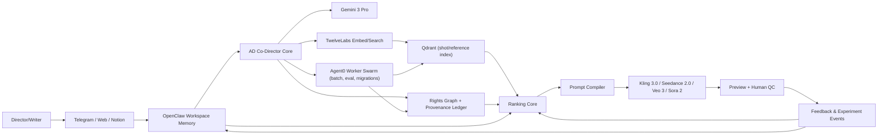

# AD Co-Director OS SSOT (2026 H2/H3)

> **Status**: Active SSoT (PDR 상위)
> **Version**: 3.0 (Hardened)
> **Last Verified**: 2026-02-18 (US)
> **Owners**: VIVID Product / AD Studio / Platform / Legal Ops

---

## 0) 문서 우선순위

본 문서는 AD Co-Director와 Original-IP Foundry의 상위 SSoT다.

1. 본 문서 > PDR > 구현 계획 > 코드 주석
2. PDR은 본 문서의 하위 구현 상세 문서로만 사용한다.
3. 본 문서와 충돌하는 구현은 배포 금지한다.

---

## 1) 제품 북극성 (North Star)

**연속성 점수(continuity_score) 중심의 조감독 OS**를 만든다.

- 감독/작가가 텔레그램·웹·Notion에서 던진 영감을 씬/샷 메모리로 연결
- 다음 씬/샷/카메라 문법을 추천
- 멀티샷 프롬프트를 엔진별로 자동 컴파일
- 결과를 A/B/Thompson 루프로 학습

---

## 2) Non-negotiable 결정

| ID | 결정 |
|---|---|
| D-01 | `continuity_score`를 추천 랭킹의 1순위 게이트로 고정 |
| D-02 | OpenClaw를 **프로젝트 메모리 SSoT 런타임**으로 채택 (파일 기반 메모리 + 하이브리드 검색) |
| D-03 | Agent0는 **병렬 실행/백오피스 워커 오케스트레이션** 용도로 채택 (도메인 지능은 AD 레이어에 유지, Taskiq/Temporal 대체 경로 유지) |
| D-04 | 모델 역할 분리: Gemini 3 Pro(장문 맥락/비디오 이해) + TwelveLabs(샷 임베딩/검색) + 생성엔진(Kling/Seedance/Veo/Sora) |
| D-05 | ElevenLabs는 기본 스택에서 제외 (현재 스코프는 생성엔진 네이티브 오디오 우선) |
| D-06 | Qdrant를 기본 검색 계층으로 유지, Vespa는 랭킹 복잡도 임계치 시 승격 |
| D-07 | Original-IP Foundry는 **권리 그래프(Rights Graph) + 생성 전/후 릴리즈 게이트**를 필수로 둔다 |
| D-08 | B2C 채널은 **채널 어댑터 계층**으로만 연결한다 (Telegram/Kakao/Web Chat 동일 이벤트 계약) |
| D-09 | 메모리·오케스트레이션은 **Provider Port**로 추상화한다 (OpenClaw/Agent0 고정 의존 금지) |
| D-10 | 분기마다 “2주 이내 대체 가능성” 리허설(Vendor Switch Drill)을 수행한다 |

---

## 3) 사업성 판단 (결론)

### 3.1 Why now

1. 생성 모델 성능 격차가 줄어드는 구간에서, 승부처는 “모델”보다 **라스트마일 워크플로/메모리/운영 데이터**다.
2. VIVID의 차별화는 모델 자체가 아니라:
   - 감독별 장기 메모리
   - 연속성 중심 추천 품질
   - 승인/기각/수정 로그 기반 학습 루프
   - 권리 안전한 Original-IP 재창조 파이프라인
3. 결론: **사업성 있음.** 단, “툴 래퍼 SaaS”가 아니라 “조감독 운영체제 + 권리 게이팅 OS”로 포지셔닝해야 한다.

### 3.2 승부가 나는 핵심 IP(지적자산)

- `director_style_profile` (프로젝트/감독별 누적 취향 벡터)
- `continuity_graph` (씬-샷 연쇄 지식)
- `prompt_compiler` (엔진별 문법 최적화 레이어)
- `rights_graph + provenance_ledger` (합법 창작 증빙 체계)

### 3.3 저장소/프로젝트 전략 (30일 기준 최종 결정)

**결정: 새 프로젝트를 파지 말고, VIVID 모노레포 내부에 “격리된 수직 슬라이스”로 만든다.**

이유:
1. 30일 내 출시에서 인증/크레딧/기존 RAG/관측성 자산 재사용이 압도적으로 유리
2. 새 레포는 CI/CD/권한/운영도구/모니터링을 재구축해야 해서 초기 속도 저하
3. 기술부채 우려는 “레포 분리”가 아니라 “Port/Adapter 계약”으로 해결 가능

실행 규칙:
- `backend/app/features/original_ip_foundry/*`로 기능 경계 고정
- Channel/Memory/Worker는 Port 인터페이스 강제
- 30일 후 분리 조건(트래픽/배포주기/조직분리)이 충족되면 서비스 스핀아웃 검토

---

## 4) 기준 아키텍처 (권장: OpenClaw + Agent0 분업)

### 4.1 B2C 채널 확장 원칙 (Telegram/Kakao/고유 UI)

1. 모든 입력은 `ChannelEvent v1`으로 정규화한다.  
2. 채널별 API/SDK 의존은 `channel_adapters/*`로 격리한다.  
3. AD Co-Director 코어는 채널명을 몰라야 한다 (채널 독립).  
4. 카카오/텔레그램 정책·쿼터 변화는 어댑터에서만 흡수한다.  
5. 신규 채널 추가 시 코어 수정 없이 Adapter + Mapper + Contract Test만 추가한다.

### 4.2 A-Prime 운영 규약 (빠른 통합 + 최소 안전장치)

옵션 A(기존 서비스 직접 통합)로 가되, 아래 6개는 하드룰로 강제한다.

1. **Kill Switch 1개 필수**: `AD_FOUNDRY_ENABLED` 즉시 차단 가능해야 함  
2. **내부/파일럿 allowlist 강제**: 수강생 전체 공개 전 내부 계정만 접근  
3. **읽기전용 시작**: 초기 72시간은 추천 결과 저장/출력만, 파괴적 write 금지  
4. **큐 분리**: 기존 수강생 기능 큐와 Foundry 배치 큐 분리  
5. **DB/검색 네임스페이스 분리**: Qdrant 컬렉션·키스페이스를 Foundry 전용으로 분리  
6. **즉시 롤백 절차 문서화**: 장애 시 10분 내 비활성화 가능한 운영 절차 유지

### 4.3 구현 반영 스냅샷 (2026-02-18)

아래 항목은 코드 레벨에서 1차 반영 완료 상태다.

1. **관측성 스키마 강제**
   - `/api/v1/foundry/*` 요청은 `FoundryAuditRoute`에서 공통 로깅
   - 필수 필드: `user/model/input_type/latency_ms/failure_code/block_reason`
2. **권리 게이트 확장**
   - `POST /api/v1/foundry/rights/evaluate-assets`
   - 응답 계약: `decision + reason_codes + per_asset + evidence_refs`
3. **패턴 원자화 v0**
   - `POST /api/v1/foundry/patterns/extract`
   - 샷 입력을 `pattern_atoms + transition_rules`로 구조화
4. **연속성 우선 추천 v1**
   - `POST /api/v1/foundry/recommendations/next-scene`
   - `continuity_score` 하드 게이트 + 권리판정 결합
5. **A/B 실험 레이어 v1**
   - `POST /api/v1/foundry/experiments/assign`
   - `POST /api/v1/foundry/experiments/feedback`
   - `GET /api/v1/foundry/experiments/{experiment_key}/summary`
6. **메모리/이중검색 1차**
   - `POST /api/v1/foundry/memory/normalize`
   - `POST /api/v1/foundry/retrieval/query` (`director_context` vs `shot_reference`)

---

## 5) OpenClaw / Agent0 역할 경계 (중요)

### 5.1 OpenClaw (필수 권장)

OpenClaw 공식 문서 기준, 다음을 그대로 활용한다.

- 파일 우선 메모리 SSoT (`memory/*.md`, `MEMORY.md`, `bank/`, `entities/`)
- BM25 + 벡터 하이브리드 검색
- 텔레그램 채널 연동
- 에이전트 툴 런타임

**정의:** OpenClaw는 VIVID의 “감독 기억 장치 + 세션 허브”다.

### 5.2 Agent0 (선택적이지만 실무 효율 높음)

Agent0 공식 문서 기준 프로젝트/시크릿/툴/자기개선 루프를 활용해 아래 백오피스 작업을 분산한다.

- 대규모 배치 인덱싱
- 실험 통계 집계
- 품질 리그레션 검사
- 코퍼스 재처리/마이그레이션

**정의:** Agent0는 “실행 공장(operations fabric)”이고, 제품 두뇌는 AD Core에 둔다.

### 5.3 둘 다 없을 때의 대체안

가능하다. 단 개발 속도와 운영 효율이 크게 하락한다.

- OpenClaw 대체: Postgres + Object Storage + 자체 메모리 검색 서비스
- Agent0 대체: Temporal/Celery/K8s CronJob 기반 워커 오케스트레이션

### 5.4 기술부채 방지용 갈아끼우기 규칙 (핵심)

1. **Memory Port**  
   - 계약: `put_memory`, `search_memory`, `list_memory`, `delete_memory`  
   - 구현체: OpenClawMemoryProvider / ClaudeMemoryProvider / InternalMemoryProvider

2. **Worker Port**  
   - 계약: `dispatch_job`, `get_job_status`, `cancel_job`  
   - 구현체: Agent0WorkerProvider / TaskiqWorkerProvider / TemporalWorkerProvider

3. **Channel Port**  
   - 계약: `ingest_event`, `send_reply`, `upload_media`  
   - 구현체: TelegramAdapter / KakaoAdapter / WebChatAdapter

4. **Contract Test 강제**  
   - 모든 구현체는 공통 Contract Test Suite 통과 시에만 프로덕션 등록.

5. **Switch Drill 운영**  
   - 분기 1회, 샌드박스에서 OpenClaw 또는 Agent0 대체 전환 리허설 수행.  
   - 목표: 기능 저하 없이 2주 내 대체 가능성 검증.

---

## 6) Original-IP Foundry (합법 창작) 설계

### 6.1 목표

“기존 IP를 복제”가 아니라, **권리 충돌 없는 신규 IP 생성·재창조**를 지원한다.

### 6.2 필수 원칙

1. 입력 자산은 `source_license`를 강제 저장한다.
2. 라이선스 타입별 정책을 자동 적용한다.
3. 생성 전/후 모두 권리 게이트를 통과해야 퍼블리시 가능하다.

### 6.3 Rights Graph 핵심 스키마

- `asset_id`, `source_type`, `license_type`, `license_url`
- `allowed_actions` (train/reference/remix/commercial)
- `attribution_required` (bool)
- `derivative_allowed` (bool)
- `blocked_elements` (캐릭터/로고/고유명사 등)
- `provenance_trace` (입력→중간산출→최종결과 체인)

### 6.4 릴리즈 게이트

- Gate A (Pre-gen): 권리 정책 위반 입력 차단
- Gate B (Post-gen): 유사도/금칙요소/출처 검증
- Gate C (Publish): 증빙 레포트 없으면 배포 금지

### 6.4.1 C2PA 호환 Export (Phase 2)

- 엔드포인트: `POST /api/v1/foundry/provenance/export-c2pa`
- 출력: `spec_version`, `manifest`, `compliance`, `warnings`
- 목적:
  1. `provenance_trace`를 C2PA claim/assertion 구조로 내보내 글로벌 검증 호환성 확보
  2. EU AI Act Art.50 대응용 기계판독 가능 provenance 패키지 확보
  3. Publish Gate에서 “증빙 포맷 미존재” 리스크 최소화
- 주의:
  - 초기 버전은 detached manifest export다.
  - 암호학적 서명/하드 바인딩(assertion)은 후속 단계에서 추가한다.

### 6.5 Masterpiece Pattern 데이터화 공식 (핵심 차별화)

VIVID의 품질 차별화는 “명작을 감상적으로 참조”가 아니라, **명작의 장점을 기계가 재사용 가능한 패턴 원자(Pattern Atom)로 변환**하는 데서 나온다.

#### 6.5.1 Pattern Atom 스키마

각 패턴은 아래 구조로 저장한다.

- `pattern_id`
- `pattern_type` (`composition`, `camera_motion`, `edit_rhythm`, `emotion_arc`, `dialogue_tension`, `blocking`)
- `preconditions` (언제 쓰는지: 감정/공간/인물 조건)
- `execution_template` (샷 길이/앵글/무브/전환 규칙)
- `expected_effect` (관객 체감 효과)
- `anti_pattern` (연속성 훼손/과잉 연출 위험 조건)
- `source_license`, `provenance_trace`

#### 6.5.2 샷 단위 표준화 계층 (Shot Grammar Canonicalization)

명작/레퍼런스 클립을 다음 단위로 강제 정규화한다.

1. **Shot Scale**: ECU/CU/MCU/MS/MLS/LS/ELS  
2. **Angle/Level**: low/eye/high + dutch/bird 등  
3. **Camera Motion**: pan/tilt/dolly/truck/zoom/handheld/locked  
4. **Edit Grammar**: cut/dissolve/fade/match/action cut  
5. **Rhythm**: 샷 길이 분포(평균/분산/가속도)  
6. **Narrative Role**: setup/conflict/escalation/payoff/release

#### 6.5.3 패턴 추출 파이프라인 (실행 순서)

1. **Ingest & Rights Gate**: 라이선스/출처 검증된 소스만 투입  
2. **Temporal Segmentation**: scene→shot→beat 분절  
3. **Feature Extraction**:  
   - Gemini: 장면 역할/감정곡선/서사 기능  
   - TwelveLabs: 멀티모달 임베딩/샷 검색 키  
   - CV 룰셋: 구도/무브/편집 리듬 정량값
4. **Pattern Mining**: 전이 규칙(shot A→B→C)과 성공 조합 빈도 추출  
5. **Packaging**: `pattern_atoms`, `transition_rules`, `anti_patterns`로 저장  
6. **Serving**: 추천 시 Pattern Atom 조합을 샷 후보 위에 오버레이

#### 6.5.4 추천 수식 확장 (연속성 + 패턴 적합도)

기존 점수에 패턴 적합도와 복제 위험 패널티를 추가한다.

`final_score_v2 = 0.40*continuity + 0.18*mise_en_scene + 0.14*story_intent_fit + 0.10*director_style_fit + 0.08*execution_feasibility + 0.10*pattern_affinity - 0.08*clone_risk`

- `pattern_affinity`: 현재 씬 목적과 Pattern Atom 조합의 적합도
- `clone_risk`: 단일 원천 IP 유사도 과다(근접복제) 위험 지표

#### 6.5.5 Qdrant 컬렉션 설계 (한 줄 아님, 코어 설계)

1. `shot_corpus`  
   - 세그먼트 벡터 + 타임코드 + shot grammar payload
2. `pattern_atoms`  
   - 패턴 임베딩 + 패턴 메타(효과/전제/금칙)
3. `transition_rules`  
   - 샷 전이 확률 + 연속성 안정 구간
4. `rights_constraints`  
   - 라이선스·금칙요소·사용가능 액션 인덱스

**동시성 제어(2026-H1 hardening):**

- 모든 Foundry pattern upsert는 `revision` 필드를 증가시키는 optimistic update로 처리
- Qdrant write는 `wait=true` + `ordering=strong` 기본값 사용
- `expected_revision != current_revision`이면 conflict 반환 후 재시도 큐로 넘긴다

**검색 단계(4-pass):**

1. Dense ANN 회수 (`shot_corpus`)  
2. payload 필터 (장르/무브/권리조건)  
3. multivector 또는 late interaction 재정렬 (`pattern_atoms`)  
4. transition compatibility 재랭킹 (`transition_rules`)

#### 6.5.6 내부 학습 루프 (Foundation 재학습 없이도 가능)

1. **Online**: A/B/Thompson으로 패턴 채택률 실시간 업데이트  
2. **Weekly Supervised Ranker**: 승인/수정/기각 로그로 가중치 재학습  
3. **Prompt Policy Tuning**: 엔진별 컴파일 템플릿을 주간 보정  
4. **Pattern Pruning**: 성능 낮은 패턴 자동 감쇠/폐기

#### 6.5.7 운영 KPI (패턴 엔진 전용)

- `pattern_reuse_rate` (실제 채택된 패턴 비율)
- `continuity_uplift_from_patterns` (패턴 적용 전후 연속성 상승량)
- `edit_reduction` (수정 횟수 감소율)
- `clone_risk_block_rate` (복제 위험 사전 차단율)
- `justification_coverage` (추천 근거에 패턴 설명 포함 비율)

---

## 7) 추천/랭킹 SSOT

### 7.1 기본식

`final_score_v2 = 0.40*continuity + 0.18*mise_en_scene + 0.14*story_intent_fit + 0.10*director_style_fit + 0.08*execution_feasibility + 0.10*pattern_affinity - 0.08*clone_risk`

> Fallback(v1): `pattern_affinity/clone_risk` 미계산 환경에서는 기존 v1 공식을 사용하되, 4주 내 v2 이관을 완료한다.

### 7.2 하드 게이트

- `continuity_score < 0.60` 자동 탈락
- `0.60 <= continuity_score < 0.80` 제한 노출
- `>= 0.80` 기본 추천군

### 7.3 증거 출력 계약

추천마다 아래 3개를 반드시 노출한다.

1. 근거 레퍼런스(클립/타임코드)
2. 추천 사유(카메라 문법 + 서사 연결)
3. 이전/다음 샷 연속성 설명

---

## 8) 검색 계층 전략 (Qdrant 기본, Vespa 승격)

### 8.1 기본

- Qdrant: 벡터 + 하이브리드 검색 + 멀티벡터(필요시)
- 앱 레이어 재랭킹: continuity/스타일/실행 가능성 가중

**실제 운영 구성:**

1. 컬렉션 분리: `shot_corpus`, `pattern_atoms`, `transition_rules`, `rights_constraints`
2. payload index 필드: `project_id`, `scene_role`, `shot_scale`, `camera_motion`, `license_type`, `derivative_allowed`
3. Query Plan:
   - Stage A: semantic recall (dense/hybrid)
   - Stage B: 권리/금칙 필터
   - Stage C: pattern affinity rerank
   - Stage D: continuity + transition rerank
4. 캐시 전략:
   - scene intent hash 캐시 (15분)
   - director profile 캐시 (실시간 무효화)

### 8.2 Vespa 승격 트리거

아래 중 2개 이상 충족 시 승격 검토:

1. 온라인 랭킹 규칙 20개+
2. 요청당 후보 10k+
3. p95 지연 SLO 지속 초과
4. 개인화 피처 실시간 결합이 기본화

---

## 9) 실험 엔진 (A/B + Thompson)

### 9.1 변형 단위

- Synopsis A/B
- SceneFlow A/B/AB
- ShotSequence A/B

### 9.2 보상 함수

`reward = 0.40*adoption + 0.20*low_edit_distance + 0.20*decision_speed + 0.20*post_render_satisfaction`

### 9.3 저장 이벤트

- assignment_created / viewed / selected / edited / rejected / render_completed

---

## 10) 생성엔진 컴파일 정책 (2026-02-18 기준)

- Seedance 2.0: 15초, 멀티샷, 최대 1080p, 이미지/비디오/오디오 참조 입력
- Veo 3: 공식 문서 기준 4/6/8초 길이 파라미터
- Sora API: `sora-2`, `sora-2-pro` 모델, 5/10/15/20초 파라미터
- Kling 3.0: 공식 발표 기준 멀티모달/움직임 품질 고도화

> 엔진 한계가 다르므로 Prompt Compiler가 shot-plan을 엔진 제약에 맞춰 자동 분할/재조합한다.

---

## 11) 30일 초고속 실행 로드맵 (Opus 4.6 + Codex 5.3 Terminal Full-Load)

> 근거: Claude Code release notes(Opus 4.6 + memory)와 OpenAI Codex 최신 업데이트(gpt-5.3-codex, background/parallel coding) 기준으로 개발 사이클을 압축한다.

### Wave 0 (Day 0-2): War-Room Setup

1. Tiger Team 구성 (Product/Platform/RAG/Legal Ops/QA)
2. Codex/Claude 병렬 개발 레인 분리
   - Codex: 코드 생성/리팩터/테스트 자동화
   - Opus 4.6: 아키텍처 검토/리스크 분석/문서 검증
3. “Contract First” 기준 고정 (Channel/Memory/Worker/Pattern)
4. 30일 KPI 대시보드 오픈 (continuity, pattern reuse, clone risk, p95)

### Wave 1 (Day 3-9): Core Foundation

1. OpenClaw 메모리 SSoT 매핑 + Provider Port 골격 완성
2. Rights Graph 스키마 + pre/post gate API 배포
3. Qdrant 4-컬렉션 구축 (`shot_corpus`, `pattern_atoms`, `transition_rules`, `rights_constraints`)
4. Masterpiece ingestion v0 실행 (최소 1,000 클립 분절)

### Wave 2 (Day 10-16): Intelligence Activation

1. Pattern Atom 추출 파이프라인 운영화
2. Ranking v2 적용 (`pattern_affinity`, `clone_risk`)
3. A/B + Thompson 루프 연결
4. Prompt Compiler 4엔진 계약 고정

### Wave 3 (Day 17-23): B2C Channel Hardening

1. Telegram + WebChat 안정화
2. Kakao adapter 통합(베타)
3. 실험/피드백 이벤트 파이프라인 안정화
4. QC/근거/권리 리포트 관리자 화면 배포

### Wave 4 (Day 24-30): Launch Readiness

1. Vendor Switch Drill (OpenClaw/Agent0 대체 리허설) 1회
2. near-duplicate 차단 + clone risk gate 고도화
3. 파일럿 그룹 온보딩(유료 또는 LOI)
4. Launch Candidate 승인

---

## 12) KPI / 릴리즈 게이트

- 추천 API p95 < 2.5s
- 검색 p95 < 900ms
- continuity >= 0.80 추천 비율 주간 70%+
- 월간 채택률 +15% 개선(초기 3개월)
- 권리 증빙 누락 0건
- pattern_reuse_rate 주간 35%+
- pattern 적용군 continuity uplift +0.08 이상
- clone_risk 차단 누락 0건

**30일 런치 타겟:**
- Day 30 기준 파일럿 10팀 이상 활성
- pattern_atoms 누적 10,000+ (권리 태그 포함)
- launch candidate에서 gate reject false-negative 0건

---

## 13) 소스 (2026-02-18 재검증)

### 플랫폼/모델

1. Gemini API docs (Gemini 3 모델 및 파라미터): https://ai.google.dev/gemini-api/docs/models
2. Gemini 3 Pro preview model card: https://ai.google.dev/gemini-api/docs/models/gemini#gemini-3-models
3. Veo API parameters (duration 4/6/8 sec): https://docs.cloud.google.com/vertex-ai/generative-ai/docs/model-reference/veo-video-generation
4. Seedance 2.0 공식 런치: https://seed.bytedance.com/en/blog/official-launch-of-seedance-2-0
5. Kling 3.0 공식 발표(배포 자료): https://www.prnewswire.com/news-releases/kuaishou-launches-kling-ai-3-0-model-and-kling-ai-studio-for-global-creators-and-businesses-302490441.html
6. OpenAI video guide (sora-2 / sora-2-pro): https://platform.openai.com/docs/guides/video
7. OpenAI safety/spec behavior (copyrighted characters/music rejection 예시): https://cdn.openai.com/spec/model-spec-2025-09-12.html
8. Claude Memory Tool (지원 모델/동작): https://platform.claude.com/docs/en/agents-and-tools/tool-use/memory-tool
9. OpenAI Codex CLI docs: https://developers.openai.com/codex/cli/
10. OpenAI Codex background mode docs: https://developers.openai.com/codex/background/
11. OpenAI Codex settings docs: https://developers.openai.com/codex/cli/settings/
12. OpenAI Codex update (gpt-5.3-codex availability): https://help.openai.com/en/articles/6825453-chatgpt-rlease-notes

### 메모리/에이전트/검색

13. Claude Code changelog (Opus 4.6 + memory updates): https://raw.githubusercontent.com/anthropics/claude-code/main/CHANGELOG.md
14. OpenClaw founder move + foundation continuity (Reuters/TechCrunch): https://finance.yahoo.com/news/openclaw-founder-steinberger-joins-openai-223554158.html
15. OpenClaw Memory concept: https://docs.openclaw.ai/concepts/memory
16. OpenClaw architecture: https://docs.openclaw.ai/architecture
17. OpenClaw Telegram channel: https://docs.openclaw.ai/channels/telegram
18. Agent0 Memory docs: https://www.agent-zero.ai/p/docs/memory/
19. Agent0 official docs (projects): https://www.agent-zero.ai/p/docs/projects/
20. Agent0 changelog (0.9.6/0.9.8): https://www.agent-zero.ai/p/docs/changelog/0.9.8/
21. Agent0 GitHub: https://github.com/agent0ai/agent-zero
22. TwelveLabs docs (embeddings): https://docs.twelvelabs.io/docs/guides/create-embeddings
23. TwelveLabs + Qdrant tutorial: https://www.twelvelabs.io/blog/twelve-labs-qdrant-api
24. Qdrant concepts: https://qdrant.tech/documentation/concepts/
25. Qdrant multivector/late interaction: https://qdrant.tech/documentation/tutorials-search-engineering/using-multivector-representations/
26. Vespa phased ranking: https://docs.vespa.ai/en/phased-ranking.html

### 마스터피스 패턴 데이터화(학술/데이터셋)

27. CineScale (792K frames, shot scale): https://www.sciencedirect.com/science/article/pii/S2352340921002869
28. CineScale2 (angle/level, ~25K frames): https://www.sciencedirect.com/science/article/pii/S2352340923007126
29. CineScale project site: https://cinescale.github.io/shotscale/
30. MovieNet (ECCV 2020, 1.1K movies, cinematic style tags): https://movienet.github.io/projects/eccv20movienet.html
31. MovieShots (ECCV 2020, 46K shots / 7K trailers): https://movienet.github.io/projects/eccv20shot.html
32. MovieBench (CVPR 2025, hierarchical movie/scene/shot annotations): https://openaccess.thecvf.com/content/CVPR2025/html/Wu_MovieBench_A_Hierarchical_Movie_Level_Dataset_for_Long_Video_Generation_CVPR_2025_paper.html
33. MovieBench project repository: https://github.com/showlab/MovieBench
34. MultiShotMaster (arXiv 2025, multi-shot controllable generation/data curation): https://arxiv.org/html/2512.03041v1

### 권리/라이선스

35. Telegram Bot API: https://core.telegram.org/bots/api
36. Kakao Talk Message concepts: https://developers.kakao.com/docs/latest/en/kakaotalk-message
37. Kakao Talk Message REST API: https://developers.kakao.com/docs/latest/en/kakaotalk-message/rest-api
38. U.S. Copyright Office AI Report Part 2 (copyrightability): https://www.copyright.gov/ai/Copyright-and-Artificial-Intelligence-Part-2-Copyrightability-Report.pdf
39. U.S. Copyright fair use FAQ: https://www.copyright.gov/help/faq/faq-fairuse.html
40. Creative Commons licenses: https://creativecommons.org/licenses/
41. CC0 public domain dedication: https://creativecommons.org/publicdomain/zero/1.0/
42. C2PA Technical Specification: https://spec.c2pa.org/specifications/specifications/2.2/specs/C2PA_Specification.html
43. C2PA Open Source SDK: https://opensource.contentauthenticity.org/docs/
44. Qdrant update points API (ordering/wait): https://api.qdrant.tech/v-1-14-x/api-reference/points/set-payload
45. Qdrant update vectors API (ordering/wait): https://api.qdrant.tech/v-1-14-x/api-reference/points/update-vectors
46. Qdrant points concepts (payload & filters): https://qdrant.tech/documentation/concepts/points/
47. EU AI Act timeline (application schedule): https://digital-strategy.ec.europa.eu/en/policies/regulatory-framework-ai
48. Taskiq docs: https://taskiq-python.github.io/
49. Taskiq package/releases: https://pypi.org/project/taskiq/

---

## 14) 최종 한 줄

**VIVID의 생존전략은 “모델 래핑”이 아니라, OpenClaw 기반 기억 + Agent0 기반 실행 + Rights Graph 기반 합법 재창조 + continuity 중심 학습 루프를 가진 Original-IP Foundry OS를 만드는 것이다.**
