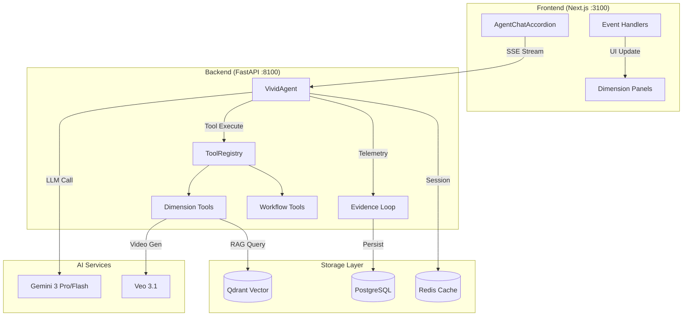
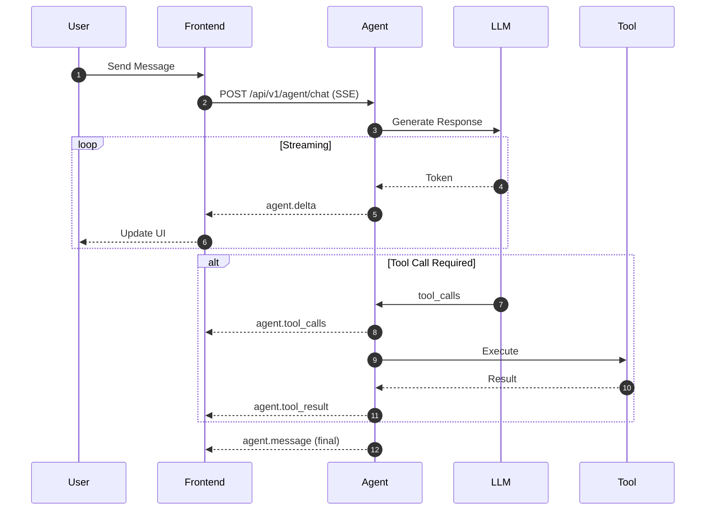
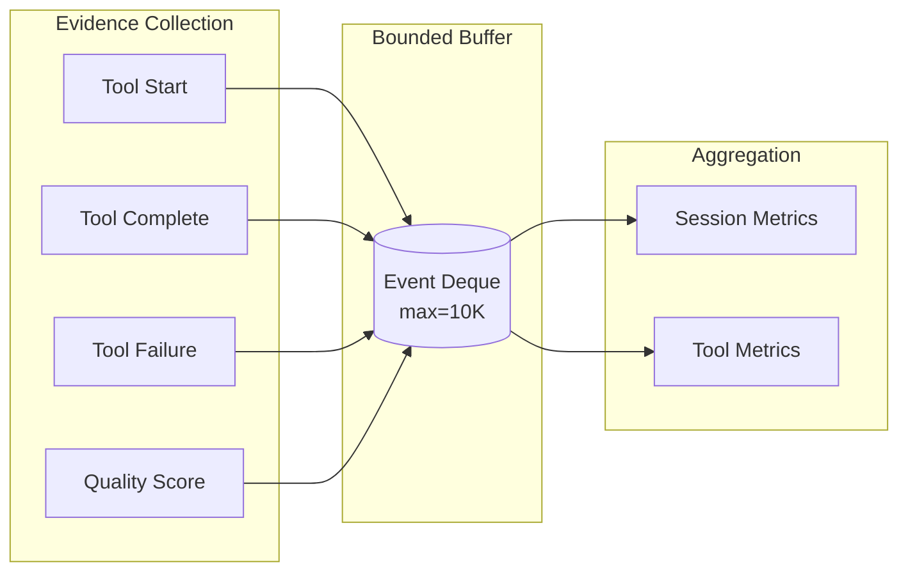
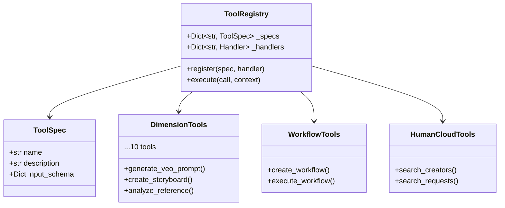

# Vivid Agent Architecture (Hardened v2)

> **Updated**: 2026-01-08
> **Version**: 2.0 (Hardened)

## 1. Overview

Vivid Agent ("Chokki") is a robust, event-driven AI agent designed for chat-based video production workflows. It orchestrates 10 different "Dimension" tools (miniapps) through a unified natural language interface.

### Core Philosophy
- **Explicit over Implicit**: All state changes and tool executions produce explicit events.
- **Resilience**: The system is designed to recover from network failures, tool timeouts, and LLM hallucinations.
- **Safety**: Strict thread safety (`RLock`), memory boundaries (`weakref`), and rate limiting.

### System Overview Diagram



---

## 2. Event & Evidence Loop

The agent operates on two primary loops:

### 2.1 Agent Event Loop

Handles real-time interaction with the user and the LLM.



**Event Types**:
| Event | Description | Frontend Handler |
|-------|-------------|------------------|
| `agent.delta` | Text token streaming | `handleDelta()` |
| `agent.tool_calls` | Tool invocation request | `handleToolCalls()` |
| `agent.tool_result` | Tool execution result | `handleToolResult()` |
| `agent.teaching_*` | Dimension tool events | `handleWorkflowStep()` |
| `agent.workflow_*` | Workflow orchestration | `handleWorkflow*()` |

### 2.2 Evidence Loop (`evidence_loop.py`)

A telemetry system that "observes" the agent to gather data for future RL/GA optimization.



- **Non-blocking**: Runs in background threads to avoid impacting user latency.
- **Thread Safe**: Protected by `RLock` to handle concurrent tool executions.
- **Bounded Buffer**: Stores only the last N events to prevent memory leaks.

---

## 3. Tool System Architecture

The agent does not execute code directly; it invokes "Tools" which are wrappers around business logic.

### 3.1 Registry Pattern



### 3.2 Dimension Tool Mapping

| Dimension | Tool Name | Capsule Key | Description |
|-----------|-----------|-------------|-------------|
| 1D | `generate_veo_prompt` | `teaching.prompt.generate` | Veo 프롬프트 생성 |
| 2D | `create_storyboard` | `teaching.storyboard.create` | 스토리보드 생성 |
| 3D | `generate_image_prompt` | `teaching.image.generate` | 이미지 프롬프트 |
| 4D | `analyze_reference` | `teaching.reference.analyze` | 레퍼런스 분석 |
| QC | `quality_check` | `dimension.quality.check` | 품질 검수 |
| AD | `aesthetic_direct` | `dimension.aesthetic.direct` | 미학 디렉터 |
| AI | `persona_analyze` | `dimension.persona.analyze` | 심연 해석 |
| VEO | `veo_generate` | `veo.video.generate` | 비디오 생성 |

### 3.3 Frontend Integration

- **AG-UI Standard Mapper**: Frontend unifies all tool events into a standard UI feedback model.
- **Dimension Mapping**: `agent.teaching_*` events are mapped to `handleWorkflowStep`, ensuring that when the agent runs a "Dimension Tool", the user sees a "Step" progress bar in the chat UI.

---

## 4. Workflow Execution Flow

```mermaid
flowchart TD
    Start([User: "영상 만들어줘"]) --> Intent[IntentRouter]
    Intent -->|WORKFLOW_REQUEST| Compose[compose_smart_workflow]
    Compose --> Lock{Session Lock?}
    Lock -->|Locked| Reject[Return Error]
    Lock -->|Free| Acquire[Acquire Lock]
    Acquire --> Loop[For each Dimension]
    
    subgraph Execution["Sequential Execution"]
        Loop --> Execute[execute_tool_by_key]
        Execute --> QC{Quality Check?}
        QC -->|Score < 70| Retry[Retry with Feedback]
        QC -->|Score >= 70| Next[Next Dimension]
        Next --> Loop
    end

    Loop -->|Complete| Release[Release Lock]
    Release --> Result([Return Workflow Result])
```

---

## 5. Hardening Measures (2026-01)

### 5.1 Memory Management
- **Weak References**: Event emitters use `weakref` to allow garbage collection of closed connections.
- **Periodic Scavenging**: Background tasks clean up stale sessions and evidence buffers.

### 5.2 Concurrency Control
- **Session Locking**: Critical sections (like Workflow Execution) acquire per-session locks to prevent race conditions.
- **Thread Safety**: All shared state in `EvidenceCollector` and `MemoryManager` is mutex-protected.

### 5.3 UX Safety
- **Timeout Handling**: Frontend enforces a 30s timeout on "Pending" tools to prevent UI freezes.
- **Intent Routing**: Improved regex/keyword matching for "Trend" and English queries to prevent fallback failures.
- **Hallucination Control**: System prompts explicitly forbid "Ghost Buttons" and enforce direct Tool usage.

---

## 6. File Reference

| Layer | Key Files | Description |
|-------|-----------|-------------|
| **Agent Core** | `agents/vivid_agent.py` | Main agent logic, LLM integration |
| **Tools** | `agents/dimension_tools.py` | 10 Dimension tool wrappers |
| **Tools** | `agents/workflow_tools.py` | Workflow orchestration |
| **Tools** | `agents/humancloud_tools.py` | Marketplace tools |
| **Telemetry** | `agents/evidence_loop.py` | Metrics collection |
| **Intent** | `agents/intent_router.py` | User intent classification |
| **Frontend** | `lib/agent-event-handlers.ts` | SSE event processing |
| **Frontend** | `components/AgentChatAccordion.tsx` | Chat UI component |

