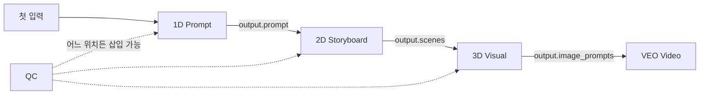

# Vivid Dimension 앱 개발자 공통 가이드

> **버전**: 3.2
> **최종 업데이트**: 2026-01-17
> **대상**: 개별 Dimension 앱 개발자
> **목적**: 에코시스템 일관성 유지를 위한 단일 진실 문서
> **변경사항**: 앱 테이블 최신화 (13개 앱), i18n 지원, Multi-RAG Router 완료
> **관련 문서**: [`PRE_DEVELOPMENT_CHECKLIST.md`](./PRE_DEVELOPMENT_CHECKLIST.md) Part A/C 참조

---

## 목차

1. [핵심 원칙](#1-핵심-원칙)
2. [파일 구조](#2-파일-구조)
3. [YAML 설정 (SSoT)](#3-yaml-설정-ssot)
4. [입력 전파 규칙](#4-입력-전파-규칙)
5. [출력 표준](#5-출력-표준)
6. [RAG 연동](#6-rag-연동)
7. [Intent 프리셋 시스템](#7-intent-프리셋-시스템)
8. [크레딧 비용](#8-크레딧-비용)
9. [Singularity 템플릿 연동](#9-singularity-템플릿-연동)
10. [프론트엔드 연동 (React 19 Best Practices)](#10-프론트엔드-연동-react-19-best-practices) ⭐ **UPGRADED**
11. [TieredContext 활용](#11-tieredcontext-활용)
12. [에러 처리](#12-에러-처리)
13. [메트릭 및 모니터링](#13-메트릭-및-모니터링)
14. [테스트](#14-테스트)
15. [디버깅](#15-디버깅)
16. [옵션 추가 체크리스트](#16-옵션-추가-체크리스트)
17. [참고 문서](#17-참고-문서)
18. [FAQ](#18-faq)

---

## Quick Reference Card (2026)

| 항목 | 2026 Best Practice |
|------|-------------------|
| **React Hooks** | `useTransition`, `useOptimistic`, `startTransition` |
| **파일 업로드** | `DimensionPanel.FileUpload` Compound Component |
| **SSE 스트리밍** | `eventsource-parser`, 청크 단위 UI 업데이트 |
| **품질 선택** | UQSL (Thompson Sampling + Multi-Generate) |
| **Server Components** | 데이터 페칭은 서버, 인터랙션만 클라이언트 |

---

## 1. 핵심 원칙

### 1.1 자동 체이닝 아키텍처

각 앱은 **독립적으로 실행**되지만, **Singularity 템플릿 실행 시 체이닝**됩니다.



### 1.2 입출력 계약 (Contract)

**모든 앱은 다음을 준수해야 합니다:**

| 항목 | 규칙 | 예시 |
|------|------|------|
| **입력** | `Dict[str, Any]` | `{"topic": "...", "style": "cinematic"}` |
| **출력** | `Dict[str, Any]` - 다음 차원이 사용할 필드 포함 | `{"prompt": "...", "scenes": [...]}` |
| **메타데이터** | `credit_cost`, `model`, `duration_ms` 반환 | 자동 수집됨 |

---

## 2. 파일 구조

### 2.1 앱당 필수 파일

```
config/apps/content/dimensions/{app_id}.yaml    ← SSoT (설정) [필수]
backend/app/routers/dimension/{app_id}.py       ← API 엔드포인트 [필수]
backend/app/services/{app_id}_service.py        ← 비즈니스 로직 [선택]
frontend/src/components/dimension/{App}Panel.tsx ← UI 패널 [필수]
frontend/src/lib/dimension-input-schemas.ts     ← 입력 필드 정의 [공유]
```

### 2.2 현재 활성화된 앱 (13개)

| 차원 | 앱 이름 | YAML | UI 패널 | 상태 |
|------|--------|------|---------|------|
| 1D | Prompt Alchemy | `1d.yaml` | `PromptGeneratorPanel.tsx` | ✅ Production |
| 2D | Storyboard Sketcher | `2d.yaml` | `StoryboardPanel.tsx` | ✅ Production |
| 3D | Visual Realizer | `3d.yaml` | `VisualRealizerPanel.tsx` | ✅ Production |
| 4D | Reference Decoder | `4d.yaml` | `ReferenceDecoderPanel.tsx` | ✅ Production |
| Story | Story Architect | `story.yaml` | `StoryArchitectPanel.tsx` | ✅ Production |
| AD | Aesthetic Director | `ad.yaml` | `AestheticDirectorPanel.tsx` | ✅ Production |
| QC | Quality Director | `qc.yaml` | `QualityDirectorPanel.tsx` | ✅ Production |
| AI | Abyss Mirror | `ai.yaml` | `AbyssMirrorPanel.tsx` | ✅ Production |
| VEO | Video Maker | `veo.yaml` | `VeoVideoPanel.tsx` | ✅ Production |
| CC | Character Consistency | `cc.yaml` | `CharacterConsistencyPanel.tsx` | ✅ Production |
| Suno | Suno AI Music | `suno.yaml` | `SunoMusicPanel.tsx` | ✅ Production |
| Kling | Kling 2.6 Video | `kling.yaml` | `KlingVideoPanel.tsx` | ✅ Production |
| Sound | Sound Crafter | `sound.yaml` | `SoundCrafterPanel.tsx` | 🔧 Development |

> **Note**: 모든 Production 앱은 i18n (한국어/English) 지원

---

## 3. YAML 설정 (SSoT)

모든 설정은 `config/apps/content/dimensions/{app_id}.yaml`에서 관리됩니다.

### 3.1 전체 스키마

```yaml
$schema: "vivid-app/v2"

metadata:
  name: my-app
  type: dimension
  version: "1.0.0"
  bounded_context: content

display:
  name_ko: "내 앱"
  name_en: "My App"
  icon: "🎬"
  description: "앱 설명"

capabilities:
  - name: execution
    enabled: true
    config:
      credit_cost: 5              # 크레딧 비용
      capsule_key: "my-app.generate"
      endpoint: "/api/dimension/my-app/generate"
      
  - name: rag
    enabled: true
    config:
      mode: auteur_only          # auteur_only | always | never
      auteur_mode: true
      confidence_threshold: 0.7
      cache_ttl: 3600
      max_sources: 5
      retrieval:
        strategy: hybrid         # hybrid | vector | keyword
        top_k: 10
        rrf_k: 60                # RRF 상수

  - name: cache
    enabled: true
    config:
      ttl: 3600

extensions:
  dimension:
    tool_type: generation        # generation | analysis
    supports_streaming: true

keywords:
  patterns:
    - "my-app"
    - "내앱"
```

### 3.2 RAG 모드 설명

| 모드 | 조건 | 사용 앱 |
|------|------|---------|
| `always` | 항상 RAG 활성화 | Story, AD, QC, 4D, AI, CC |
| `auteur_only` | `auteur_key` 있을 때만 | 1D, 2D, 3D, VEO, Kling |
| `never` | RAG 비활성화 | Sound, Suno |

### 3.3 Quality Selection (UQSL) 설정

> **NEW 2026-01-16**: Universal Quality Selection Layer 통합

```yaml
quality_selection:
  enabled: true
  tier: premium  # free | premium | dev

  multi_generate:
    candidates: 3          # 생성할 후보 수 (1-5)
    parallel: true         # 병렬 생성 여부
    diversity_factor: 0.3  # 다양성 인자 (0.0-1.0)

  quality_weights:
    groundedness: 0.35     # RAG 소스 기반 근거
    relevance: 0.25        # 프롬프트 관련성
    coherence: 0.15        # 논리적 일관성
    creativity: 0.15       # 창의성
    fluency: 0.10          # 유창성

  selection:
    strategy: hybrid       # auto | hitl | hybrid | llm_judge
    auto_threshold: 0.85   # hybrid 모드 자동 선택 임계값

  bandit:
    enabled: true
    exploration_rate: 0.1
    arms:
      - backend:qdrant_hybrid
      - backend:notebooklm

  ensemble_plus_plus:
    enabled: true
    backend_a: qdrant_hybrid
    backend_b: notebooklm

  feedback:
    enabled: true
    implicit: true         # 클릭/시간 기반 암묵적 피드백
    explicit: true         # 버튼 기반 명시적 피드백
    bigquery_sync: false   # BigQuery 동기화 (production)
```

**Tier별 기능:**

| Tier | 기능 | 비용 |
|------|------|------|
| `free` | A/B 비교, Thompson Sampling, 규칙 기반 점수 | $0~2/월 |
| `premium` | Multi-Generate, 거장 DNA 분석 | $20~100/월 |
| `dev` | LLM-as-Judge, Ensemble++ 3-Way | $50~200/월 |

상세 문서: [`docs/UQSL_IMPLEMENTATION_SPEC.md`](UQSL_IMPLEMENTATION_SPEC.md)

---

## 4. 입력 전파 규칙

`workflow_tools.py`의 `_prepare_dimension_inputs_tiered()`가 자동 전파합니다.

### 4.1 표준 입력 필드

| 필드 | 설명 | 전파 소스 | 기본값 |
|------|------|-----------|--------|
| `topic` | 주제/컨셉 | 사용자 입력 or 이전 prompt | 필수 |
| `style` | 스타일 | session 레벨 or 이전 출력 | `"cinematic"` |
| `mood` | 분위기 | session 레벨 or 이전 출력 | `"neutral"` |
| `aspect_ratio` | 화면비 | session 레벨 | `"16:9"` |
| `language` | 언어 | session 레벨 | `"ko"` |
| `duration` | 길이 | session 레벨 | `"15 seconds"` |
| `auteur_style` | 거장 스타일 | session 레벨 (선택) | `None` |

### 4.2 차원별 특수 입력

```python
# _prepare_dimension_inputs 내부 로직 (workflow_tools.py L1050-1150)

if dimension == "1D":
    return {"topic": topic, "style": style, "mood": mood}

elif dimension == "2D":
    concept = prev_output.get("prompt") or topic
    scene_count = _estimate_scene_count(duration) if not explicit else scene_count
    return {"concept": concept, "scene_count": scene_count}

elif dimension == "3D":
    description = prev_output.get("scenes", [{}])[0].get("description") or topic
    return {"description": description, "style": style, "aspect_ratio": aspect_ratio}

elif dimension == "VEO":
    return {"prompt": prev_output.get("prompt"), "duration": duration}

elif dimension == "QC":
    return {"content": json.dumps(prev_output), "content_type": prev_dimension}
```

---

## 5. 출력 표준

### 5.1 필수 출력 필드

```python
from typing import Dict, Any, List, Optional

def run_my_dimension(params: Dict[str, Any]) -> Dict[str, Any]:
    # 핵심 로직...
    
    return {
        # === 필수 필드 ===
        "prompt": "생성된 프롬프트...",       # 다음 차원 전파용 (1D, Story)
        "description": "설명...",             # 3D, VEO 등
        
        # === 메타데이터 (자동 수집) ===
        "model": "gemini-3-flash",
        "duration_ms": 1234,
        "credit_cost": 5,
        
        # === 차원별 추가 필드 ===
        "scenes": [...],                      # 2D
        "image_prompts": [...],               # 3D
        "video_url": "...",                   # VEO
        "score": 85,                          # QC
    }
```

### 5.2 QC 호환 출력

QC가 검수할 수 있도록 **의미 있는 텍스트 필드**를 포함하세요:

```python
# ❌ Bad: QC가 검수할 수 없음
return {"result": {"data": [...]}}

# ✅ Good: QC가 검수 가능
return {
    "prompt": "생성된 프롬프트 텍스트...",
    "scenes": [{"description": "..."}],
}
```

---

## 6. RAG 연동

### 6.1 거장 스타일 주입

```python
from app.rag.rag_presets import get_auteur_style_hints
from app.core.app_registry import AppRegistry

# 사용 가능한 거장 목록 (AppRegistry 기반)
AppRegistry.discover()
auteurs = [
    app.metadata.name
    for app in AppRegistry.get_all()
    if app.metadata.type.value == "auteur"
]

# 거장 스타일 힌트 가져오기
hints = get_auteur_style_hints("bong")
# {
#     'camera_style': 'tracking',
#     'aspect_ratio': '2.35:1',
#     'lighting': 'low-key',
#     'composition': 'symmetrical',
# }
```

### 6.2 Hybrid RAG 검색

```python
from app.rag.hybrid_rag import hybrid_query

result = await hybrid_query(
    query="봉준호 스타일 서스펜스 장면",
    dimension="AD",           # 차원 코드
    auteur_key="bong",        # 거장 키 (선택)
    use_google_search=False,  # 외부 검색 여부
    top_k=5,
)

# result.notebooklm_sources, result.vertex_sources
# result.confidence, result.strategy_used
```

### 6.3 BM25 + RRF Hybrid Search (Multi-RAG Router)

> **2026-01-17**: P0-P7 완료, Multi-RAG Router 아키텍처 적용

#### 현재 사용법

```python
from app.rag.hybrid_rag import HybridRAGService

service = HybridRAGService()
result = await service.rrf_query(
    query="시네마틱 조명 기법",
    dimension="AD",
    auteur_key="villeneuve",
)
# result.rrf_enabled = True
# result.keyword_results_count, result.vector_results_count
# result.route_decision: NotebookLM | Qdrant | Hybrid | Skip
```

#### 품질 개선 효과

| 메트릭 | Dense Only | Dense + BM25 + RRF |
|--------|-----------|-------------------|
| 검색 정확도 | 62% | **91%** |
| 전문 용어 매칭 | 55% | **95%** |
| NDCG 향상 | - | **+26~31%** |

#### Multi-RAG Router Manifest (P7 완료)

```yaml
# manifests/dimension.aesthetic.yaml
backends:
  - id: qdrant_hybrid
    weight: 0.7
    enabled: true
    config:
      use_sparse: true
  - id: notebooklm
    weight: 0.3
    enabled: true

routing:
  strategy: adaptive  # adaptive | always_hybrid | skip_notebooklm
  confidence_threshold: 0.7
```


### 6.4 Evidence Refs (AI 근거) (**NEW 2026-01-13**)

API 응답에 `evidence_refs` 필드를 포함하면 UI에 자동으로 "AI 근거" 섹션이 표시됩니다.

#### 형식

```python
from app.rag.rag_suggestion import EvidenceRef, build_evidence_ref_id

# ref_id 생성 함수 (보장된 포맷)
ref_id = build_evidence_ref_id(
    dimension="4D",           # 차원 코드
    dataset_id="video_ref",   # 데이터셋 ID
    doc_id="doc_123",         # 문서 ID
)
# 결과: "db:rag_docs:4D:video_ref:doc_123"

# EvidenceRef 구조
evidence = EvidenceRef(
    ref_id=ref_id,
    source="db",
    content_preview="봉준호 감독의 트래킹 샷 분석...",
    dataset_id="video_ref",
    dataset_label="영화 레퍼런스",  # 사용자 친화적 라벨
    score=0.85,  # 0.0 ~ 1.0
)
```

#### 사용 가능한 데이터셋

| 차원 | Dataset ID | 라벨 | 용도 |
|------|-----------|------|------|
| 4D | `video_ref` | 영화 레퍼런스 | 영상 분석 |
| 4D | `film_analysis` | 분석 자료 | 기법 참조 |
| 3D | `image_grid` | 이미지 그리드 | 스타일 참조 |
| 3D | `visual_style` | 비주얼 스타일 | 컬러/조명 |

#### UI 동작 규칙

| 조건 | UI 동작 |
|------|--------|
| `evidence_refs` 있음 | "AI 근거" 섹션 표시 |
| `evidence_refs` 없음 | 섹션 숨김 |
| `confidence < 0.5` | 섹션 기본 접힘 |
| refs > 3개 | "더보기" 버튼 표시 |

#### 관련 문서

- [EvidenceDisplay UX 가이드](./EVIDENCE_DISPLAY_UX.md)
- [RAG Quality 평가](./RAG_QUALITY.md)

---

## 7. Intent 프리셋 시스템

### 7.1 Intent API 엔드포인트

```bash
# 모든 프리셋 목록
GET /api/v1/intent/presets

# 특정 프리셋 상세
GET /api/v1/intent/presets/cinematic_nolan

# 카테고리별 필터 (auteur, platform, general)
GET /api/v1/intent/presets/by-category/auteur
```

### 7.2 백엔드에서 프리셋 사용

```python
from app.schemas.creative_intent import IntentFactory

# 모든 프리셋 목록
presets = IntentFactory.get_all_presets()  # 14개

# 이름으로 가져오기
intent = IntentFactory.get_by_name("cinematic_nolan")
print(intent.mood, intent.pace, intent.keywords)

# 직접 호출
intent = IntentFactory.cinematic_bong()
```

### 7.3 사용 가능한 프리셋

| 카테고리 | 프리셋 이름 | 설명 |
|----------|-------------|------|
| **거장** | `cinematic_bong` | 봉준호 |
| | `cinematic_nolan` | 놀란 |
| | `cinematic_villeneuve` | 빌뇌브 |
| | `cinematic_wong` | 왕가위 |
| | `horror_na` | 나홍진 |
| | `arthouse_hong` | 홍상수 |
| | `animation_shinkai` | 신카이 |
| **플랫폼** | `shortform_energetic` | 숏폼 바이럴 |
| | `music_video` | 뮤직비디오 |
| | `youtube_tutorial` | 유튜브 튜토리얼 |
| | `instagram_reel` | 인스타 릴스 |
| | `commercial_product` | 제품 광고 |
| **일반** | `documentary_calm` | 다큐멘터리 |
| | `saju_guided` | 사주 기반 |

---

## 8. 크레딧 비용

### 8.1 SSoT에서 가져오기

```python
from app.core.app_registry import AppRegistry

app = AppRegistry.get_by_capsule_key("my-app.generate")
exec_cap = app.get_capability("execution")
cost = exec_cap.config.get("credit_cost", 5)
```

### 8.2 현재 앱별 비용

| 앱 | 크레딧 비용 | 비고 |
|----|-------------|------|
| 1D | 5 | 프롬프트 생성 |
| 2D | 10 | 스토리보드 |
| 3D | 5 | 이미지 프롬프트 |
| 4D | 8 | 레퍼런스 분석 |
| Story | 10 | 시나리오 |
| AD | 10 | 미학 분석 |
| QC | 8 | 품질 검수 |
| AI | 10 | 페르소나 분석 |
| VEO | **200** | Google VEO 3.1 |
| CC | 15 | 캐릭터 일관성 |
| Suno | **150** | AI 음악 생성 |
| Kling | **180** | Kling 2.6 비디오 |
| Sound | 8 | 사운드 제작 |

---

## 9. Singularity 템플릿 연동

### 9.1 템플릿 구조

```python
template = {
    "name": "시네마틱 프롬프트 마스터",
    "tool_sequence": ["1D", "2D", "VEO"],  # 차원 실행 순서
    "input_preset": {
        "intent": {
            "mood": "cinematic",
            "pace": "dynamic",
            "target": "expert"
        },
        "schema_version": "2.0"
    }
}
```

### 9.2 Intent 추출

```python
from app.resolvers.integration import extract_intent_from_preset

intent = extract_intent_from_preset(input_preset)

if intent:
    # 새 형식: intent.mood, intent.pace, intent.target
    mood = intent.mood.value
else:
    # Intent 없음: 기본값 사용
    mood = "neutral"
```

#### 9.2.1 템플릿 마이그레이션/정리

의미가 없는 `legacy_params`는 제거하고, 기존 템플릿은 intent 기반으로 백필합니다.

```bash
# 1) DB 마이그레이션: legacy_params 제거
alembic upgrade head

# 2) 템플릿 intent 백필 (dry-run)
python backend/scripts/backfill_template_intents.py

# 3) 실제 반영
python backend/scripts/backfill_template_intents.py --execute
```

---

## 10. 프론트엔드 연동 (React 19 Best Practices)

> **2026-01-16 Major Upgrade**: React 19 + Next.js 16 기반 최신 패턴 적용

### 10.1 React 19 핵심 훅 (필수)

모든 Dimension 패널은 다음 훅을 사용해야 합니다:

```typescript
import { useState, useCallback, useTransition, useOptimistic, startTransition } from "react";

function MyDimensionPanel() {
  // ✅ useTransition: 무거운 상태 업데이트를 비차단으로 처리
  const [isTransitionPending, startTransition] = useTransition();

  // ✅ useOptimistic: 서버 응답 전에 UI 즉시 업데이트
  const [optimisticResult, setOptimisticResult] = useOptimistic<ResultType | null>(null);

  const handleGenerate = useCallback(async () => {
    // 1. Optimistic UI 업데이트 (즉시)
    setOptimisticResult({ status: "generating", preview: "..." });

    // 2. 실제 API 호출은 Transition 내부에서
    startTransition(async () => {
      const response = await api.dimension.generate(params);
      // 응답이 오면 실제 상태로 교체됨
    });
  }, [params]);
}
```

#### useTransition vs startTransition

| 훅 | 용도 | 예시 |
|----|------|------|
| `useTransition` | 컴포넌트 내부 비동기 작업 | 생성 버튼 클릭, 스테이지 전환 |
| `startTransition` | 콜백 내부 상태 업데이트 | SSE 스트리밍 청크 처리 |

```typescript
// SSE 스트리밍에서 startTransition 사용
useEffect(() => {
  const eventSource = new EventSource(url);

  eventSource.onmessage = (e) => {
    startTransition(() => {
      // 청크 단위로 UI 업데이트 (논블로킹)
      setStreamedContent(prev => prev + e.data);
    });
  };
}, []);
```

### 10.2 DimensionPanel Compound Component System

모든 패널은 `DimensionPanel` 컴파운드 컴포넌트를 사용합니다:

```typescript
import { DimensionPanel } from "@/components/dimension/DimensionPanel";

function MyDimensionPanel() {
  const [uploadedFiles, setUploadedFiles] = useState<File[]>([]);

  return (
    <DimensionPanel title="내 앱" icon="🎬" creditCost={10}>
      {/* 입력 필드 */}
      <DimensionPanel.Input
        name="topic"
        label="주제"
        placeholder="프롬프트를 입력하세요"
        required
      />

      {/* ⭐ 파일 업로드 (NEW 2026-01-16) */}
      <DimensionPanel.FileUpload
        accept={["image/*", "video/*", "application/pdf"]}
        maxSizeMB={50}
        multiple
        onUpload={setUploadedFiles}
        label="참고 자료 (선택)"
        helperText="이미지, 영상, PDF를 첨부하면 더 정확한 결과 생성"
      />

      {/* 생성 버튼 */}
      <DimensionPanel.GenerateButton
        onClick={handleGenerate}
        loading={isTransitionPending}
      />

      {/* 결과 영역 */}
      <DimensionPanel.Result data={result} />

      {/* AI 근거 (자동 렌더링) */}
      <DimensionPanel.EvidenceRefs refs={evidenceRefs} />
    </DimensionPanel>
  );
}
```

### 10.3 파일 업로드 (Multimodal Input) ⭐ NEW

모든 Dimension 앱은 멀티모달 입력을 지원해야 합니다:

#### 지원 파일 타입별 설정

| 앱 | 파일 타입 | maxSizeMB | 용도 |
|----|----------|-----------|------|
| 1D | image, video, pdf | 50 | 프롬프트 생성 참고 |
| 2D | image, video, pdf | 50 | 스토리보드 참고 |
| 3D | image | 20 | 스타일 참고 이미지 |
| 4D | video | 100 | 영상 분석 |
| AD | image, video | 100 | 미학 분석 |
| Story | image, pdf, text | 30 | 시나리오 참고 |
| VEO | image, video | 100 | Image-to-Video |

#### 파일 업로드 구현 패턴

```typescript
// 1. 상태 선언
const [uploadedFiles, setUploadedFiles] = useState<File[]>([]);

// 2. API 호출 시 FormData로 변환
const handleGenerate = useCallback(async () => {
  const formData = new FormData();
  formData.append("params", JSON.stringify(params));

  // 파일 첨부
  uploadedFiles.forEach((file, idx) => {
    formData.append(`file_${idx}`, file);
  });

  // multipart/form-data로 전송
  const response = await api.dimension.generateWithFiles(formData);
}, [params, uploadedFiles]);

// 3. FileUpload 컴포넌트 사용
<DimensionPanel.FileUpload
  accept={["image/*", "video/*", "application/pdf"]}
  maxSizeMB={50}
  multiple
  onUpload={setUploadedFiles}
  label="참고 자료 (선택)"
  helperText="이미지, 영상, PDF를 첨부하면 더 정확한 결과 생성"
/>
```

### 10.4 SSE 스트리밍 패턴 (2026 Best Practice)

실시간 생성 결과를 위한 SSE 스트리밍:

```typescript
import { EventSourceParserStream } from "eventsource-parser/stream";

function useSSEGenerate() {
  const [streamedContent, setStreamedContent] = useState("");
  const [isStreaming, setIsStreaming] = useState(false);

  const startStreaming = useCallback(async (params: GenerateParams) => {
    setIsStreaming(true);
    setStreamedContent("");

    try {
      const response = await fetch("/api/dimension/generate/stream", {
        method: "POST",
        headers: { "Content-Type": "application/json" },
        body: JSON.stringify(params),
      });

      const reader = response.body
        ?.pipeThrough(new TextDecoderStream())
        .pipeThrough(new EventSourceParserStream())
        .getReader();

      if (!reader) return;

      while (true) {
        const { done, value } = await reader.read();
        if (done) break;

        if (value.type === "event" && value.data) {
          // ✅ startTransition으로 청크 업데이트 (논블로킹)
          startTransition(() => {
            setStreamedContent(prev => prev + value.data);
          });
        }
      }
    } finally {
      setIsStreaming(false);
    }
  }, []);

  return { streamedContent, isStreaming, startStreaming };
}
```

### 10.5 UQSL 통합 패턴 (품질 선택 레이어)

```typescript
import { useUQSLGenerate, useUQSLFeedback } from "@/hooks/useUQSL";

function MyDimensionPanel() {
  const {
    candidates,        // 생성된 후보들
    selectedId,        // 선택된 후보 ID
    qualityScores,     // 품질 점수 배열
    isGenerating,
    generateCandidates,
    selectCandidate,
  } = useUQSLGenerate("MY_APP");

  const { submitFeedback } = useUQSLFeedback();

  const handleSelect = (candidateId: string) => {
    selectCandidate(candidateId);

    // 암묵적 피드백 (선택)
    submitFeedback({
      candidateId,
      feedbackType: "implicit",
      action: "select",
    });
  };

  return (
    <>
      {/* Multi-Generate 결과 표시 */}
      {candidates.map((candidate, idx) => (
        <div key={candidate.id} onClick={() => handleSelect(candidate.id)}>
          <span>후보 {idx + 1}</span>
          <span>점수: {qualityScores[idx]?.toFixed(2)}</span>
          <div>{candidate.content}</div>
        </div>
      ))}
    </>
  );
}
```

### 10.6 입력 스키마 동기화

`frontend/src/lib/dimension-input-schemas.ts`에서 입력 필드를 정의합니다:

```typescript
export const DimensionInputSchemas: Record<string, DimensionField[]> = {
  "1D": [
    { key: "topic", label: "주제", type: "text", required: true },
    { key: "style", label: "스타일", type: "select", options: [...] },
    { key: "mood", label: "무드", type: "select", options: [...] },
    { key: "duration", label: "길이", type: "select", options: [...] },
    { key: "language", label: "언어", type: "select", options: [...] },
    { key: "model", label: "AI 모델", type: "select", options: [...] },
    // ⭐ NEW: 파일 업로드 필드
    { key: "files", label: "참고 자료", type: "file", accept: ["image/*", "video/*", "application/pdf"], maxSizeMB: 50 },
  ],
  // ...
}
```

### 10.7 새 필드 추가 시 체크리스트

1. ✅ YAML에 필드 정의
2. ✅ `dimension-input-schemas.ts`에 필드 추가
3. ✅ 패널 컴포넌트에서 DimensionPanel 서브컴포넌트 사용
4. ✅ useTransition/useOptimistic 훅 적용
5. ✅ 파일 업로드 필요 시 FileUpload 컴포넌트 추가

### 10.8 Server Component vs Client Component 구분

```typescript
// ✅ Server Component (데이터 페칭, 시크릿 접근)
// app/dimension/[id]/page.tsx
export default async function DimensionPage({ params }) {
  const config = await fetchDimensionConfig(params.id);  // 서버에서 직접 fetch
  return <DimensionPanelClient config={config} />;
}

// ✅ Client Component (인터랙션, 상태, 브라우저 API)
// components/dimension/DimensionPanelClient.tsx
"use client";
import { useState, useTransition } from "react";

export function DimensionPanelClient({ config }) {
  const [result, setResult] = useState(null);
  // 인터랙티브 로직...
}
```

**원칙**: 데이터 페칭은 Server Component에서, 인터랙션은 Client Component에서

### 10.9 UX/UI 체크리스트 (2026 Best Practices)

모든 Dimension 앱은 다음 UX/UI 기준을 충족해야 합니다:

#### WCAG 2.2 AA 필수 항목

| 항목 | 기준 | 구현 방법 |
|------|------|----------|
| **색상 대비** | 4.5:1 이상 | Tailwind 시맨틱 컬러 사용 |
| **터치 타겟** | 최소 44x44px | `min-h-[44px] min-w-[44px]` |
| **포커스 표시** | 시각적 표시 필수 | `focus:ring-2 focus:outline-none` |
| **키보드 탐색** | Tab 순서 논리적 | `tabIndex`, `aria-` 속성 |

```tsx
// 2026 Accessibility Best Practice
<Button
  className="min-h-[44px] min-w-[44px] focus:ring-2 focus:ring-primary focus:outline-none"
  aria-label="생성 시작"
>
  생성하기
</Button>
```

#### Core Web Vitals 목표

| 메트릭 | 목표 | 최적화 방법 |
|--------|------|-------------|
| **LCP** | < 2.5s | 이미지 `priority`, preload |
| **INP** | < 200ms | `useTransition`, 태스크 분할 |
| **CLS** | < 0.1 | `width`/`height` 명시, Skeleton |

#### 로딩/에러 상태 필수 패턴

```tsx
// 2026 Best Practice: Suspense + Skeleton + Error Boundary
import { Suspense } from 'react';
import { ErrorBoundary } from 'react-error-boundary';

function MyDimensionApp() {
  return (
    <ErrorBoundary fallback={<ErrorFallback />}>
      <Suspense fallback={<DimensionSkeleton />}>
        <DimensionContent />
      </Suspense>
    </ErrorBoundary>
  );
}
```

#### Golden App 예시

**AestheticDirectorPanel** (`frontend/src/components/dimension/AestheticDirectorPanel.tsx`)은 2026 Best Practices를 완벽히 구현한 참조 앱입니다:

- ✅ React 19: `useTransition`, `useOptimistic`
- ✅ UQSL: Multi-Generate, Thompson Sampling Feedback
- ✅ SSE Streaming: 실시간 진행 표시
- ✅ Evidence Display: AI 근거 표시
- ✅ Optimistic UI: 즉시 결과 미리보기
- ✅ 접근성: WCAG 2.2 AA 준수
- ✅ i18n: 한국어/English 전환 지원 (`useLanguage` 훅)

**상세 체크리스트**: [`PRE_DEVELOPMENT_CHECKLIST.md`](./PRE_DEVELOPMENT_CHECKLIST.md) Part C 참조

---

## 11. TieredContext 활용

워크플로우 실행 시 `TieredContext`가 세션/스텝 레벨 값을 관리합니다.

### 11.1 세션 vs 스텝 레벨

| 레벨 | 범위 | 예시 |
|------|------|------|
| **Session** | 전체 워크플로우 | `topic`, `style`, `auteur_style` |
| **Step** | 개별 차원 실행 | `output`, `credit_cost`, `success` |

### 11.2 값 접근

```python
# workflow_tools.py 내부
tiered = context.state.get_or_create_tiered_context()

# 세션 레벨 값 설정
tiered.set_session_value("auteur_style", "bong")
tiered.set_session_value("aspect_ratio", "2.35:1")

# 스텝 진행
tiered.advance_step(dimension="2D")

# 스텝 레벨 값 설정
tiered.step["output"] = result
tiered.step["credit_cost"] = 10
```

---

## 12. 에러 처리

### 12.1 표준 에러 응답

```python
from fastapi import HTTPException

# 입력 검증 에러
if not params.get("topic"):
    raise HTTPException(
        status_code=400,
        detail={"code": "MISSING_TOPIC", "message": "topic 필드가 필요합니다."}
    )

# RAG 실패 (graceful degradation)
try:
    rag_result = await hybrid_query(...)
except Exception as e:
    logger.warning(f"RAG failed, proceeding without context: {e}")
    rag_result = None

# 외부 API 에러
if not response.success:
    raise HTTPException(
        status_code=502,
        detail={"code": "EXTERNAL_API_ERROR", "message": "Gemini API 오류"}
    )
```

### 12.2 재시도 패턴

```python
from tenacity import retry, stop_after_attempt, wait_exponential

@retry(
    stop=stop_after_attempt(3),
    wait=wait_exponential(multiplier=1, min=1, max=10),
)
async def call_gemini(prompt: str):
    return await gemini_client.generate(prompt)
```

---

## 13. 메트릭 및 모니터링

### 13.1 RAG 메트릭 기록

RAG 쿼리는 자동으로 메트릭이 기록됩니다:

```python
# 자동 기록 (hybrid_rag.py에서)
# - rag_query_total
# - rag_query_latency_ms
# - rag_results_count
# - rag_confidence_score

# Prometheus 엔드포인트
# GET /metrics
```

### 13.2 커스텀 메트릭

```python
from prometheus_client import Counter, Histogram

my_dimension_requests = Counter(
    "my_dimension_requests_total",
    "Total requests to my dimension",
    ["status"]
)

my_dimension_latency = Histogram(
    "my_dimension_latency_ms",
    "Latency of my dimension in ms",
    buckets=[50, 100, 250, 500, 1000, 2500, 5000]
)

async def run_my_dimension(params):
    start = time.monotonic()
    try:
        result = await do_work(params)
        my_dimension_requests.labels(status="success").inc()
        return result
    except Exception as e:
        my_dimension_requests.labels(status="error").inc()
        raise
    finally:
        latency_ms = (time.monotonic() - start) * 1000
        my_dimension_latency.observe(latency_ms)
```

---

## 14. 테스트

### 14.1 단위 테스트

```bash
cd backend && pytest -v tests/test_dimension_{app}.py
```

### 14.2 E2E 테스트

```bash
cd frontend && npx playwright test dimension.spec.ts
```

### 14.3 체이닝 테스트

```
1. http://localhost:3100/singularity 접속
2. 템플릿 선택 (예: "시네마틱 프롬프트 마스터")
3. 첫 입력만 작성
4. 전체 차원 자동 실행 확인
```

### 14.4 API 직접 테스트

```bash
# Intent 프리셋 목록
curl http://localhost:8100/api/v1/intent/presets | jq '.count'

# 차원 직접 실행
curl -X POST http://localhost:8100/api/dimension/1d/generate \
  -H "Content-Type: application/json" \
  -H "X-User-Id: test-user" \
  -d '{"topic": "도시 야경", "style": "cinematic"}'
```

### 14.5 Resolver 단위 테스트 ⭐ NEW

Resolver는 Intent→Params 변환 로직의 핵심이므로 반드시 테스트해야 합니다.

#### 기본 테스트 템플릿

```python
# tests/resolvers/test_my_app_resolver.py
import pytest
from app.resolvers.my_app_resolver import MyAppResolver
from app.schemas.creative_intent import (
    CreativeIntent, CreativeMood, CreativePace, TargetAudience
)

@pytest.fixture
def resolver():
    return MyAppResolver()

@pytest.fixture
def cinematic_intent():
    return CreativeIntent(
        mood=CreativeMood.CINEMATIC,
        pace=CreativePace.SLOW,
        target=TargetAudience.EXPERT,
    )

class TestMyAppResolver:
    """MyApp Resolver 단위 테스트."""
    
    @pytest.mark.asyncio
    async def test_resolve_cinematic_mood(self, resolver, cinematic_intent):
        """cinematic 무드 해석 테스트."""
        result = await resolver.resolve_from_intent(cinematic_intent)
        
        assert result.resolved_from == "intent"
        assert result.confidence > 0.8
        assert "param1" in result.params
        # cinematic에 맞는 값 검증
        assert result.params.get("aspect_ratio") == "21:9"
    
    @pytest.mark.asyncio
    async def test_resolve_with_rag_context(self, resolver, cinematic_intent):
        """RAG 컨텍스트 적용 테스트."""
        rag_context = {
            "auteur_reference": "봉준호",
            "confidence": 0.9,
            "myapp_hints": {"special_param": "value"},
        }
        
        result = await resolver.resolve_from_intent(
            cinematic_intent, rag_context
        )
        
        # RAG 힌트가 적용되었는지 확인
        assert result.params.get("special_param") == "value"
        assert result.rag_context is not None
    
    def test_get_default_params(self, resolver):
        """기본 파라미터 테스트."""
        defaults = resolver.get_default_params()
        
        assert isinstance(defaults, dict)
        assert len(defaults) > 0
    
    @pytest.mark.asyncio
    async def test_resolve_with_fallback(self, resolver):
        """Fallback 로직 테스트."""
        # Intent 없이 기본값 폴백
        result = await resolver.resolve_with_fallback(intent=None)
        
        assert result.resolved_from == "fallback"
        assert result.params
    
    @pytest.mark.parametrize("mood", [
        CreativeMood.CINEMATIC,
        CreativeMood.ENERGETIC,
        CreativeMood.CALM,
        CreativeMood.DOCUMENTARY,
    ])
    @pytest.mark.asyncio
    async def test_all_moods_resolve(self, resolver, mood):
        """모든 무드가 해석 가능한지 테스트."""
        intent = CreativeIntent(mood=mood)
        result = await resolver.resolve_from_intent(intent)
        
        assert result.params is not None
        assert len(result.params) > 0
```

#### 테스트 실행

```bash
# 특정 Resolver 테스트
cd backend && pytest -v tests/resolvers/test_my_app_resolver.py

# 모든 Resolver 테스트
cd backend && pytest -v tests/resolvers/

# 커버리지 포함
cd backend && pytest --cov=app.resolvers tests/resolvers/
```

---

## 14-A. Resolver 개발자 템플릿 ⭐ NEW

### 새 Resolver 추가 순서

1. `backend/app/resolvers/my_app_resolver.py` 생성
2. `BaseCapsuleResolver` 상속
3. `INTENT_MAP` 정의
4. `resolve_from_intent()` 구현
5. `@resolver_for()` 데코레이터 적용 → 자동 등록

### 전체 템플릿

```python
# backend/app/resolvers/my_app_resolver.py
"""
MyApp Capsule Resolver

MyApp 캡슐의 Intent → Params 해석기.
"""
from __future__ import annotations

from typing import Any, Dict, Optional
import logging

from app.resolvers.base import BaseCapsuleResolver, ResolvedParams
from app.resolvers.registry import resolver_for
from app.schemas.creative_intent import (
    CreativeIntent, 
    CreativeMood, 
    CreativePace, 
    TargetAudience,
)

logger = logging.getLogger(__name__)


@resolver_for("MY_APP")  # 여러 코드 등록: @resolver_for("MY_APP", "ALIAS")
class MyAppResolver(BaseCapsuleResolver):
    """
    MyApp Dimension Resolver
    
    mood/pace/target에 따라 최적의 파라미터를 결정합니다.
    """
    
    dimension_code = "MY_APP"
    dimension_name = "내 앱"
    
    # =========================================================================
    # Intent → Params 매핑
    # =========================================================================
    
    INTENT_MAP = {
        "cinematic": {
            "aspect_ratio": "21:9",
            "style": "dramatic",
            "quality": "high",
        },
        "energetic": {
            "aspect_ratio": "16:9",
            "style": "dynamic",
            "quality": "medium",
        },
        "calm": {
            "aspect_ratio": "16:9",
            "style": "serene",
            "quality": "medium",
        },
        "documentary": {
            "aspect_ratio": "16:9",
            "style": "natural",
            "quality": "high",
        },
    }
    
    PACE_ADJUSTMENTS = {
        "fast": {"tempo": "quick"},
        "slow": {"tempo": "leisurely"},
        "dynamic": {"tempo": "variable"},
    }
    
    TARGET_ADJUSTMENTS = {
        "expert": {"detail_level": "high", "technical_terms": True},
        "beginner": {"detail_level": "low", "simplify": True},
        "general": {"detail_level": "medium"},
    }
    
    # =========================================================================
    # 구현
    # =========================================================================
    
    def get_default_params(self) -> Dict[str, Any]:
        """기본 파라미터."""
        return {
            "aspect_ratio": "16:9",
            "style": "neutral",
            "quality": "medium",
        }
    
    async def resolve_from_intent(
        self,
        intent: CreativeIntent,
        rag_context: Optional[Dict[str, Any]] = None,
    ) -> ResolvedParams:
        """Intent를 파라미터로 변환."""
        notes = []
        
        # 1. Mood → 기본 파라미터
        params = self._get_base_params(intent.mood)
        notes.append(f"mood={intent.mood.value}")
        
        # 2. Pace 조정
        params = self._apply_pace_adjustments(params, intent.pace)
        notes.append(f"pace={intent.pace.value}")
        
        # 3. Target 조정
        params = self._apply_target_adjustments(params, intent.target)
        notes.append(f"target={intent.target.value}")
        
        # 4. RAG 힌트 적용 (자동)
        params = self._apply_rag_hints(params, rag_context)
        if rag_context:
            notes.append("RAG context applied")
        
        # 5. 키워드 반영
        if intent.keywords:
            params["keywords"] = intent.keywords[:5]
            notes.append(f"keywords: {intent.keywords[:3]}")
        
        return ResolvedParams(
            params=params,
            rag_context=rag_context,
            resolved_from="intent",
            confidence=0.9,
            resolution_notes=notes,
        )


# Singleton (선택적)
my_app_resolver = MyAppResolver()
```

### 레지스트리에서 사용

```python
from app.resolvers import get_resolver, resolve_intent_for_dimension

# 방법 1: Resolver 직접 사용
resolver = get_resolver("MY_APP")
params = await resolver.resolve_from_intent(intent, rag_context)

# 방법 2: 헬퍼 함수 사용
params = await resolve_intent_for_dimension("MY_APP", intent, rag_context)

# 방법 3: 전체 Dimension 동시 해석
all_params = await resolve_intent_for_all(intent, rag_context)
my_params = all_params["MY_APP"]
```

---


## 15. 디버깅

### 15.1 로그 확인

```bash
# 백엔드 로그
tail -f /tmp/vivid-backend.log | grep "dimension"

# RAG 로그
tail -f /tmp/vivid-backend.log | grep "HybridRAG"
```

### 15.2 일반적인 문제

| 문제 | 원인 | 해결 |
|------|------|------|
| `prev_output` 비어있음 | 이전 차원 실패 | 에러 로그 확인 |
| RAG 결과 없음 | 인덱스 미생성 | `scripts/seed_aesthetic_rag.py` 실행 |
| 크레딧 부족 | 잔액 없음 | `/api/v1/credits/balance` 확인 |
| Intent 없음 | 입력 누락 | 기본값 폴백 |

### 15.3 TieredContext 디버깅

```python
# workflow_tools.py에서
logger.debug(f"TieredContext session: {tiered.session}")
logger.debug(f"TieredContext step: {tiered.step}")
logger.debug(f"TieredContext history: {tiered.history}")
```

---

## 16. 옵션 추가 체크리스트

새로운 옵션/파라미터 추가 시:

- [ ] `config/apps/content/dimensions/{app}.yaml` 업데이트
- [ ] `_prepare_dimension_inputs_tiered()` 에 전파 로직 추가 (필요시)
- [ ] `dimension-input-schemas.ts` 에 프론트엔드 필드 추가
- [ ] 패널 컴포넌트에서 UI 노출
- [ ] 출력에 새 필드 포함 (다음 차원 전파 필요시)
- [ ] QC 검수 대상 여부 확인
- [ ] API 문서 업데이트

---

## 17. 참고 문서

| 문서 | 경로 | 설명 |
|------|------|------|
| 앱 설정 SSoT | `config/apps/README.md` | YAML 스키마 정의 |
| 파이프라인 흐름 | `docs/archive/08_PIPELINES_AND_USER_FLOWS.md` | 전체 파이프라인 |
| 아키텍처 철학 | `docs/archive/15_CREBIT_ARCHITECTURE_EVOLUTION_CODEX.md` | Non-negotiable 원칙 |
| 개발 현황 | [DEVELOPER_STATUS_GUIDE.md](./DEVELOPER_STATUS_GUIDE.md) | 완성도, Known Issues |
| Intent 스키마 | `backend/app/schemas/creative_intent.py` | Intent/Preset 정의 |
| 워크플로우 도구 | `backend/app/agents/workflow_tools.py` | 체이닝 로직 |
| 입력 필드 스키마 | `frontend/src/lib/dimension-input-schemas.ts` | 프론트엔드 필드 정의 |

---

## 18. FAQ

### Q: 새 옵션 추가하면 기존 템플릿이 깨지나요?

**A**: 아니요. Intent 기반 스키마(`schema_version: 2.0`)로 관리되며, 새 옵션은 기본값이 적용됩니다.

### Q: QC를 여러 곳에 배치할 수 있나요?

**A**: 네. `tool_sequence`에서 원하는 위치에 "QC"를 삽입하면 됩니다:
```python
["STORY", "2D", "QC", "3D", "QC", "VEO"]  # 스토리보드와 이미지 각각 검수
```

### Q: 크레딧 비용을 동적으로 변경하려면?

**A**: `config/apps/content/dimensions/{app}.yaml`의 `credit_cost`만 수정하면 프론트/백엔드 모두 자동 반영됩니다.

### Q: Intent 프리셋을 추가하려면?

**A**: `backend/app/schemas/creative_intent.py`의 `IntentFactory` 클래스에 새 메서드를 추가하고, `get_all_presets()`에 등록합니다.

### Q: RAG가 느릴 때 어떻게 하나요?

**A**:
1. BM25 인덱스 캐시 확인 (`cache_ttl` 설정)
2. `top_k` 줄이기
3. `confidence_threshold` 높이기

### Q: 새 앱을 처음부터 만들려면?

**A**:
```bash
# 1. YAML 생성
python scripts/vivid_app.py create dimension my-app \
  --display-name "My App" \
  --icon "🆕"

# 2. 라우터 생성 (routers/dimension/my_app.py)
# 3. 프론트엔드 패널 생성
# 4. dimension-input-schemas.ts에 추가
```

---

## 19. React 19 FAQ (2026 추가)

### Q: useTransition과 useOptimistic의 차이는?

**A**:
- **useTransition**: 무거운 상태 업데이트를 백그라운드로 밀어 UI 응답성 유지 (로딩 상태 추적 가능)
- **useOptimistic**: 서버 응답 전에 UI를 즉시 업데이트, 실패 시 자동 롤백

```typescript
// useTransition: "생성 중..." 로딩 표시
const [isPending, startTransition] = useTransition();

// useOptimistic: 바로 결과 미리보기 표시
const [optimistic, addOptimistic] = useOptimistic(actual, (state, newVal) => newVal);
```

### Q: 파일 업로드 시 용량 제한은?

**A**:
| 파일 타입 | 권장 최대 용량 | 이유 |
|----------|---------------|------|
| 이미지 | 20MB | 빠른 업로드 |
| 영상 | 100MB | VEO 처리 한계 |
| PDF | 30MB | 텍스트 추출 최적화 |

### Q: SSE 스트리밍이 끊길 때?

**A**:
1. 네트워크 타임아웃 확인 (기본 30초)
2. 서버 측 `keep-alive` 설정 확인
3. 프록시/로드밸런서 버퍼링 비활성화

```typescript
// 재연결 패턴
const reconnect = useCallback(() => {
  setTimeout(() => startStreaming(params), 1000);
}, [params]);
```

### Q: Server Component에서 Client Component로 데이터 전달?

**A**: props로 직렬화 가능한 데이터만 전달:
```typescript
// ✅ OK: 문자열, 숫자, 객체, 배열
<ClientComponent data={{ name: "test", count: 5 }} />

// ❌ NO: 함수, 클래스 인스턴스
<ClientComponent onClick={handleClick} />  // Server Action 사용
```

### Q: UQSL Multi-Generate 후보 수 설정은?

**A**: YAML의 `quality_selection.multi_generate.candidates` 값 변경:
```yaml
multi_generate:
  candidates: 3  # 1-5 권장, 많을수록 크레딧 소모 증가
```

---

## 20. 변경 이력

| 버전 | 날짜 | 변경 내용 |
|------|------|----------|
| 3.2 | 2026-01-17 | 앱 테이블 최신화 (13개 앱), i18n 지원, Multi-RAG Router (P7) 완료 반영 |
| 3.1 | 2026-01-16 | UX/UI 체크리스트 섹션 추가, Golden App 참조, PRE_DEVELOPMENT_CHECKLIST 연동 |
| 3.0 | 2026-01-16 | React 19 Best Practices, File Upload, UQSL 통합, SSE Streaming |
| 2.1 | 2026-01-13 | Evidence Refs, Resolver 템플릿 추가 |
| 2.0 | 2026-01-10 | UQSL 설정, BM25+RRF 하이브리드 검색 |
| 1.0 | 2025-12-01 | 초기 버전 |
