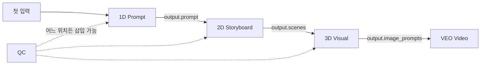

# Vivid Dimension 앱 개발자 공통 가이드

> **버전**: 2.1  
> **작성일**: 2026-01-13  
> **대상**: 개별 Dimension 앱 개발자  
> **목적**: 에코시스템 일관성 유지를 위한 단일 진실 문서

---

## 목차

1. [핵심 원칙](#1-핵심-원칙)
2. [파일 구조](#2-파일-구조)
3. [YAML 설정 (SSoT)](#3-yaml-설정-ssot)
4. [입력 전파 규칙](#4-입력-전파-규칙)
5. [출력 표준](#5-출력-표준)
6. [RAG 연동](#6-rag-연동)
7. [Intent 프리셋 시스템](#7-intent-프리셋-시스템)
8. [크레딧 비용](#8-크레딧-비용)
9. [Singularity 템플릿 연동](#9-singularity-템플릿-연동)
10. [프론트엔드 연동](#10-프론트엔드-연동)
11. [TieredContext 활용](#11-tieredcontext-활용)
12. [에러 처리](#12-에러-처리)
13. [메트릭 및 모니터링](#13-메트릭-및-모니터링)
14. [테스트](#14-테스트)
15. [디버깅](#15-디버깅)
16. [옵션 추가 체크리스트](#16-옵션-추가-체크리스트)
17. [참고 문서](#17-참고-문서)
18. [FAQ](#18-faq)

---

## 1. 핵심 원칙

### 1.1 자동 체이닝 아키텍처

각 앱은 **독립적으로 실행**되지만, **Singularity 템플릿 실행 시 체이닝**됩니다.



### 1.2 입출력 계약 (Contract)

**모든 앱은 다음을 준수해야 합니다:**

| 항목 | 규칙 | 예시 |
|------|------|------|
| **입력** | `Dict[str, Any]` | `{"topic": "...", "style": "cinematic"}` |
| **출력** | `Dict[str, Any]` - 다음 차원이 사용할 필드 포함 | `{"prompt": "...", "scenes": [...]}` |
| **메타데이터** | `credit_cost`, `model`, `duration_ms` 반환 | 자동 수집됨 |

---

## 2. 파일 구조

### 2.1 앱당 필수 파일

```
config/apps/content/dimensions/{app_id}.yaml    ← SSoT (설정) [필수]
backend/app/routers/dimension/{app_id}.py       ← API 엔드포인트 [필수]
backend/app/services/{app_id}_service.py        ← 비즈니스 로직 [선택]
frontend/src/components/dimension/{App}Panel.tsx ← UI 패널 [필수]
frontend/src/lib/dimension-input-schemas.ts     ← 입력 필드 정의 [공유]
```

### 2.2 실제 파일 예시

| 앱 | YAML | 라우터 | UI |
|----|------|--------|-----|
| 1D | `config/apps/content/dimensions/1d.yaml` | `backend/app/routers/dimension/__init__.py` | `PromptGeneratorPanel.tsx` |
| Story | `config/apps/content/dimensions/story.yaml` | `backend/app/routers/dimension/story.py` | `StoryArchitectPanel.tsx` |
| AD | `config/apps/content/dimensions/ad.yaml` | `backend/app/routers/dimension/aesthetic.py` | `AestheticDirectorPanel.tsx` |

---

## 3. YAML 설정 (SSoT)

모든 설정은 `config/apps/content/dimensions/{app_id}.yaml`에서 관리됩니다.

### 3.1 전체 스키마

```yaml
$schema: "vivid-app/v2"

metadata:
  name: my-app
  type: dimension
  version: "1.0.0"
  bounded_context: content

display:
  name_ko: "내 앱"
  name_en: "My App"
  icon: "🎬"
  description: "앱 설명"

capabilities:
  - name: execution
    enabled: true
    config:
      credit_cost: 5              # 크레딧 비용
      capsule_key: "my-app.generate"
      endpoint: "/api/dimension/my-app/generate"
      
  - name: rag
    enabled: true
    config:
      mode: auteur_only          # auteur_only | always | never
      auteur_mode: true
      confidence_threshold: 0.7
      cache_ttl: 3600
      max_sources: 5
      retrieval:
        strategy: hybrid         # hybrid | vector | keyword
        top_k: 10
        rrf_k: 60                # RRF 상수

  - name: cache
    enabled: true
    config:
      ttl: 3600

extensions:
  dimension:
    tool_type: generation        # generation | analysis
    supports_streaming: true

keywords:
  patterns:
    - "my-app"
    - "내앱"
```

### 3.2 RAG 모드 설명

| 모드 | 조건 | 사용 앱 |
|------|------|---------|
| `always` | 항상 RAG 활성화 | Story, AD, QC, 4D, AI |
| `auteur_only` | `auteur_key` 있을 때만 | 1D, 2D, 3D, VEO |
| `never` | RAG 비활성화 | Sound |

---

## 4. 입력 전파 규칙

`workflow_tools.py`의 `_prepare_dimension_inputs_tiered()`가 자동 전파합니다.

### 4.1 표준 입력 필드

| 필드 | 설명 | 전파 소스 | 기본값 |
|------|------|-----------|--------|
| `topic` | 주제/컨셉 | 사용자 입력 or 이전 prompt | 필수 |
| `style` | 스타일 | session 레벨 or 이전 출력 | `"cinematic"` |
| `mood` | 분위기 | session 레벨 or 이전 출력 | `"neutral"` |
| `aspect_ratio` | 화면비 | session 레벨 | `"16:9"` |
| `language` | 언어 | session 레벨 | `"ko"` |
| `duration` | 길이 | session 레벨 | `"15 seconds"` |
| `auteur_style` | 거장 스타일 | session 레벨 (선택) | `None` |

### 4.2 차원별 특수 입력

```python
# _prepare_dimension_inputs 내부 로직 (workflow_tools.py L1050-1150)

if dimension == "1D":
    return {"topic": topic, "style": style, "mood": mood}

elif dimension == "2D":
    concept = prev_output.get("prompt") or topic
    scene_count = _estimate_scene_count(duration) if not explicit else scene_count
    return {"concept": concept, "scene_count": scene_count}

elif dimension == "3D":
    description = prev_output.get("scenes", [{}])[0].get("description") or topic
    return {"description": description, "style": style, "aspect_ratio": aspect_ratio}

elif dimension == "VEO":
    return {"prompt": prev_output.get("prompt"), "duration": duration}

elif dimension == "QC":
    return {"content": json.dumps(prev_output), "content_type": prev_dimension}
```

---

## 5. 출력 표준

### 5.1 필수 출력 필드

```python
from typing import Dict, Any, List, Optional

def run_my_dimension(params: Dict[str, Any]) -> Dict[str, Any]:
    # 핵심 로직...
    
    return {
        # === 필수 필드 ===
        "prompt": "생성된 프롬프트...",       # 다음 차원 전파용 (1D, Story)
        "description": "설명...",             # 3D, VEO 등
        
        # === 메타데이터 (자동 수집) ===
        "model": "gemini-3-flash",
        "duration_ms": 1234,
        "credit_cost": 5,
        
        # === 차원별 추가 필드 ===
        "scenes": [...],                      # 2D
        "image_prompts": [...],               # 3D
        "video_url": "...",                   # VEO
        "score": 85,                          # QC
    }
```

### 5.2 QC 호환 출력

QC가 검수할 수 있도록 **의미 있는 텍스트 필드**를 포함하세요:

```python
# ❌ Bad: QC가 검수할 수 없음
return {"result": {"data": [...]}}

# ✅ Good: QC가 검수 가능
return {
    "prompt": "생성된 프롬프트 텍스트...",
    "scenes": [{"description": "..."}],
}
```

---

## 6. RAG 연동

### 6.1 거장 스타일 주입

```python
from app.rag.rag_presets import get_auteur_style_hints
from app.core.app_registry import AppRegistry

# 사용 가능한 거장 목록 (AppRegistry 기반)
AppRegistry.discover()
auteurs = [
    app.metadata.name
    for app in AppRegistry.get_all()
    if app.metadata.type.value == "auteur"
]

# 거장 스타일 힌트 가져오기
hints = get_auteur_style_hints("bong")
# {
#     'camera_style': 'tracking',
#     'aspect_ratio': '2.35:1',
#     'lighting': 'low-key',
#     'composition': 'symmetrical',
# }
```

### 6.2 Hybrid RAG 검색

```python
from app.rag.hybrid_rag import hybrid_query

result = await hybrid_query(
    query="봉준호 스타일 서스펜스 장면",
    dimension="AD",           # 차원 코드
    auteur_key="bong",        # 거장 키 (선택)
    use_google_search=False,  # 외부 검색 여부
    top_k=5,
)

# result.notebooklm_sources, result.vertex_sources
# result.confidence, result.strategy_used
```

### 6.3 BM25 + RRF Hybrid Search ⭐ UPGRADED

> **2026-01-15 업데이트**: Plugin-Registry 아키텍처로 전환 예정

#### 현재 사용법 (기존)

```python
from app.rag.hybrid_rag import HybridRAGService

service = HybridRAGService()
result = await service.rrf_query(
    query="시네마틱 조명 기법",
    dimension="AD",
    auteur_key="villeneuve",
)
# result.rrf_enabled = True
# result.keyword_results_count, result.vector_results_count
```

#### 품질 개선 효과

| 메트릭 | Dense Only | Dense + BM25 + RRF |
|--------|-----------|-------------------|
| 검색 정확도 | 62% | **91%** |
| 전문 용어 매칭 | 55% | **95%** |
| NDCG 향상 | - | **+26~31%** |

#### Plugin-Registry 패턴 (예정)

```yaml
# manifests/dimension.aesthetic.yaml
backends:
  - id: qdrant_dense
    weight: 0.5
    enabled: true
  - id: bm25_sparse
    weight: 0.3
    enabled: true
  - id: notebooklm
    weight: 0.2
    enabled: true
```


### 6.4 Evidence Refs (AI 근거) (**NEW 2026-01-13**)

API 응답에 `evidence_refs` 필드를 포함하면 UI에 자동으로 "AI 근거" 섹션이 표시됩니다.

#### 형식

```python
from app.rag.rag_suggestion import EvidenceRef, build_evidence_ref_id

# ref_id 생성 함수 (보장된 포맷)
ref_id = build_evidence_ref_id(
    dimension="4D",           # 차원 코드
    dataset_id="video_ref",   # 데이터셋 ID
    doc_id="doc_123",         # 문서 ID
)
# 결과: "db:rag_docs:4D:video_ref:doc_123"

# EvidenceRef 구조
evidence = EvidenceRef(
    ref_id=ref_id,
    source="db",
    content_preview="봉준호 감독의 트래킹 샷 분석...",
    dataset_id="video_ref",
    dataset_label="영화 레퍼런스",  # 사용자 친화적 라벨
    score=0.85,  # 0.0 ~ 1.0
)
```

#### 사용 가능한 데이터셋

| 차원 | Dataset ID | 라벨 | 용도 |
|------|-----------|------|------|
| 4D | `video_ref` | 영화 레퍼런스 | 영상 분석 |
| 4D | `film_analysis` | 분석 자료 | 기법 참조 |
| 3D | `image_grid` | 이미지 그리드 | 스타일 참조 |
| 3D | `visual_style` | 비주얼 스타일 | 컬러/조명 |

#### UI 동작 규칙

| 조건 | UI 동작 |
|------|--------|
| `evidence_refs` 있음 | "AI 근거" 섹션 표시 |
| `evidence_refs` 없음 | 섹션 숨김 |
| `confidence < 0.5` | 섹션 기본 접힘 |
| refs > 3개 | "더보기" 버튼 표시 |

#### 관련 문서

- [EvidenceDisplay UX 가이드](./EVIDENCE_DISPLAY_UX.md)
- [RAG Quality 평가](./RAG_QUALITY.md)

---

## 7. Intent 프리셋 시스템

### 7.1 Intent API 엔드포인트

```bash
# 모든 프리셋 목록
GET /api/v1/intent/presets

# 특정 프리셋 상세
GET /api/v1/intent/presets/cinematic_nolan

# 카테고리별 필터 (auteur, platform, general)
GET /api/v1/intent/presets/by-category/auteur
```

### 7.2 백엔드에서 프리셋 사용

```python
from app.schemas.creative_intent import IntentFactory

# 모든 프리셋 목록
presets = IntentFactory.get_all_presets()  # 14개

# 이름으로 가져오기
intent = IntentFactory.get_by_name("cinematic_nolan")
print(intent.mood, intent.pace, intent.keywords)

# 직접 호출
intent = IntentFactory.cinematic_bong()
```

### 7.3 사용 가능한 프리셋

| 카테고리 | 프리셋 이름 | 설명 |
|----------|-------------|------|
| **거장** | `cinematic_bong` | 봉준호 |
| | `cinematic_nolan` | 놀란 |
| | `cinematic_villeneuve` | 빌뇌브 |
| | `cinematic_wong` | 왕가위 |
| | `horror_na` | 나홍진 |
| | `arthouse_hong` | 홍상수 |
| | `animation_shinkai` | 신카이 |
| **플랫폼** | `shortform_energetic` | 숏폼 바이럴 |
| | `music_video` | 뮤직비디오 |
| | `youtube_tutorial` | 유튜브 튜토리얼 |
| | `instagram_reel` | 인스타 릴스 |
| | `commercial_product` | 제품 광고 |
| **일반** | `documentary_calm` | 다큐멘터리 |
| | `saju_guided` | 사주 기반 |

---

## 8. 크레딧 비용

### 8.1 SSoT에서 가져오기

```python
from app.core.app_registry import AppRegistry

app = AppRegistry.get_by_capsule_key("my-app.generate")
exec_cap = app.get_capability("execution")
cost = exec_cap.config.get("credit_cost", 5)
```

### 8.2 현재 앱별 비용

| 앱 | 크레딧 비용 |
|----|-------------|
| 1D | 5 |
| 2D | 10 |
| 3D | 5 |
| 4D | 8 |
| AD | 10 |
| Story | 10 |
| Sound | 8 |
| QC | 8 |
| VEO | **200** |

---

## 9. Singularity 템플릿 연동

### 9.1 템플릿 구조

```python
template = {
    "name": "시네마틱 프롬프트 마스터",
    "tool_sequence": ["1D", "2D", "VEO"],  # 차원 실행 순서
    "input_preset": {
        "intent": {
            "mood": "cinematic",
            "pace": "dynamic",
            "target": "expert"
        },
        "legacy_params": {
            "style": "nolan",
            "duration": "8 seconds"
        }
    }
}
```

### 9.2 Intent 추출

```python
from app.resolvers.integration import extract_intent_from_preset

intent, legacy_params = extract_intent_from_preset(input_preset)

if intent:
    # 새 형식: intent.mood, intent.pace, intent.target
    mood = intent.mood.value
else:
    # 레거시 형식: legacy_params["mood"]
    mood = legacy_params.get("mood", "neutral")
```

---

## 10. 프론트엔드 연동

### 10.1 입력 스키마 동기화

`frontend/src/lib/dimension-input-schemas.ts`에서 입력 필드를 정의합니다:

```typescript
export const DimensionInputSchemas: Record<string, DimensionField[]> = {
  "1D": [
    { key: "topic", label: "주제", type: "text", required: true },
    { key: "style", label: "스타일", type: "select", options: [...] },
    { key: "mood", label: "무드", type: "select", options: [...] },
    { key: "duration", label: "길이", type: "select", options: [...] },
    { key: "language", label: "언어", type: "select", options: [...] },
    { key: "model", label: "AI 모델", type: "select", options: [...] },
  ],
  // ...
}
```

### 10.2 새 필드 추가 시

1. YAML에 필드 정의
2. `dimension-input-schemas.ts`에 필드 추가
3. 패널 컴포넌트에서 사용

---

## 11. TieredContext 활용

워크플로우 실행 시 `TieredContext`가 세션/스텝 레벨 값을 관리합니다.

### 11.1 세션 vs 스텝 레벨

| 레벨 | 범위 | 예시 |
|------|------|------|
| **Session** | 전체 워크플로우 | `topic`, `style`, `auteur_style` |
| **Step** | 개별 차원 실행 | `output`, `credit_cost`, `success` |

### 11.2 값 접근

```python
# workflow_tools.py 내부
tiered = context.state.get_or_create_tiered_context()

# 세션 레벨 값 설정
tiered.set_session_value("auteur_style", "bong")
tiered.set_session_value("aspect_ratio", "2.35:1")

# 스텝 진행
tiered.advance_step(dimension="2D")

# 스텝 레벨 값 설정
tiered.step["output"] = result
tiered.step["credit_cost"] = 10
```

---

## 12. 에러 처리

### 12.1 표준 에러 응답

```python
from fastapi import HTTPException

# 입력 검증 에러
if not params.get("topic"):
    raise HTTPException(
        status_code=400,
        detail={"code": "MISSING_TOPIC", "message": "topic 필드가 필요합니다."}
    )

# RAG 실패 (graceful degradation)
try:
    rag_result = await hybrid_query(...)
except Exception as e:
    logger.warning(f"RAG failed, proceeding without context: {e}")
    rag_result = None

# 외부 API 에러
if not response.success:
    raise HTTPException(
        status_code=502,
        detail={"code": "EXTERNAL_API_ERROR", "message": "Gemini API 오류"}
    )
```

### 12.2 재시도 패턴

```python
from tenacity import retry, stop_after_attempt, wait_exponential

@retry(
    stop=stop_after_attempt(3),
    wait=wait_exponential(multiplier=1, min=1, max=10),
)
async def call_gemini(prompt: str):
    return await gemini_client.generate(prompt)
```

---

## 13. 메트릭 및 모니터링

### 13.1 RAG 메트릭 기록

RAG 쿼리는 자동으로 메트릭이 기록됩니다:

```python
# 자동 기록 (hybrid_rag.py에서)
# - rag_query_total
# - rag_query_latency_ms
# - rag_results_count
# - rag_confidence_score

# Prometheus 엔드포인트
# GET /metrics
```

### 13.2 커스텀 메트릭

```python
from prometheus_client import Counter, Histogram

my_dimension_requests = Counter(
    "my_dimension_requests_total",
    "Total requests to my dimension",
    ["status"]
)

my_dimension_latency = Histogram(
    "my_dimension_latency_ms",
    "Latency of my dimension in ms",
    buckets=[50, 100, 250, 500, 1000, 2500, 5000]
)

async def run_my_dimension(params):
    start = time.monotonic()
    try:
        result = await do_work(params)
        my_dimension_requests.labels(status="success").inc()
        return result
    except Exception as e:
        my_dimension_requests.labels(status="error").inc()
        raise
    finally:
        latency_ms = (time.monotonic() - start) * 1000
        my_dimension_latency.observe(latency_ms)
```

---

## 14. 테스트

### 14.1 단위 테스트

```bash
cd backend && pytest -v tests/test_dimension_{app}.py
```

### 14.2 E2E 테스트

```bash
cd frontend && npx playwright test dimension.spec.ts
```

### 14.3 체이닝 테스트

```
1. http://localhost:3100/singularity 접속
2. 템플릿 선택 (예: "시네마틱 프롬프트 마스터")
3. 첫 입력만 작성
4. 전체 차원 자동 실행 확인
```

### 14.4 API 직접 테스트

```bash
# Intent 프리셋 목록
curl http://localhost:8100/api/v1/intent/presets | jq '.count'

# 차원 직접 실행
curl -X POST http://localhost:8100/api/dimension/1d/generate \
  -H "Content-Type: application/json" \
  -H "X-User-Id: test-user" \
  -d '{"topic": "도시 야경", "style": "cinematic"}'
```

---

## 15. 디버깅

### 15.1 로그 확인

```bash
# 백엔드 로그
tail -f /tmp/vivid-backend.log | grep "dimension"

# RAG 로그
tail -f /tmp/vivid-backend.log | grep "HybridRAG"
```

### 15.2 일반적인 문제

| 문제 | 원인 | 해결 |
|------|------|------|
| `prev_output` 비어있음 | 이전 차원 실패 | 에러 로그 확인 |
| RAG 결과 없음 | 인덱스 미생성 | `scripts/seed_aesthetic_rag.py` 실행 |
| 크레딧 부족 | 잔액 없음 | `/api/v1/credits/balance` 확인 |
| Intent 없음 | 레거시 템플릿 | `legacy_params` 폴백 사용 |

### 15.3 TieredContext 디버깅

```python
# workflow_tools.py에서
logger.debug(f"TieredContext session: {tiered.session}")
logger.debug(f"TieredContext step: {tiered.step}")
logger.debug(f"TieredContext history: {tiered.history}")
```

---

## 16. 옵션 추가 체크리스트

새로운 옵션/파라미터 추가 시:

- [ ] `config/apps/content/dimensions/{app}.yaml` 업데이트
- [ ] `_prepare_dimension_inputs_tiered()` 에 전파 로직 추가 (필요시)
- [ ] `dimension-input-schemas.ts` 에 프론트엔드 필드 추가
- [ ] 패널 컴포넌트에서 UI 노출
- [ ] 출력에 새 필드 포함 (다음 차원 전파 필요시)
- [ ] QC 검수 대상 여부 확인
- [ ] API 문서 업데이트

---

## 17. 참고 문서

| 문서 | 경로 | 설명 |
|------|------|------|
| 앱 설정 SSoT | `config/apps/README.md` | YAML 스키마 정의 |
| 파이프라인 흐름 | `docs/archive/08_PIPELINES_AND_USER_FLOWS.md` | 전체 파이프라인 |
| 아키텍처 철학 | `docs/archive/15_CREBIT_ARCHITECTURE_EVOLUTION_CODEX.md` | Non-negotiable 원칙 |
| 개발 현황 | [DEVELOPER_STATUS_GUIDE.md](./DEVELOPER_STATUS_GUIDE.md) | 완성도, Known Issues |
| Intent 스키마 | `backend/app/schemas/creative_intent.py` | Intent/Preset 정의 |
| 워크플로우 도구 | `backend/app/agents/workflow_tools.py` | 체이닝 로직 |
| 입력 필드 스키마 | `frontend/src/lib/dimension-input-schemas.ts` | 프론트엔드 필드 정의 |

---

## 18. FAQ

### Q: 새 옵션 추가하면 기존 템플릿이 깨지나요?

**A**: 아니요. `legacy_params`가 하위 호환 레이어 역할을 합니다. 새 옵션은 기본값이 적용됩니다.

### Q: QC를 여러 곳에 배치할 수 있나요?

**A**: 네. `tool_sequence`에서 원하는 위치에 "QC"를 삽입하면 됩니다:
```python
["STORY", "2D", "QC", "3D", "QC", "VEO"]  # 스토리보드와 이미지 각각 검수
```

### Q: 크레딧 비용을 동적으로 변경하려면?

**A**: `config/apps/content/dimensions/{app}.yaml`의 `credit_cost`만 수정하면 프론트/백엔드 모두 자동 반영됩니다.

### Q: Intent 프리셋을 추가하려면?

**A**: `backend/app/schemas/creative_intent.py`의 `IntentFactory` 클래스에 새 메서드를 추가하고, `get_all_presets()`에 등록합니다.

### Q: RAG가 느릴 때 어떻게 하나요?

**A**: 
1. BM25 인덱스 캐시 확인 (`cache_ttl` 설정)
2. `top_k` 줄이기
3. `confidence_threshold` 높이기

### Q: 새 앱을 처음부터 만들려면?

**A**: 
```bash
# 1. YAML 생성
python scripts/vivid_app.py create dimension my-app \
  --display-name "My App" \
  --icon "🆕"

# 2. 라우터 생성 (routers/dimension/my_app.py)
# 3. 프론트엔드 패널 생성
# 4. dimension-input-schemas.ts에 추가
```
