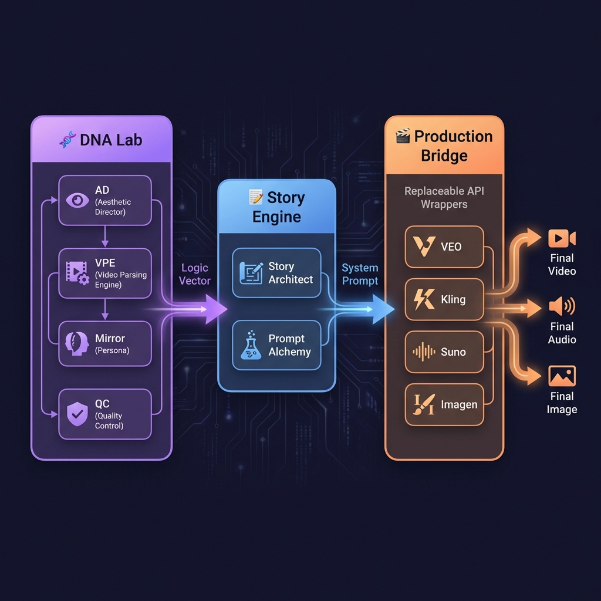

# Vivid/Crebit 메가앱 아키텍처 2026

> **Version**: 2.0
> **Date**: 2026-01-26
> **Status**: ✅ SSOT (Single Source of Truth)
> **Implementation**: Phase 1-4 ✅ 완료 | Phase 4.5 🔄 진행 | Phase 5-6 ⏳ 대기
> **Supersedes**: `unified_4layer_strategy.md`, `story_first_architecture_roadmap.md`

---

## Executive Summary

> [!IMPORTANT]
> **"공룡 모델이 바뀌어도, 우리의 Logic Vector는 영원하다"**

18개 Dimension 앱 → 3개 메가앱 통합:
- **🧬 DNA Lab**: 거장 DNA + 영상 해석 → Logic Vector
- **📝 Story Engine**: 스토리 구조화 + 시스템 프롬프트 생성
- **🎬 Production Bridge**: 공룡 API 래퍼 (교체 가능)

### 아키텍처 다이어그램



### 4-D DNA 비전 (2026 핵심 차별화)

> [!TIP]
> **세상에 거의 없는 통합**: 4개 DNA 축을 하나의 파이프라인으로 통합

| DNA 축 | 기술 기반 | 현재 상태 |
|--------|----------|:--------:|
| 1️⃣ 거장 명작 DNA | Qdrant 10개 컬렉션 | ✅ 완료 |
| 2️⃣ 수작 영상 DNA | VPE + Multimodal RAG | ✅ 완료 |
| 3️⃣ 심연의 유저 해석 | PersonaMem-v2 + Big Five | 🔄 OCEAN 추가 |
| 4️⃣ IP 페르소나 관리 | MegaNova 패턴 JSON | ✅ 완료 |

**경쟁 우위**: Runway AI, LTX Studio 모두 개별 기능만 제공. **4-D 통합은 Vivid 유일**.

---

## 🔬 2026 트렌드 검증 (웹 리서치 기반)

> **검증일**: 2026-01-26

### ✅ 검증된 설계 (변경 불필요)

| 컴포넌트 | 2026 검증 근거 | 출처 |
|---------|---------------|------|
| **Logic Vector** | "Shot Grammar" 프레임워크가 2026 Best Practice로 확인 | truefan.ai, ltx.studio |
| **System Prompt Generator** | Veo 3.1이 "렌더링 엔진처럼 구조화된 명령을 정확히 실행" | Google Developers Blog |
| **Provider Pattern** | 모든 플랫폼(Veo, Sora, Kling)이 다른 API 사용, 추상화 필수 | 다수 |
| **DNA Lab (거장 DNA)** | 유일한 차별화 요소, 경쟁사 없음 | - |

### 🔄 개선 필요 (Phase 4.5)

| 항목 | 현재 | 필요 (2026 API 대응) |
|------|------|---------------------|
| Reference Images | `reference_image_url: str` (1장) | `reference_images: List[str]` (최대 3장) |
| First/Last Frame | 없음 | Veo 3.1 지원 - 트랜지션 생성 가능 |

### 🆕 신규 추가 권장 (Phase 6)

| 항목 | 설명 | 우선순위 |
|------|------|---------|
| **Continuity Supervisor** | Multimodal LLM 기반 영상 QA 자동화 | Medium |
| **CLIP-based RAG** | Text + Visual 임베딩 하이브리드 | Low (Q2 2026) |

### 2026 AI Video 최신 현황

| 플랫폼 | 최신 버전 | 최대 길이 | 핵심 기능 |
|--------|----------|----------|----------|
| **Veo** | 3.1 | 60초 (extension) | Reference Images (3장), First/Last Frame |
| **Sora** | 2 Pro | 25초 | Storyboard Mode, Multi-shot, Caption Cards |
| **Kling** | 2.6 | 10초 | Fast generation, 다양한 스타일 |

---

## Implementation Status (2026-H2 통합 아키텍처)

> [!IMPORTANT]
> **2026-01-28 업데이트**: 독립 4개 앱 → 통합 파이프라인 + 2026 표준 아키텍처

### 아키텍처 개선 비교

| 항목 | 현재 | 개선 후 |
|------|------|--------|
| **실행 방식** | 독립 호출 (4회) | **Saga 패턴 파이프라인** |
| **데이터 동기화** | 즉시 Qdrant | **Transactional Outbox** |
| **실패 처리** | 개별 refund | **Saga 보상 트랜잭션** |
| **Mirror 모델** | MBTI만 | **MBTI + Big Five (OCEAN)** |
| **QC 기준** | 고정 | **IP Context-aware** |
| **Logic Vector** | 고정 (v1 영구) | **Versioning + Drift Detection** |
| **Shot Grammar** | 포맷 변환만 | **Transpiler (엔진별 최적화)** |
| **피드백** | 알림만 | **HITL Dashboard + Auto-Apply** |

### Phase 진행 현황

| Phase | 주차 | 상태 | 설명 |
|-------|:----:|:----:|------|
| **Phase 1.1** | W1 | ⏳ | Unified Schema (`DNALabResult`) |
| **Phase 1.2** | W1-2 | ⏳ | Saga Orchestrator (`VPE→AD→Mirror→QC`) |
| **Phase 1.3** | W2 | ⏳ | Transactional Outbox + Publisher |
| **Phase 1.4** | W3 | ⏳ | API Endpoint (`/run-pipeline`) |
| **Phase 1.5.1** | W3-4 | ⏳ | Big Five (OCEAN) 심리학 모델 |
| **Phase 1.5.2** | W3-4 | ⏳ | Context-aware QC |
| **Phase 1.5.3** | W3-4 | ⏳ | Logic Vector Versioning + Drift Detection |
| **Phase 1.5.4** | W3-4 | ⏳ | Shot Grammar Transpiler (Veo/Kling/Sora) |
| **Phase 2.1** | W5 | ⏳ | Feedback Table + Analytics |
| **Phase 2.2** | W5-6 | ⏳ | Auto-Improvement Cron |
| **Phase 2.3** | W5-6 | ⏳ | HITL Dashboard + Auto-Apply |

### 핵심 신규 컴포넌트

```
┌─────────────────────────────────────────────────────────────────────────┐
│                    DNA Lab 통합 파이프라인 (Saga)                        │
├─────────────────────────────────────────────────────────────────────────┤
│                                                                         │
│  [VPE] ──→ [AD] ──→ [Mirror] ──→ [QC]                                  │
│    ↓         ↓         ↓          ↓                                    │
│  Logic   Aesthetic  Persona    Quality                                 │
│  Vector  Guidelines   DNA      Report                                  │
│    │         │         │          │                                    │
│    └─────────┴────┬────┴──────────┘                                    │
│                   ↓                                                     │
│            DNALabResult                                                │
│                   ↓                                                     │
│         ┌────────┴────────┐                                            │
│         ↓                 ↓                                            │
│    [Outbox]         [Transpiler]                                       │
│         ↓                 ↓                                            │
│    Qdrant Sync      Veo/Kling/Sora                                     │
│                                                                         │
├─────────────────────────────────────────────────────────────────────────┤
│  [Drift Detection] ──→ [HITL Dashboard] ──→ [Auto-Apply]               │
└─────────────────────────────────────────────────────────────────────────┘
```

### 신규 파일 목록 (15개)

| 파일 | 용도 | Phase |
|------|------|:-----:|
| `schemas/dna_lab_unified.py` | 통합 스키마 | 1.1 |
| `services/dna_lab_orchestrator.py` | Saga 오케스트레이터 | 1.2 |
| `models_outbox.py` | Outbox 테이블 | 1.3 |
| `services/outbox_publisher.py` | Qdrant 동기화 | 1.3 |
| `services/logic_vector_versioning.py` | Drift Detection | 1.5.3 |
| `schemas/drift_detection.py` | Drift 스키마 | 1.5.3 |
| `routers/production/providers/adapters/transpiler.py` | Shot Grammar Transpiler | 1.5.4 |
| `services/feedback_analyzer.py` | 피드백 분석 | 2.2 |
| `services/hitl_workflow.py` | HITL 워크플로우 | 2.3 |
| `routers/hitl.py` | HITL API | 2.3 |
| `frontend/src/app/admin/hitl/page.tsx` | HITL 대시보드 | 2.3 |
| `alembic/.../add_outbox.py` | Outbox 마이그레이션 | 1.3 |
| `alembic/.../add_ocean.py` | Big Five 컬럼 | 1.5.1 |
| `alembic/.../add_logic_vector_versions.py` | 버전 테이블 | 1.5.3 |
| `alembic/.../add_hitl_review_items.py` | HITL 테이블 | 2.3 |

---

## 1. Dimension 앱 현황 (18개)

### 완전 구현 (7개) - 바로 노출 가능

| 앱 ID | 이름 | 기능 | Backend | Frontend | Tests |
|-------|------|------|---------|----------|-------|
| ad | Aesthetic Director | 거장 시각적 DNA 분석/생성 | 1,242 LOC | 1,766 LOC | ✅ |
| mirror | Abyss Mirror | MBTI+사주 페르소나 분석 | 943 LOC | 1,210 LOC | ✅ |
| kling | Kling Video | Kling 2.6 AI 비디오 생성 | 687 LOC | 644 LOC | ✅ |
| qc | Quality Controller | 영화적 품질/메타 검증 | 706 LOC | 673 LOC | ✅ |
| story | Story Architect | 시나리오/스토리 구조 생성 | 698 LOC | 863 LOC | ✅ |
| suno | Suno Music | Suno V5 음악 생성 | 594 LOC | 703 LOC | ✅ |
| veo | VEO Video | VEO 3.1 비디오 생성 | 598 LOC | 898 LOC | ✅ |

### 부분 구현 (8개) - UI 있으나 테스트 부족

| 앱 ID | 이름 | 기능 | 상태 |
|-------|------|------|------|
| 1d | Prompt Generator | VEO 프롬프트 생성 | 테스트 없음 |
| 2d | Storyboard Generator | 시각적 스토리보드 생성 | 테스트 없음 |
| 4d | Reference Analyzer | 영화 레퍼런스 분석 | 테스트 없음 |
| character | Character Consistency | StoryMem 기반 캐릭터 관리 | 테스트 없음 |
| prompt | Prompt Alchemy | 플랫폼별 최적화 프롬프트 | 테스트 없음 |
| sound | Sound Designer | 오디오/사운드 생성 | 생성 기능 미구현 |
| storyboard | Storyboard Sketcher | AI 스토리보드+일관성 | 테스트 없음 |

### 미구현/Adapter (3개) - 노출 불필요

| 앱 ID | 이름 | 상태 |
|-------|------|------|
| 3d | Image Generator | Frontend 없음 |
| json_gen | JSON Adapter | 내부용 |
| nanobanana | Nanobanana Adapter | 내부용 |

---

## 2. 확정된 앱 통합 구조 (18개 → 3개)

```
┌─────────────────────────────────────────────────────────────────────┐
│                    Crebit 3-Mega App Architecture                    │
├─────────────────────────────────────────────────────────────────────┤
│                                                                      │
│  [🧬 DNA Lab]              [📝 Story Engine]     [🎬 Production]    │
│  ┌─────────────┐           ┌─────────────┐       ┌─────────────┐    │
│  │ AD          │           │ Story       │       │ VEO 3.1     │    │
│  │ VPE (신규)  │──Logic──▶│ Prompt (1D) │──▶│ Kling 2.6   │    │
│  │ Mirror      │  Vector   │             │ Sys  │ Sora 2 Pro  │    │
│  │ QC          │           │             │Prompt│ Suno/Sound  │    │
│  └─────────────┘           └─────────────┘       └─────────────┘    │
│                                                                      │
│  ▲ 핵심 자산: Logic Vector (거장 DNA + 영상 해석 결합)               │
│                                                                      │
└─────────────────────────────────────────────────────────────────────┘
```

### 3개 메가앱 상세

| 메가앱 | 역할 | 포함 모듈 | 핵심 출력 |
|--------|------|----------|----------|
| 🧬 DNA Lab | 거장 DNA + 영상 해석 → Logic Vector | AD, VPE(신규), Mirror, QC | Logic Vector JSON |
| 📝 Story Engine | 스토리 구조화 + 시스템 프롬프트 생성 | Story, Prompt (1D) | Shot Grammar Prompt |
| 🎬 Production Bridge | 공룡 API 래퍼 (교체 가능) | VEO, Kling, Sora, Suno, Imagen | 최종 미디어 |

---

## 3. VPE (Video Parsing Engine) - 신규 핵심 모듈

### 목적

마스터피스 영상을 Gemini 3 Pro로 해석하여 Logic Vector 데이터 추출

### 분석 파이프라인

```
MP4/YouTube URL
    │
    ▼
[Scene Segmentation] → timestamp 기반 씬 분할
    │
    ▼
[Shot-Level Analysis] → Camera, Lens, Composition, Lighting
    │
    ▼
[Beat/Emotion Extraction] → Hook/Build/Turn/Payoff/Resolution
    │
    ▼
[Logic Vector Document] → Qdrant 저장
```

### Shot Grammar 출력 예시 (2026 표준)

> [!NOTE]
> Shot Grammar는 2026년 AI 영상 생성 업계 표준 프레임워크로 확인됨
> - Camera Optics, Motion, Lighting Physics 등 상세 지시 가능
> - Veo 3.1, Sora 2 Pro 모두 구조화된 프롬프트 정확히 실행

```json
{
  "logic_vector": {
    "auteur_id": "bong",
    "cadence": {"hook": 0.3, "build": 0.5, "climax": 3.5},
    "composition": {"primary_strategy": "vertical_blocking", "symmetry_score": 0.74},
    "camera_grammar": {"dolly": 0.35, "handheld": 0.15, "push_in": 0.02},
    "lighting_physics": {"key_light": "low-key", "color_temp_range": [3200, 5600]},
    "color_science": {"lut_reference": "Kodak_2383", "palette": ["desaturated", "green_tint"]}
  }
}
```

---

## 4. Phase 4.5: Schema Enhancement (2026 API 대응)

> [!IMPORTANT]
> Veo 3.1, Sora 2 Pro의 최신 기능 지원을 위한 스키마 확장

### 4.5.1 GenerationRequest 스키마 확장

**파일**: `backend/app/routers/production/providers/base.py`

```python
# 현재 (Phase 4에서 구현됨)
@dataclass
class GenerationRequest:
    prompt: str
    reference_image_url: Optional[str] = None  # 1장만 지원
    ...

# 수정 후 (Phase 4.5)
@dataclass
class GenerationRequest:
    prompt: str
    # Reference Images (최대 3장) - Veo 3.1 지원
    reference_images: List[str] = field(default_factory=list)
    # First/Last Frame Control - Veo 3.1 트랜지션 생성
    first_frame_url: Optional[str] = None
    last_frame_url: Optional[str] = None
    # 기존 필드 유지 (backward compatibility)
    reference_image_url: Optional[str] = None  # deprecated
    ...
```

### 4.5.2 VEO Provider 업데이트

```python
async def generate(self, request: GenerationRequest, ...) -> GenerationResult:
    payload = {
        "prompt": full_prompt,
        "aspect_ratio": request.aspect_ratio,
        # 신규 추가
        "reference_images": request.reference_images[:3],  # 최대 3장
    }
    
    # First/Last Frame (Image-to-Video 모드)
    if request.first_frame_url and request.last_frame_url:
        payload["first_frame"] = request.first_frame_url
        payload["last_frame"] = request.last_frame_url
```

---

## 5. Phase 5: Frontend 통합

### 5.1 새 페이지 생성

| 경로 | 컴포넌트 |
|------|----------|
| `/dna-lab` | DNA Lab Hub (탭: VPE, AD, Mirror, QC) |
| `/story-engine` | Story Engine Hub (탭: Story, Prompt) |
| `/production` | Production Bridge Hub (탭: VEO, Kling, Sora, Suno) |

### 5.2 Legacy 리디렉션

```typescript
const LEGACY_REDIRECTS: Record<string, string> = {
  "/dimension/aesthetic": "/dna-lab?tab=ad",
  "/dimension/abyss-mirror": "/dna-lab?tab=mirror",
  "/dimension/quality-check": "/dna-lab?tab=qc",
  "/dimension/story-architect": "/story-engine?tab=story",
  "/dimension/prompt": "/story-engine?tab=prompt",
  "/dimension/video-maker": "/production?provider=veo",
  "/dimension/kling": "/production?provider=kling",
  "/dimension/suno": "/production?provider=suno",
};
```

---

## 6. Phase 6: Continuity Supervisor (미래 대비)

> **목적**: 생성된 영상의 연속성/품질 자동 검증

### 6.1 Continuity Supervisor Service

```python
@dataclass
class ContinuityReport:
    overall_score: float  # 0.0 - 1.0
    character_consistency: float
    lighting_consistency: float
    motion_smoothness: float
    issues: List[str]  # 발견된 문제점
    frame_issues: Dict[int, str]  # 프레임별 이슈

class ContinuitySupervisor:
    """Multimodal LLM 기반 영상 품질 검증"""
    
    async def verify(
        self,
        video_url: str,
        expected_logic_vector: Optional[LogicVector] = None,
    ) -> ContinuityReport:
        # 1. 영상을 프레임 단위로 분석
        # 2. 캐릭터 일관성 검사
        # 3. 조명/색상 일관성 검사
        # 4. 모션 부드러움 검사
        # 5. Logic Vector 대비 스타일 일치도 (선택)
```

### 6.2 비즈니스 가치

- **자동 QA**: 수동 검토 시간 30% 절감
- **재생성 판단**: 점수 80% 미만 시 자동 재생성 제안
- **피드백 루프**: 어떤 부분이 문제인지 구체적 리포트

---

## 7. 구현 로드맵 (수정됨)

| Phase | 작업 | 상태 | 공수 |
|-------|------|------|------|
| **Phase 1** | VPE 신규 구축 | ✅ 완료 | 2주 |
| **Phase 2** | DNA Lab 통합 | ✅ 완료 | 1주 |
| **Phase 3** | Story Engine 통합 | ✅ 완료 | 1.5주 |
| **Phase 4** | Production Bridge | ✅ 완료 | 0.5주 |
| **Phase 4.5** | Schema Enhancement | 🔄 진행 | 2일 |
| **Phase 5** | Frontend 통합 | ⏳ 대기 | 0.5주 |
| **Phase 6** | Continuity Supervisor | 🆕 계획 | 1-2주 |

---

## 8. 예상 효과

| 메트릭 | Before | After |
|--------|--------|-------|
| 앱 개수 | 18개 | **3개** |
| Logic Vector 소스 | 텍스트만 | **텍스트 + 영상** |
| 공룡 API 교체 시간 | 2주 | **1일** |
| System Prompt 정교함 | 자연어 | **Shot Grammar JSON** |
| Reference Images | 1장 | **3장 (Veo 3.1)** |
| 트랜지션 생성 | 불가능 | **First/Last Frame** |

---

## 9. 검증 계획

### 자동화된 테스트

```bash
# 1. VPE 유닛 테스트
pytest tests/services/test_video_parsing_engine.py -v

# 2. DNA Validator 테스트
pytest tests/services/test_dna_validator.py -v

# 3. RAG 통합 테스트
pytest tests/rag/test_dna_lab_rag.py -v

# 4. Story Engine E2E 테스트
pytest tests/e2e/test_story_engine.py -v

# 5. Reference Images 테스트 (Phase 4.5)
pytest tests/routers/test_production_bridge.py -v -k "reference_images"
```

### 수동 검증

1. **VPE 품질 검증**: 봉준호 "기생충" 3분 클립 분석 → 기존 Logic Vector와 80% 일치 확인
2. **System Prompt 정교함**: Story Engine → VEO 3.1 생성 → Shot Grammar 요소 포함 여부
3. **Production Bridge 교체 테스트**: VEO → Kling 교체 시 Story Engine 코드 변경 없음
4. **Reference Images 테스트**: 3장 이미지로 캐릭터 일관성 검증

---

## 10. 핵심 통계

| 항목 | 수치 |
|------|------|
| 총 Dimension 앱 | 18개 |
| 완전 구현 | 7개 (39%) |
| 부분 구현 | 8개 (44%) |
| 미구현/Adapter | 3개 (17%) |
| Backend 총 LOC | ~11,000 LOC |
| Frontend 총 LOC | ~13,500 LOC |
| 워크플로우 템플릿 | 5개 프리셋 |
| 페이지 총 개수 | 50+ 라우트 |

---

## Research Sources (2026-01-26)

| 출처 | 내용 |
|------|------|
| [Veo 3.1 API](https://developers.googleblog.com/) | Reference images (3장), first/last frame control |
| [Sora 2 Prompting Guide](https://cookbook.openai.com/) | Storyboard mode, multi-shot, caption cards |
| [truefan.ai](https://truefan.ai/) | Shot Grammar 프레임워크 2026 표준 |
| [ltx.studio](https://ltx.studio/) | Structured video generation, cinematic control |
| [NVIDIA Multimodal RAG](https://developer.nvidia.com/) | CLIP-based approach (장기 로드맵) |

---

## 관련 문서

| 문서 | 역할 | 상태 |
|------|------|------|
| [MEGA_APP_IMPLEMENTATION_ROADMAP_2026.md](./MEGA_APP_IMPLEMENTATION_ROADMAP_2026.md) | 상세 구현 로드맵 | Active |
| [SSOT_DECISIONS_LOG.md](./SSOT_DECISIONS_LOG.md) | 결정 로그 (Decision 011) | Active |
| [unified_4layer_strategy.md](./archive/strategic_2026_01/unified_4layer_strategy.md) | 이전 전략 | Superseded |

---

*Version 2.0 Created: 2026-01-26 | 2026 Trend Validation Applied*
